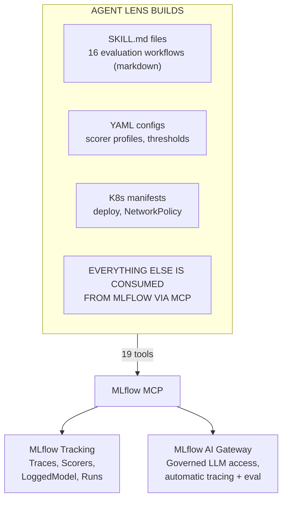

# Design Principles

*Read this before proposing architecture changes or adding new components.*

Agent Lens is the **decision plane** on top of the MLflow **data plane**. Every
design decision follows from this separation. If you find yourself building
something that stores traces, scores content, or registers models — stop. MLflow
already does it.

---

## 1. Data Plane vs. Decision Plane

MLflow owns data. Agent Lens owns decisions.

| MLflow (Consume — Never Rebuild) | Agent Lens (Build on Top) |
|---|---|
| Trace storage | Qualification lifecycle |
| 20+ built-in GenAI judges | Scorer profile selection  |
| LoggedModel registry | Qualification state + TTL |
| Token/cost accounting | Fleet-wide cost aggregation |
| Webhooks (15 event types) | CI/CD quality gate (synchronous) |
| Assessments on traces | Governance audit trail |
| Experiment organization | Fleet observatory |

When in doubt, ask: "Does MLflow already store or compute this?" If yes, consume
it via MCP. If no, check the [MLflow Capability Audit](docs/product/mlflow-capability-audit.md)
to verify it truly does not exist before proposing to build it.

---

## 2. Official MCP Only

All MLflow access goes through the **upstream official MLflow MCP server**
(`mlflow mcp run`). This is not negotiable.

**What this means:**
- No `import mlflow` in the sandbox or in skills
- No custom FastMCP wrappers around MLflow APIs
- No direct REST calls to the MLflow tracking server
- The `config.yaml` tool allowlist is the single source of truth for available tools

**Why:**
- Upstream MCP is maintained by the MLflow team — we get new capabilities for free
- The MCP protocol provides a stable contract that survives MLflow API changes
- Sandboxing requires a clean trust boundary — MCP is that boundary
- CI contract tests (`check_mcp_contract.sh`) verify tool availability before deploy

**When a tool is missing:** Contribute it upstream to
[mlflow/mlflow](https://github.com/mlflow/mlflow). Do not fork or wrap.

---

## 3. Skills Over Code

Evaluation logic lives in `SKILL.md` files (structured prompt documents), not in
hardcoded application logic.

**What this means:**
- A skill is a markdown file, not Python code
- Skills declare which MCP tools they use — the allowlist is enforced by CI
- New evaluation workflows are added by writing a new `SKILL.md`, not by modifying
  the agent harness source
- There are **no** custom service components — only skills, configs, and K8s manifests

**Why:**
- Skills are auditable — a security reviewer can read markdown
- Skills are composable — the agent chains them as needed
- Skills are portable — they work with any MCP-capable agent harness, not just the reference runtime
- Custom code means custom bugs; skills leverage MLflow's tested judge implementations
- MLflow AI Gateway already provides governed LLM access, automatic tracing,
  cost tracking, and automatic evaluation — no need to rebuild any of that

---

## 4. Score Honestly

GenAI built-in scorers produce **yes/no** categorical results. Agent Lens reports
**pass rates**, never invented Likert scales.

**What this means:**
- "85% pass rate on RelevanceToQuery" — correct
- "4.2 out of 5 on quality" — forbidden (no such scale exists)
- Assessment `state: OK` means the scorer executed — not that the agent answered correctly
- Assessment `feedback.error` means the scorer failed, not that the agent failed
- Always surface scorer **rationale** text — the explanation matters more than the yes/no

**Why:**
- Invented scales create false precision that misleads qualification decisions
- Pass rates are statistically meaningful — "4.2/5" is not
- Agent platform engineers need honest, defensible evidence for governance

**Qualification thresholds:**
- Default pass: ≥ 80% pass rate per required scorer
- Default error ceiling: < 5% scorer failures
- These are configurable — not hardcoded truths

---

## 5. Consume Before Building

Before proposing any new component, check whether MLflow already provides it.
The [MLflow Capability Audit](docs/product/mlflow-capability-audit.md) is the
authoritative reference.

**Examples of "consume" decisions:**
- Agent registry → LoggedModel with qualification tags (not a custom database)
- Cost tracking → `mlflow.llm.cost` span attribute (not a custom cost table)
- Scorer catalog → `list_scorers` MCP tool (not a hardcoded list)
- Version comparison → `search_logged_models` with ordering (not a custom diff engine)
- Tag-based filtering → LoggedModel `filter_string` supports tags (not a custom index)

**Examples of "build" decisions:**
- Fleet observatory → MLflow is per-experiment; fleet view needs cross-experiment aggregation
- Qualification lifecycle → MLflow has no concept of QUALIFIED/PENDING/EXPIRED states

**Formerly "build", now "consume" (MLflow AI Gateway):**
- CI/CD evaluation → `mlflow.genai.evaluate()` callable from any CI script
- Audit trail → MLflow AI Gateway traces every request with full payload
- Cost tracking → MLflow AI Gateway captures token counts automatically
- Automatic evaluation → MLflow AI Gateway runs LLM judges as traces arrive

**The test:** If you can implement a feature using only existing MCP tools + a
SKILL.md file, do that. If you need a new MCP tool, contribute it upstream.
If MLflow AI Gateway already does it, consume it — do not rebuild.

---

## 6. Sandboxed and Secure (OpenShell)

Agent Lens runs inside an [OpenShell](https://github.com/NVIDIA/OpenShell) sandbox —
the same defense-in-depth isolation stack used for production agent workloads.
The qualification agent itself is sandboxed, not just the agents it evaluates.

**What this means:**
- **[OpenShell Sandbox](https://github.com/NVIDIA/OpenShell)** provides the isolation
  stack: Linux namespaces, Landlock filesystem ACLs, seccomp syscall filtering,
  L7 network proxy with binary identity binding, and OCSF audit events
- **NetworkPolicy** isolation — egress restricted to MLflow MCP endpoint only
- **Credential isolation** — inference API keys never enter the sandbox; the
  proxy injects credentials after policy evaluation
- **Immutable container image** — no `pip install` at runtime, no package
  manager in the final image
- **API key auth** for the dashboard — scrypt-hashed, never stored in plaintext

The sandbox is **subtractive** (constrains what the agent can do). The skills are
**additive** (layer on knowledge and MCP tool access). These are
[separate concerns](https://medium.com/@ralphbean/what-even-is-the-harness-2e7ac2fba905)
with different failure modes and different design philosophies.

On Kubernetes, the [agent-sandbox-operator](https://github.com/kubernetes-sigs/agent-sandbox)
manages sandbox pod lifecycle (warm pools, PVCs, rescheduling). The OpenShell
supervisor inside the pod enforces the security boundary.

**Why:**
- Enterprise customers require defense-in-depth controls before production approval
- The sandbox model means a compromised skill cannot escalate to cluster access
- The sandbox doubles as a **recorder** — providing provenance attestation
  independent of the agent runtime's self-reporting
- "Secure by default" reduces the audit burden for adopters

See [SECURITY.md](SECURITY.md) for the full security model and vulnerability
reporting process.

---

## The Build Boundary in One Diagram

---

## Defining References

| Document | What it covers |
|----------|---------------|
| [Identity](docs/product/identity.md) | What Agent Lens is and is not |
| [MLflow Capability Audit](docs/product/mlflow-capability-audit.md) | Build vs. consume for every planned feature |
| [Vision](docs/product/vision.md) | Market context, ICP, north star metrics |
| [Architecture](docs/product/architecture.md) | Technical implementation details |
| [SECURITY.md](SECURITY.md) | Security model and vulnerability reporting |
| [CONTRIBUTING.md](CONTRIBUTING.md) | How to contribute code and skills |
| [AGENTS.md](AGENTS.md) | Instructions for AI coding agents |
