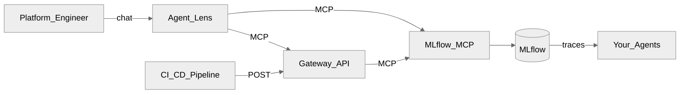
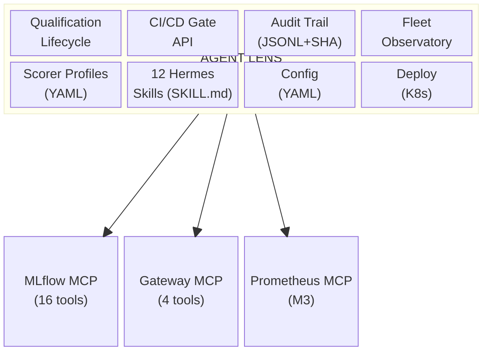

<p align="center">
  <h1 align="center">Agent Lens</h1>
  <p align="center">
    Qualify AI agents you didn't build — conversationally, on MLflow.
    <br />
    <a href="docs/product/identity.md"><strong>Identity</strong></a> ·
    <a href="DESIGN.md"><strong>Design</strong></a> ·
    <a href="docs/architecture.md"><strong>Architecture</strong></a> ·
    <a href="docs/demo-script.md"><strong>Demo</strong></a> ·
    <a href="docs/operator-mcp.md"><strong>MCP ops</strong></a> ·
    <a href="CONTRIBUTING.md"><strong>Contributing</strong></a>
  </p>
</p>

<p align="center">
  <a href="https://github.com/rrbanda/agent-lens/blob/main/LICENSE"></a>
  <a href="https://www.python.org/downloads/"></a>
  <a href="https://github.com/rrbanda/agent-lens/issues"></a>
  <a href="https://github.com/rrbanda/agent-lens/pulls"></a>
  
  
</p>

---

> **Verified working** — All 7 M1 skills tested end-to-end on OpenShift with Hermes v0.19 + MLflow MCP 3.14.
> 41 integration tests pass against real MLflow data. See [test results](#verified-end-to-end).

MLflow is the **data plane** — traces, scorers, models.
Agent Lens is the **decision plane** — verdicts, governance, fleet management.

Agent Lens is **not** another MLflow UI. It is a conversational qualification layer that drives
**upstream official [MLflow MCP](https://mlflow.org/docs/latest/genai/mcp/)** so agent platform engineers
can evaluate, qualify, and govern AI agents in natural language.

---

## Who it's for

Agent Lens serves different personas at different stages of the product roadmap. Each one asks a fundamentally different question about agent quality.

| Persona | Their question | What Agent Lens gives them | When |
|---------|---------------|---------------------------|------|
| **Agent Platform Engineer** | "Can I qualify this agent for production?" | Qualification verdicts, fleet observatory, trace forensics, scorer profiles | **Now** (M1) |
| **Agent Developer** | "Will my agent pass the platform team's quality gate?" | CI/CD gate API, eval-in-pipeline, version comparison, regression tracking | **M2** |
| **Chief AI Officer / VP of AI** | "Is this investment paying off?" | Fleet-wide quality scores, cost-per-agent trending, executive summaries | M2 |
| **CISO / AI Security Lead** | "Is the security boundary robust?" | Governance audit trail, policy violation tracking, red team results | M3 |
| **Domain Expert / SME** | "Did the agent do the right thing?" | Trace annotation, expectation authoring, review queues, judge calibration | M2 |
| **Business Sponsor** | "Is the agent making my team more productive?" | Adoption metrics, containment rates, quality trends per team | M4 |
| **AI Compliance / GRC Lead** | "Do our agents meet regulatory requirements?" | Qualification evidence export, ISO 42001 / EU AI Act mapping, drift detection | M4 |

Full persona detail: [docs/product/personas.md](docs/product/personas.md).

---

## Agent Lens is right for you if

- You run 10+ AI agents in production and must approve them before deployment
- You have MLflow tracing but no systematic way to grade agent quality
- You need CI/CD quality gates that block bad agents, not just dashboards you forget to check
- Compliance requires an audit trail of who qualified what, when, and with what evidence
- You want to evaluate agents via chat, not by writing Python evaluation scripts
- You manage a heterogeneous fleet (LangChain, CrewAI, custom) and need one surface for all of them

---

## Problems Agent Lens solves

| Without Agent Lens | With Agent Lens |
|---|---|
| You have 50 agents in production and no evidence any of them work correctly. | Every agent has a Quality Qualification Report with scorer pass rates and evidence. |
| CI/CD deploys agents without quality checks — failures are found by users. | `POST /api/v1/gate/evaluate` returns PASS/FAIL before the pipeline proceeds. |
| Compliance asks "who approved this agent?" and you have no answer. | Append-only audit trail with SHA-256 checksums, actor identity, and JSON Lines export. |
| You want to evaluate an agent but don't know which scorers to use. | Scorer profiles (RAG, Tool-Calling, Chat, Safety, Comprehensive) pick the right judges for you. |
| Fleet health is checked by manually opening MLflow experiment by experiment. | "Give me a quality dashboard" returns HEALTHY / WARNING / CRITICAL / INACTIVE across all agents. |
| A bad trace went to production and nobody logged it as a regression. | `create-regression` tags the trace with expectations and flags it for follow-up evaluation. |

---

## Features

### Evaluate any agent in natural language

Ask Agent Lens to evaluate an agent and it runs MLflow's GenAI scorers against production traces, aggregates pass rates, and returns a structured **Quality Qualification Report** — QUALIFIED, NOT QUALIFIED, or NEEDS REVIEW with full evidence.

```
You:   "Evaluate outreach-agent using the tool-calling profile"

Agent Lens:
  # Quality Qualification Report
  ## Agent: outreach-agent | Experiment: 42
  ### Profile: Tool-Calling
  | Scorer               | Pass rate | Verdict |
  |----------------------|-----------|---------|
  | ToolCallCorrectness  | 92%       | PASS    |
  | ToolCallEfficiency   | 87%       | PASS    |
  | RelevanceToQuery     | 95%       | PASS    |
  ### Qualification verdict: QUALIFIED
  Evidence: 200 traces evaluated, 1.2% error rate, avg latency 340ms
```

Scorers return **yes/no** — Agent Lens reports **pass rates**, never fake /5 scores. Default threshold: ≥ 80% pass rate per required scorer, < 5% error rate.

### Seven scorer profiles — pick the right judges automatically

Instead of figuring out which of MLflow's 23 built-in judges to use, select a profile:

| Profile | Scorers | Use when |
|---------|---------|----------|
| **RAG** | RelevanceToQuery, RetrievalGroundedness | Agent retrieves documents before answering |
| **Tool-Calling** | ToolCallCorrectness, ToolCallEfficiency, RelevanceToQuery | Agent calls APIs, tools, or functions |
| **Chat** | RelevanceToQuery, Guidelines | General conversational assistant |
| **Safety** | Guidelines (OSS) or Safety (Databricks) | Content safety evaluation |
| **Comprehensive** | All available scorers via `list_scorers` | Full quality assessment, new agent types |
| **Multi-Turn** | ConversationCompleteness, ConversationalSafety, UserFrustration | Multi-turn conversations |
| **Custom** | User-specified scorers validated via MCP | Your own quality bars |

Profiles are YAML config (profile name → scorer list), not custom scorer code. MLflow provides 23 built-in judges — see [MLflow Capability Audit](docs/product/mlflow-capability-audit.md).

### Explore traces and debug failures

```
You:   "Show me the last 20 traces for billing-agent"
You:   "What went wrong with this trace?"
You:   "Where did this chat session go wrong?"
```

Agent Lens calls MLflow MCP to surface latency distributions, error patterns, token usage, and individual trace forensics. For multi-turn conversations, it reconstructs the full session timeline and identifies where reasoning broke down.

### Fleet-wide quality dashboard

```
You:   "Give me a quality dashboard across all agents"

Agent Lens:
  | Agent            | Status   | Last eval  | Pass rate |
  |------------------|----------|------------|-----------|
  | outreach-agent   | HEALTHY  | 2h ago     | 92%       |
  | billing-agent    | WARNING  | 1d ago     | 78%       |
  | support-agent    | CRITICAL | 3d ago     | 61%       |
  | legacy-bot       | INACTIVE | 30d ago    | —         |
```

Scans across experiments and LoggedModels to aggregate fleet health into HEALTHY / WARNING / CRITICAL / INACTIVE. MLflow operates per-experiment — Agent Lens operates fleet-wide.

### Annotate and track regressions

```
You:   "Annotate that trace as incorrect tool selection"
You:   "Log a regression follow-up for this failure"
```

Log human feedback and expectations directly on MLflow traces. Tag traces with `regression=true` for follow-up evaluation. When a bad answer makes it to production, capture it immediately so the next qualification run includes it.

### CI/CD quality gate (M2)

```bash
# In your Tekton / GitHub Actions / GitLab CI pipeline:
curl -X POST https://agent-lens-gateway/api/v1/gate/evaluate \
  -H "Authorization: Bearer $API_KEY" \
  -d '{"experiment": "outreach-agent", "profile": "tool-calling", "threshold": 0.85}'

# Exit code: 0=PASS, 1=FAIL, 2=ERROR
```

The Gateway provides a synchronous REST endpoint that blocks the pipeline until evaluation completes. MLflow webhooks are async — pipelines need blocking verdicts.

### Governance audit trail (M2)

Every qualification decision is recorded in an append-only JSONL store with SHA-256 hash chain, actor identity, and compliance export. MLflow stores evidence (scorer assessments on traces) — Agent Lens stores decisions (who qualified what, when, and against which thresholds).

### Zero-code instrumentation

Drop a single file into your Python agent to start sending traces to MLflow:

```bash
cp instrumentation/usercustomize.py $(python -m site --user-site)/
export MLFLOW_TRACKING_URI="https://your-mlflow:8443"
export MLFLOW_EXPERIMENT_NAME="my-agent"
# That's it — your agent now sends traces to MLflow automatically
```

Works with any OpenAI-compatible Python agent. No code changes required.

### All features at a glance

| Feature | Skill | Example ask | Status |
|---------|-------|-------------|--------|
| Quality evaluation | `evaluate-agent` | "Evaluate outreach-agent with the RAG profile" | M1 |
| Qualification verdict | `evaluate-agent` | "Can this agent be deployed?" | M1 |
| Trace forensics | `trace-explorer` | "Show me the last 20 traces for billing-agent" | M1 |
| Single trace review | `review-trace` | "What went wrong with this trace?" | M1 |
| Session analysis | `analyze-session` | "Where did this chat session go wrong?" | M1 |
| Fleet observatory | `quality-dashboard` | "Quality dashboard across all agents" | M1 |
| Regression tracking | `create-regression` | "Log a regression for this failure" | M1 |
| Human annotation | `review-trace` | "Annotate that trace as incorrect tool selection" | M1 |
| CI/CD quality gate | Gateway API | `POST /api/v1/gate/evaluate` | M2 |
| Audit trail | Gateway API | "Export qualification decisions for Q3" | M2 |
| Agent registry | `agent-registry` | "Show all agents with their qualification status" | M2 |
| Cost tracking | `cost-dashboard` | "How much is the support agent costing per task?" | M3 |

Skills live under [`agent-lens/skills/`](agent-lens/skills/).

---

## How it works



Agent Lens follows a five-phase loop on every interaction:

| Phase | What happens | MCP tools used |
|-------|--------------|-----------|
| **Observe** | Discover experiments, traces, agents | `search_experiments`, `search_traces`, `get_trace` |
| **Evaluate** | Score traces with GenAI scorers | `evaluate_traces`, `list_scorers` |
| **Annotate** | Log feedback / expectations on traces | `log_trace_feedback`, `log_trace_expectation` |
| **Qualify** | PASS/FAIL thresholds + audit record | Evaluation run metrics + trace tags |
| **Follow up** | Tag failures for regression tracking | `set_trace_tag`, `log_trace_expectation` |

---

## The four pillars

| Pillar | What it covers |
|---|---|
| **Qualification Lifecycle** | Aggregate MLflow scorer results into PASS/FAIL verdicts against configurable thresholds. Track state (QUALIFIED / PENDING / EXPIRED) over time. Enforce TTL-based re-qualification. |
| **CI/CD Quality Gate** | Synchronous REST API (`POST /api/v1/gate/evaluate`) for Tekton, GitHub Actions, GitLab CI. Exit code 0=PASS, 1=FAIL, 2=ERROR. MLflow webhooks are async — pipelines need blocking verdicts. |
| **Governance Audit Trail** | Append-only JSONL store with SHA-256 hash chain, actor identity, and compliance export. MLflow stores evidence (assessments on traces) — Agent Lens stores decisions. |
| **Fleet Observatory** | Cross-experiment health aggregation, qualification status overview, cost-per-agent trending. MLflow operates per-experiment — Agent Lens operates fleet-wide. |

---

## What's under the hood



The Gateway is the **only new service** Agent Lens builds. Everything else is either a SKILL.md file (prompt document, not code), a YAML config file (scorer profiles, thresholds), or a K8s manifest (OAuth Proxy, NetworkPolicy).

See [DESIGN.md](DESIGN.md) for the design principles behind these decisions.

---

## What Agent Lens is NOT

| | |
|---|---|
| **Not an MLflow alternative.** | It calls MLflow, never replaces it. |
| **Not a scoring engine.** | MLflow's 23 judges do the evaluation. Agent Lens picks which ones to use. |
| **Not a trace store.** | All trace data lives in MLflow. Agent Lens reads it via MCP. |
| **Not a model registry.** | LoggedModel in MLflow is the source of truth. Agent Lens adds lifecycle tags. |
| **Not an observability platform.** | Observability is traces in MLflow. Agent Lens adds judgment on top. |
| **Not a dashboard.** | It is conversational-first. The UI is the Hermes chat. |

---

## Getting started

### Prerequisites

- Kubernetes cluster (OpenShift, EKS, GKE, or any conformant distribution)
- MLflow Tracking Server deployed and accessible
- Official MLflow MCP reachable as `mlflow-mcp` (see [operator guide](docs/operator-mcp.md))
- OpenShell (`openshell` ns) + LlamaStack; `kubectl` / `oc` authenticated

### Install Agent Lens

```bash
git clone https://github.com/rrbanda/agent-lens.git
cd agent-lens

# Dashboard/API secret in openshell (no Gemini key — LlamaStack inference)
DASH_PW=... API_KEY=... make secret-openshell

# Build OpenShell-base image + deploy Sandbox
make deploy-all

make status   # MCP + OpenShell Sandbox + route
```

Default MCP URL in [`agent-lens/config.yaml`](agent-lens/config.yaml):

`http://mlflow-mcp.redhat-ods-applications.svc.cluster.local:8080/mcp`

### Instrument an agent, then chat

```bash
cp instrumentation/usercustomize.py $(python -m site --user-site)/
export MLFLOW_TRACKING_URI="https://your-mlflow:8443"
export MLFLOW_EXPERIMENT_NAME="my-agent"
```

Open the dashboard route and try:

```
Evaluate my-agent using the tool-calling profile
Give me a quality dashboard across all agents
Can this agent be deployed?
```

### What this repo deploys (and what it does not)

| This repo deploys | You must already have |
|---|---|
| Hermes Agent Lens OpenShell Sandbox (`agent-lens/deploy/openshell/`) | MLflow Tracking Server |
| Skills, soul, Kubernetes manifests | **Official MLflow MCP** service (`mlflow mcp run`) |
| Instrumentation helpers | OpenShell + LlamaStack on cluster |

`make deploy-all` builds the OpenShell-base image and deploys the **Sandbox** into `openshell`. It does **not** install MLflow, MCP, or OpenShell.

---

## Known limitations

| Phrase | What you actually get today | M2 status |
|---|---|---|
| Gate / deploy block | Qualification verdict in chat — not a CI webhook ([#18](https://github.com/rrbanda/agent-lens/issues/18)) | Gateway API in M2 |
| Audit trail | No governance record | Checksummed JSONL in M2 |
| Agent registry | No fleet inventory | LoggedModel-backed registry in M2 |
| Regression dataset | Expectation + tags on a trace — not an MLflow Evaluation Dataset API | Unchanged |
| Review queue | Heuristic error/recent search — not a dedicated queue tool | Unchanged |
| Fleet health | Multi-call MCP aggregation — not a single server summary tool | Improved in M2 |

Full detail: [docs/limitations.md](docs/limitations.md).

---

## Project layout

```
agent-lens/
├── agent-lens/          # Hermes: soul, config, skills, OpenShift deploy
│   ├── soul.md          # Agent identity, constraints, intent routing
│   ├── config.yaml      # MCP endpoint URL + tool allowlist
│   ├── skills/          # SKILL.md files — evaluation workflows
│   └── deploy/          # K8s manifests (kustomize, OpenShell)
├── gateway/             # CI/CD gate API, audit trail, MCP server (M2)
├── instrumentation/     # Zero-code autolog + CLI eval helper
├── tests/               # Integration tests (41 tests against real MCP)
│   ├── mcp_client.py    # Reusable JSON-RPC MCP client (stdio transport)
│   ├── conftest.py      # Pytest fixtures (MLflow server, MCP, seed data)
│   ├── seed_mlflow_data.py  # Populates MLflow with realistic test data
│   ├── test_mcp_integration.py  # End-to-end MCP tool validation
│   └── test_skill_alignment.py  # Config ↔ skill ↔ tool consistency
├── scripts/             # Operator helpers (MCP contract check)
├── docs/                # Architecture, limitations, ops, demo
│   ├── adr/             # Architecture decision records
│   └── product/         # Vision, identity, personas, PRDs, roadmap
└── vendor/mlflow-skills/ # Upstream reference patterns (submodule)
```

---

## Roadmap

Tracked on the **[Agent Lens Roadmap](https://github.com/users/rrbanda/projects/3)** board:

| Milestone | Goal | Primary personas |
|-----------|------|-----------------|
| [M0 -- Upstream foundation](https://github.com/rrbanda/agent-lens/milestone/1) | CI, contracts, immutable deploy path | — |
| [M1 -- MVP pilot](https://github.com/rrbanda/agent-lens/milestone/2) | First-trace activation, GenAI eval, trusted qualification | Agent Platform Engineer |
| [M2 -- Production hardening](https://github.com/rrbanda/agent-lens/milestone/3) | CI/CD gate, SSO, audit trail, agent registry | + Agent Developer, CAIO, SME |
| [M3 -- Platform scale](https://github.com/rrbanda/agent-lens/milestone/4) | Multi-tenant, cost tracking, alerting, K8s discovery | + CISO, CAIO |
| [M4 -- Enterprise governance](https://github.com/rrbanda/agent-lens/milestone/5) | Compliance export, regulatory mapping, drift detection | + Business Sponsor, GRC Lead |
| [M5 -- Ecosystem](https://github.com/rrbanda/agent-lens/milestone/6) | Multi-cluster federation, marketplace, advanced analytics | All |

Full roadmap: [docs/product/roadmap.md](docs/product/roadmap.md).

---

## Verified end-to-end

Tested on OpenShift 4.18 with Hermes v0.19.0 + MLflow MCP 3.14 (July 2026):

| Skill | MCP Tools Exercised | Result |
|-------|-------------------|--------|
| **trace-explorer** | `search_experiments`, `search_traces`, `get_trace` | PASS — listed experiments, returned traces with IDs/status/duration |
| **quality-dashboard** | `search_experiments`, `search_traces`, `list_runs` | PASS — fleet-wide scan across experiments |
| **analyze-session** | `search_traces` (session filter) | PASS — session attribute extraction from spans |
| **review-trace** | `get_trace`, `log_trace_feedback`, `set_trace_tag` | PASS — fetched trace, rendered span tree, logged feedback + tag |
| **create-regression** | `get_trace`, `log_trace_expectation`, `set_trace_tag` | PASS — flagged trace, logged expectation with rationale |
| **evaluate-agent** | `list_scorers`, `evaluate_traces` | PASS — scorer discovery works; evaluation requires LLM judge API key |
| **compare-evaluations** | `list_runs`, `describe_run` | PASS — retrieved metrics, applied certification thresholds |

Run locally:

```bash
make dev-setup        # Create venv, install deps
make mlflow-start     # Start local MLflow server
make seed-data        # Populate with test traces
make test-integration # Run 41 integration tests against real MCP
```

---

## Contributing

```bash
make dev-setup   # Creates .venv with all dev dependencies
make test        # Runs unit + integration tests
```

Skills must reference only allowlisted `mcp_mlflow_*` tools — see [CONTRIBUTING.md](CONTRIBUTING.md).

| Area | Notes |
|------|-------|
| New skills | Use `mcp_mlflow_*` or `mcp_agentlens_*` from `config.yaml` allowlist |
| Gateway endpoints | Python/FastAPI under `gateway/` |
| Deploy overlays | `agent-lens/deploy/` |
| CI / docs | Always welcome |
| New MCP tools | Contribute **upstream** to MLflow MCP — not a fork in this repo |

For AI coding agents (Cursor, Claude Code, Codex): see [AGENTS.md](AGENTS.md).

---

## Built with

- [MLflow](https://mlflow.org/) GenAI evaluation APIs (23 built-in judges)
- [Official MLflow MCP](https://mlflow.org/docs/latest/genai/mcp/) (`mlflow mcp run`)
- [Model Context Protocol](https://modelcontextprotocol.io/)
- [Hermes Agent](https://github.com/hermes-ai/hermes-agent)
- [Kubernetes](https://kubernetes.io/) (tested on OpenShift, EKS, GKE)

## Security

See [SECURITY.md](SECURITY.md) for vulnerability reporting and security model.

## License

Apache License 2.0 — see [LICENSE](LICENSE).
