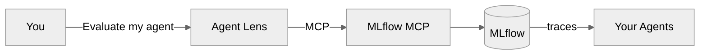

<p align="center">
  <h1 align="center">Agent Lens</h1>
  <p align="center">
    Trust your agents. Verify with evidence.
    <br /><br />
    <a href="https://rrbanda.github.io/agentlens/"><strong>Docs</strong></a> ·
    <a href="https://rrbanda.github.io/agentlens/docs/getting-started"><strong>Get Started</strong></a> ·
    <a href="https://rrbanda.github.io/agentlens/docs/frameworks"><strong>Frameworks</strong></a> ·
    <a href="https://rrbanda.github.io/agentlens/docs/skills"><strong>Skills</strong></a> ·
    <a href="CONTRIBUTING.md"><strong>Contributing</strong></a>
  </p>
</p>

<p align="center">
  <a href="https://github.com/rrbanda/agent-lens/blob/main/LICENSE"></a>
  <a href="https://www.python.org/downloads/"></a>
  
  
</p>

---

Agent Lens is a **conversational qualification layer for AI agents** built on the official [MLflow MCP](https://mlflow.org/docs/latest/genai/mcp/). Ask questions in plain English — get structured quality verdicts backed by evidence.

```
You:   "Evaluate my support-agent using the RAG profile"

Agent Lens:
  # Quality Qualification Report — support-agent
  | Scorer               | Pass rate | Verdict |
  |----------------------|-----------|---------|
  | RelevanceToQuery     | 95%       | PASS    |
  | RetrievalGroundedness| 87%       | PASS    |
  ### Verdict: QUALIFIED (200 traces, 1.2% error rate)
```

**Framework-agnostic.** Works with LangGraph, Google ADK, LangChain, CrewAI, OpenAI Agents SDK, AutoGen, LlamaIndex, or any custom agent. If MLflow can trace it, Agent Lens can qualify it.

---

## Quick start

```bash
git clone https://github.com/rrbanda/agent-lens.git && cd agent-lens

# Local development
make dev-setup && make mlflow-start && make seed-data
make test-integration

# Deploy to Kubernetes
DASH_PW=... API_KEY=... LLM_API_KEY=<your-key> make secret-openshell
make deploy-all
```

Point your agents at MLflow, then ask Agent Lens anything:

```
"Show me the last 20 traces for billing-agent"
"Give me a quality dashboard across all agents"
"Red-team the onboarding agent for prompt injection"
"Can this agent be deployed to production?"
```

Full setup guide: [Getting Started](https://rrbanda.github.io/agentlens/docs/getting-started)

---

## What it does

MLflow gives you traces and scorers. Agent Lens gives you **verdicts**.



| You ask | Agent Lens does |
|---------|----------------|
| "Evaluate outreach-agent" | Runs MLflow scorers, reports pass rates, returns QUALIFIED / NOT QUALIFIED |
| "Quality dashboard" | Scans all experiments, returns fleet health: HEALTHY / WARNING / CRITICAL |
| "What went wrong with this trace?" | Deep-dives into spans, inputs, outputs, and failure patterns |
| "Red-team for prompt injection" | Registers safety judges, evaluates traces, reports vulnerability rates |
| "Create a scorer for privacy policy" | Builds a custom LLM judge from your natural language criteria |
| "Export compliance report" | Exports qualification evidence as structured JSONL for auditors |

---

## 16 skills

Every capability is a `SKILL.md` file — a portable markdown prompt, not code.

| Skill | What it does |
|-------|-------------|
| **trace-explorer** | Search and drill into traces across experiments |
| **quality-dashboard** | Fleet-wide health overview (HEALTHY / WARNING / CRITICAL) |
| **analyze-session** | Multi-turn session analysis with failure identification |
| **review-trace** | Deep trace inspection with span tree and assessments |
| **create-regression** | Flag traces as regressions for follow-up |
| **evaluate-agent** | Run MLflow scorers and produce qualification verdicts |
| **compare-evaluations** | Side-by-side run comparison with trend analysis |
| **create-judge** | Build custom LLM judges from natural language criteria |
| **red-team** | Adversarial safety evaluation with attack-specific judges |
| **eval-loop** | Full evaluation-driven development cycle |
| **cost-quality** | Cost vs quality tradeoff analysis across models |
| **audit-trail** | Chronological qualification decision history |
| **agent-registry** | Fleet inventory with per-agent status |
| **executive-summary** | Board-ready health summary, no jargon |
| **compliance-export** | JSONL/CSV export for GRC tools |
| **aggregate-traces** | Error rates, latency percentiles, trends |

Full reference: [Skills docs](https://rrbanda.github.io/agentlens/docs/skills)

---

## Works with any agent framework

Agent Lens evaluates any agent that sends traces to MLflow.

| Framework | Instrumentation |
|-----------|-----------------|
| LangGraph | `mlflow.langchain.autolog()` |
| Google ADK | `mlflow.tracing.enable()` |
| LangChain | `mlflow.langchain.autolog()` |
| CrewAI | `mlflow.crewai.autolog()` |
| OpenAI Agents SDK | `mlflow.openai.autolog()` |
| AutoGen | `mlflow.autogen.autolog()` |
| LlamaIndex | `mlflow.llama_index.autolog()` |
| Custom Python | `@mlflow.trace` decorator |
| Any language | MLflow REST API |

**Zero-code option:** Drop one file into your agent's site-packages:

```bash
cp instrumentation/usercustomize.py $(python -m site --user-site)/
export MLFLOW_TRACKING_URI="https://your-mlflow:5000"
```

Full guide: [Supported Frameworks](https://rrbanda.github.io/agentlens/docs/frameworks)

---

## How it works

Agent Lens follows a five-phase loop on every interaction:

| Phase | What happens | MCP tools |
|-------|-------------|-----------|
| **Observe** | Discover experiments, traces | `search_experiments`, `search_traces`, `get_trace` |
| **Evaluate** | Score traces with GenAI judges | `evaluate_traces`, `list_scorers` |
| **Annotate** | Log feedback and expectations | `log_trace_feedback`, `set_trace_tag` |
| **Qualify** | PASS/FAIL against thresholds | Evaluation run metrics |
| **Follow up** | Tag failures for regression | `set_trace_tag`, `create_run` |

All 19 MLflow MCP tools, zero custom services. Skills are markdown, config is YAML, deploy is Kubernetes.

---

## Architecture

Agent Lens builds **no custom services**. Everything is a SKILL.md (prompt), a YAML config, or a K8s manifest.

| Layer | What it is | Portable? |
|-------|-----------|-----------|
| Skills (`agent-lens/skills/`) | Markdown prompt documents | Yes — works with any MCP agent |
| Soul (`agent-lens/soul.md`) | Agent identity and constraints | Yes |
| Config (`agent-lens/config.yaml`) | MCP URL + tool allowlist | Yes |
| Container + startup | Agent harness (ships with Hermes) | Swappable — replace for your runtime |
| K8s manifests | Deployment, service, route | Yes — any Kubernetes distribution |

The reference deployment ships with [Hermes](https://github.com/hermes-ai/hermes-agent) as the agent runtime. Skills are portable to any MCP-capable harness. See [Architecture](https://rrbanda.github.io/agentlens/docs/architecture).

---

## CI/CD quality gate

Use MLflow directly in your pipeline — Agent Lens defines the profiles, MLflow runs the evaluation:

```python
import mlflow
from mlflow.genai.scorers import Correctness

traces = mlflow.search_traces(experiment_names=["my-agent"], max_results=50)
results = mlflow.genai.evaluate(data=traces, scorers=[Correctness()])
pass_rate = results.metrics.get("correctness/mean", 0)
exit(0 if pass_rate >= 0.85 else 1)
```

---

## Contributing

```bash
make dev-setup   # Create .venv with dev dependencies
make test        # Run unit + integration tests
```

Skills reference only allowlisted `mcp_mlflow_*` tools. New MCP tools should be contributed **upstream** to MLflow.

See [CONTRIBUTING.md](CONTRIBUTING.md) · For AI coding agents: [AGENTS.md](AGENTS.md)

---

## Built with

- [MLflow](https://mlflow.org/) — GenAI evaluation, 20+ built-in scorers
- [MLflow MCP](https://mlflow.org/docs/latest/genai/mcp/) — 19 tools via Model Context Protocol
- Any OpenAI-compatible LLM (Gemini, OpenAI, Azure, Ollama, vLLM)
- [Kubernetes](https://kubernetes.io/) — tested on OpenShift, EKS, GKE

## License

Apache License 2.0 — see [LICENSE](LICENSE).
