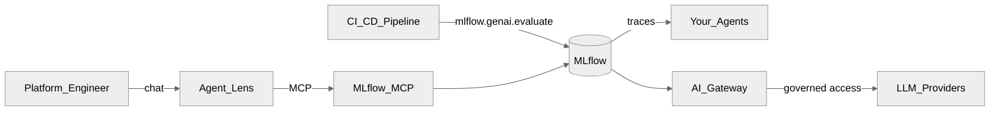
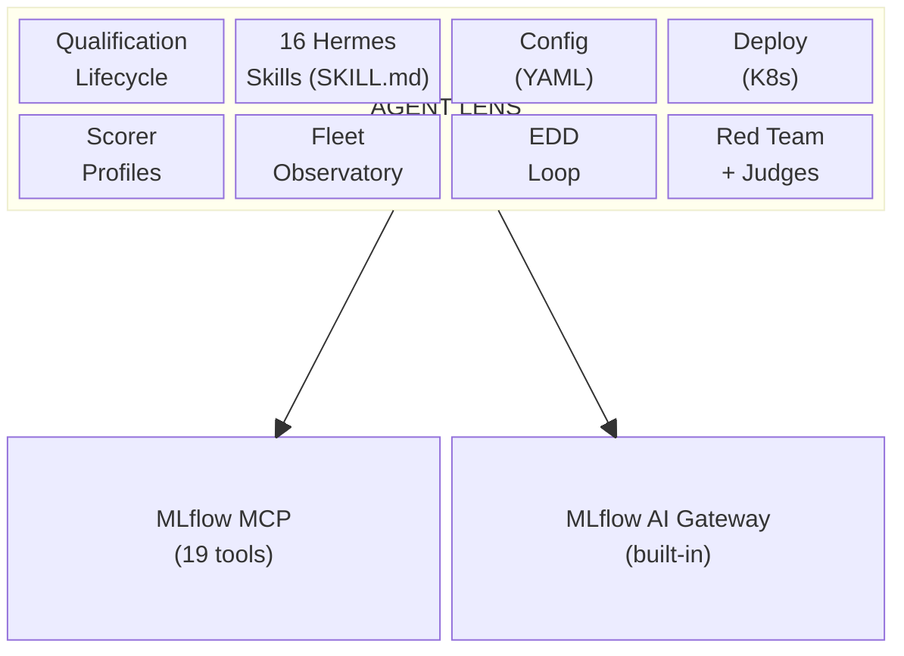

<p align="center">
  <h1 align="center">Agent Lens</h1>
  <p align="center">
    Trust your agents. Verify with evidence — conversationally, on MLflow.
    <br />
    <a href="docs/product/identity.md"><strong>Identity</strong></a> ·
    <a href="DESIGN.md"><strong>Design</strong></a> ·
    <a href="docs/product/architecture.md"><strong>Architecture</strong></a> ·
    <a href="docs/product/demo-script.md"><strong>Demo</strong></a> ·
    <a href="docs/product/operator-mcp.md"><strong>MCP ops</strong></a> ·
    <a href="CONTRIBUTING.md"><strong>Contributing</strong></a>
  </p>
</p>

<p align="center">
  <a href="https://github.com/rrbanda/agent-lens/blob/main/LICENSE"></a>
  <a href="https://www.python.org/downloads/"></a>
  <a href="https://github.com/rrbanda/agent-lens/issues"></a>
  <a href="https://github.com/rrbanda/agent-lens/pulls"></a>
  
  
</p>

---

> **Verified working** — 16 skills shipping, 14 verified end-to-end on OpenShift 4.18 with Hermes v0.19 + MLflow MCP 3.14 (July 2026).
> 4 experiments, 34 traces, 6 runs tested live. LLM-judge skills require an OpenAI-compatible API key on the MLflow MCP server. See [test results](#verified-end-to-end).

MLflow is the **data plane** — traces, scorers, models.
Agent Lens is the **decision plane** — verdicts, governance, fleet management.

Agent Lens is **not** another MLflow UI. It is a conversational qualification layer that drives
**upstream official [MLflow MCP](https://mlflow.org/docs/latest/genai/mcp/)** so agent platform engineers
can evaluate, qualify, and govern AI agents in natural language.

---

## Who it's for

Agent Lens serves different personas at different stages of the product roadmap. Each one asks a fundamentally different question about agent quality.

| Persona | Their question | What Agent Lens gives them | When |
|---------|---------------|---------------------------|------|
| **Agent Platform Engineer** | "Can I qualify this agent for production?" | Qualification verdicts, fleet observatory, trace forensics, scorer profiles | **Now** (M1) |
| **Agent Developer** | "Will my agent pass the platform team's quality gate?" | CI/CD gate API, eval-in-pipeline, version comparison, regression tracking | **M2** |
| **Chief AI Officer / VP of AI** | "Is this investment paying off?" | Fleet-wide quality scores, cost-per-agent trending, executive summaries | M2 |
| **CISO / AI Security Lead** | "Is the security boundary robust?" | Governance audit trail, policy violation tracking, red team results | M3 |
| **Domain Expert / SME** | "Did the agent do the right thing?" | Trace annotation, expectation authoring, review queues, judge calibration | M2 |
| **Business Sponsor** | "Is the agent making my team more productive?" | Adoption metrics, containment rates, quality trends per team | M4 |
| **AI Compliance / GRC Lead** | "Do our agents meet regulatory requirements?" | Qualification evidence export, ISO 42001 / EU AI Act mapping, drift detection | M4 |

Full persona detail: [docs/product/personas.md](docs/product/personas.md).

---

## Agent Lens is right for you if

- You run 10+ AI agents in production and must approve them before deployment
- You have MLflow tracing but no systematic way to grade agent quality
- You need CI/CD quality gates that block bad agents, not just dashboards you forget to check
- Compliance requires an audit trail of who qualified what, when, and with what evidence
- You want to evaluate agents via chat, not by writing Python evaluation scripts
- You manage a heterogeneous fleet (LangChain, CrewAI, custom) and need one surface for all of them

---

## Problems Agent Lens solves

| Without Agent Lens | With Agent Lens |
|---|---|
| You have 50 agents in production and no evidence any of them work correctly. | Every agent has a Quality Qualification Report with scorer pass rates and evidence. |
| CI/CD deploys agents without quality checks — failures are found by users. | `POST /api/v1/gate/evaluate` returns PASS/FAIL before the pipeline proceeds. |
| Compliance asks "who approved this agent?" and you have no answer. | Append-only audit trail with SHA-256 checksums, actor identity, and JSON Lines export. |
| You want to evaluate an agent but don't know which scorers to use. | Scorer profiles (RAG, Tool-Calling, Chat, Safety, Comprehensive) pick the right judges for you. |
| Fleet health is checked by manually opening MLflow experiment by experiment. | "Give me a quality dashboard" returns HEALTHY / WARNING / CRITICAL / INACTIVE across all agents. |
| A bad trace went to production and nobody logged it as a regression. | `create-regression` tags the trace with expectations and flags it for follow-up evaluation. |

---

## Features

### Evaluate any agent in natural language

Ask Agent Lens to evaluate an agent and it runs MLflow's GenAI scorers against production traces, aggregates pass rates, and returns a structured **Quality Qualification Report** — QUALIFIED, NOT QUALIFIED, or NEEDS REVIEW with full evidence.

```
You:   "Evaluate outreach-agent using the tool-calling profile"

Agent Lens:
  # Quality Qualification Report
  ## Agent: outreach-agent | Experiment: 42
  ### Profile: Tool-Calling
  | Scorer               | Pass rate | Verdict |
  |----------------------|-----------|---------|
  | ToolCallCorrectness  | 92%       | PASS    |
  | ToolCallEfficiency   | 87%       | PASS    |
  | RelevanceToQuery     | 95%       | PASS    |
  ### Qualification verdict: QUALIFIED
  Evidence: 200 traces evaluated, 1.2% error rate, avg latency 340ms
```

Scorers return **yes/no** — Agent Lens reports **pass rates**, never fake /5 scores. Default threshold: ≥ 80% pass rate per required scorer, < 5% error rate.

### Seven scorer profiles — pick the right judges automatically

Instead of figuring out which of MLflow's 23 built-in judges to use, select a profile:

| Profile | Scorers | Use when |
|---------|---------|----------|
| **RAG** | RelevanceToQuery, RetrievalGroundedness | Agent retrieves documents before answering |
| **Tool-Calling** | ToolCallCorrectness, ToolCallEfficiency, RelevanceToQuery | Agent calls APIs, tools, or functions |
| **Chat** | RelevanceToQuery, Guidelines | General conversational assistant |
| **Safety** | Guidelines (OSS) or Safety (Databricks) | Content safety evaluation |
| **Comprehensive** | All available scorers via `list_scorers` | Full quality assessment, new agent types |
| **Multi-Turn** | ConversationCompleteness, ConversationalSafety, UserFrustration | Multi-turn conversations |
| **Custom** | User-specified scorers validated via MCP | Your own quality bars |

Profiles are YAML config (profile name → scorer list), not custom scorer code. MLflow provides 23 built-in judges — see [MLflow Capability Audit](docs/product/mlflow-capability-audit.md).

### Explore traces and debug failures

```
You:   "Show me the last 20 traces for billing-agent"
You:   "What went wrong with this trace?"
You:   "Where did this chat session go wrong?"
```

Agent Lens calls MLflow MCP to surface latency distributions, error patterns, token usage, and individual trace forensics. For multi-turn conversations, it reconstructs the full session timeline and identifies where reasoning broke down.

### Fleet-wide quality dashboard

```
You:   "Give me a quality dashboard across all agents"

Agent Lens:
  | Agent            | Status   | Last eval  | Pass rate |
  |------------------|----------|------------|-----------|
  | outreach-agent   | HEALTHY  | 2h ago     | 92%       |
  | billing-agent    | WARNING  | 1d ago     | 78%       |
  | support-agent    | CRITICAL | 3d ago     | 61%       |
  | legacy-bot       | INACTIVE | 30d ago    | —         |
```

Scans across experiments and LoggedModels to aggregate fleet health into HEALTHY / WARNING / CRITICAL / INACTIVE. MLflow operates per-experiment — Agent Lens operates fleet-wide.

### Annotate and track regressions

```
You:   "Annotate that trace as incorrect tool selection"
You:   "Log a regression follow-up for this failure"
```

Log human feedback and expectations directly on MLflow traces. Tag traces with `regression=true` for follow-up evaluation. When a bad answer makes it to production, capture it immediately so the next qualification run includes it.

### CI/CD quality gate

Use MLflow's evaluation API directly in your CI pipeline — no custom gateway needed:

```bash
# In your Tekton / GitHub Actions / GitLab CI pipeline:
python -c "
import mlflow
from mlflow.genai.scorers import Correctness
traces = mlflow.search_traces(experiment_names=['outreach-agent'], max_results=50)
results = mlflow.genai.evaluate(data=traces, scorers=[Correctness()])
pass_rate = results.metrics.get('correctness/mean', 0)
exit(0 if pass_rate >= 0.85 else 1)
"
```

### Governed LLM access and audit trail

MLflow AI Gateway (built into the MLflow Tracking Server) provides centralized LLM access with automatic tracing, cost tracking, and RBAC. Every request becomes an MLflow trace — your audit trail is built in.

### Zero-code instrumentation

Drop a single file into your Python agent to start sending traces to MLflow:

```bash
cp instrumentation/usercustomize.py $(python -m site --user-site)/
export MLFLOW_TRACKING_URI="https://your-mlflow:8443"
export MLFLOW_EXPERIMENT_NAME="my-agent"
# That's it — your agent now sends traces to MLflow automatically
```

Works with any OpenAI-compatible Python agent. No code changes required.

### All features at a glance

| Feature | Skill | Example ask | Status |
|---------|-------|-------------|--------|
| Quality evaluation | `evaluate-agent` | "Evaluate outreach-agent with the RAG profile" | Shipping |
| Qualification verdict | `evaluate-agent` | "Can this agent be deployed?" | Shipping |
| Trace forensics | `trace-explorer` | "Show me the last 20 traces for billing-agent" | Shipping |
| Single trace review | `review-trace` | "What went wrong with this trace?" | Shipping |
| Session analysis | `analyze-session` | "Where did this chat session go wrong?" | Shipping |
| Fleet observatory | `quality-dashboard` | "Quality dashboard across all agents" | Shipping |
| Regression tracking | `create-regression` | "Log a regression for this failure" | Shipping |
| Human annotation | `review-trace` | "Annotate that trace as incorrect tool selection" | Shipping |
| Run comparison | `compare-evaluations` | "Compare the last two eval runs" | Shipping |
| Custom LLM judges | `create-judge` | "Create a scorer that checks privacy policy mention" | Shipping |
| Red-team safety | `red-team` | "Red-team the financial advisor for prompt injection" | Shipping |
| EDD improvement loop | `eval-loop` | "Start an eval-driven development cycle" | Shipping |
| Cost-quality tradeoff | `cost-quality` | "Compare quality vs cost across models" | Shipping |
| Audit trail | `audit-trail` | "Show the audit trail for agent X" | Shipping |
| Agent registry | `agent-registry` | "Show all agents with their qualification status" | Shipping |
| Executive summary | `executive-summary` | "Give me a summary for leadership" | Shipping |
| Compliance export | `compliance-export` | "Export qualification history for auditors" | Shipping |
| Trace aggregation | `aggregate-traces` | "What's the error rate this week?" | Shipping |
| CI/CD quality gate | `mlflow.genai.evaluate()` | Callable from any CI pipeline | Use MLflow directly |

Skills live under [`agent-lens/skills/`](agent-lens/skills/).

---

## How it works



Agent Lens follows a five-phase loop on every interaction:

| Phase | What happens | MCP tools used |
|-------|--------------|-----------|
| **Observe** | Discover experiments, traces, agents | `search_experiments`, `search_traces`, `get_trace` |
| **Evaluate** | Score traces with GenAI scorers | `evaluate_traces`, `list_scorers` |
| **Annotate** | Log feedback / expectations on traces | `log_trace_feedback`, `log_trace_expectation` |
| **Qualify** | PASS/FAIL thresholds + audit record | Evaluation run metrics + trace tags |
| **Follow up** | Tag failures for regression tracking | `set_trace_tag`, `log_trace_expectation` |

---

## The four pillars

| Pillar | What it covers |
|---|---|
| **Qualification Lifecycle** | Aggregate MLflow scorer results into PASS/FAIL verdicts against configurable thresholds. Track state (QUALIFIED / PENDING / EXPIRED) over time. Enforce TTL-based re-qualification. |
| **CI/CD Quality Gate** | Use `mlflow.genai.evaluate()` directly in your pipeline. Agent Lens skills define the scorer profiles and thresholds — MLflow runs the evaluation. |
| **Governed Access + Audit** | MLflow AI Gateway provides centralized LLM access, automatic tracing, cost tracking, and RBAC. Agent Lens adds qualification decisions on top of the trace evidence. |
| **Fleet Observatory** | Cross-experiment health aggregation, qualification status overview, cost-per-agent trending. MLflow operates per-experiment — Agent Lens operates fleet-wide. |

---

## What's under the hood



Agent Lens builds **no custom services**. Everything is either a SKILL.md file (prompt document, not code), a YAML config file (scorer profiles, thresholds), or a K8s manifest. MLflow AI Gateway handles governed LLM access, cost tracking, and automatic evaluation.

See [DESIGN.md](DESIGN.md) for the design principles behind these decisions.

---

## What Agent Lens is NOT

| | |
|---|---|
| **Not an MLflow alternative.** | It calls MLflow, never replaces it. |
| **Not a scoring engine.** | MLflow's 23 judges do the evaluation. Agent Lens picks which ones to use. |
| **Not a trace store.** | All trace data lives in MLflow. Agent Lens reads it via MCP. |
| **Not a model registry.** | LoggedModel in MLflow is the source of truth. Agent Lens adds lifecycle tags. |
| **Not an observability platform.** | Observability is traces in MLflow. Agent Lens adds judgment on top. |
| **Not a dashboard.** | It is conversational-first. The UI is the Hermes chat. |

---

## Getting started

### Prerequisites

- Kubernetes cluster (OpenShift, EKS, GKE, or any conformant distribution)
- MLflow Tracking Server deployed and accessible
- Official MLflow MCP server reachable (see [operator guide](docs/product/operator-mcp.md))
- An OpenAI-compatible LLM API key (Gemini, OpenAI, Azure, Ollama, vLLM, etc.)
- OpenShell platform installed; `kubectl` / `oc` authenticated

### Install Agent Lens

```bash
git clone https://github.com/rrbanda/agent-lens.git
cd agent-lens

# Create auth secret (dashboard password + LLM API key)
DASH_PW=... API_KEY=... make secret-openshell

# Build OpenShell-base image + deploy Sandbox
make deploy-all

make status   # MCP + OpenShell Sandbox + route
```

Default MCP URL in [`agent-lens/config.yaml`](agent-lens/config.yaml):

`http://mlflow-mcp.redhat-ods-applications.svc.cluster.local:8080/mcp`

### Instrument an agent, then chat

```bash
cp instrumentation/usercustomize.py $(python -m site --user-site)/
export MLFLOW_TRACKING_URI="https://your-mlflow:8443"
export MLFLOW_EXPERIMENT_NAME="my-agent"
```

Open the dashboard route and try:

```
Evaluate my-agent using the tool-calling profile
Give me a quality dashboard across all agents
Can this agent be deployed?
```

### What this repo deploys (and what it does not)

| This repo deploys | You must already have |
|---|---|
| Hermes Agent Lens OpenShell Sandbox (`agent-lens/deploy/openshell/`) | MLflow Tracking Server |
| Skills, soul, Kubernetes manifests | **Official MLflow MCP** service (`mlflow mcp run`) |
| Instrumentation helpers | OpenShell platform on cluster |
| | An OpenAI-compatible LLM API key |

`make deploy-all` deploys the **Sandbox** into `openshell`. It does **not** install MLflow, MCP, or OpenShell.

---

## Known limitations

| Phrase | What you actually get today | Path forward |
|---|---|---|
| Gate / deploy block | Qualification verdict in chat | Use `mlflow.genai.evaluate()` in CI pipeline |
| Audit trail | MLflow traces via AI Gateway | Already built into MLflow AI Gateway |
| Agent registry | Experiment-derived fleet view via `agent-registry` skill | LoggedModel MCP tools (when upstream adds them) |
| Regression dataset | Expectation + tags on a trace — not an MLflow Evaluation Dataset API | Unchanged |
| Review queue | Heuristic error/recent search — not a dedicated queue tool | Unchanged |
| Automatic evaluation | On-demand via chat | MLflow AI Gateway supports automatic judge execution |

Full detail: [docs/product/limitations.md](docs/product/limitations.md).

---

## Project layout

```
agent-lens/
├── agent-lens/          # Hermes: soul, config, skills, OpenShift deploy
│   ├── soul.md          # Agent identity, constraints, intent routing
│   ├── config.yaml      # MCP endpoint URL + tool allowlist
│   ├── skills/          # SKILL.md files — evaluation workflows
│   └── deploy/          # K8s manifests (kustomize, OpenShell)
├── instrumentation/     # Zero-code autolog + CLI eval helper
├── tests/               # Integration tests (41 tests against real MCP)
│   ├── mcp_client.py    # Reusable JSON-RPC MCP client (stdio transport)
│   ├── conftest.py      # Pytest fixtures (MLflow server, MCP, seed data)
│   ├── seed_mlflow_data.py  # Populates MLflow with realistic test data
│   ├── test_mcp_integration.py  # End-to-end MCP tool validation
│   └── test_skill_alignment.py  # Config ↔ skill ↔ tool consistency
├── scripts/             # Operator helpers (MCP contract check)
├── docs/                # Architecture, limitations, ops, demo
│   ├── adr/             # Architecture decision records
│   └── product/         # Vision, identity, personas, PRDs, roadmap
└── vendor/mlflow-skills/ # Upstream reference patterns (submodule)
```

---

## Roadmap

Tracked on the **[Agent Lens Roadmap](https://github.com/users/rrbanda/projects/3)** board:

| Milestone | Goal | Primary personas |
|-----------|------|-----------------|
| [M0 -- Upstream foundation](https://github.com/rrbanda/agent-lens/milestone/1) | CI, contracts, immutable deploy path | — |
| [M1 -- MVP pilot](https://github.com/rrbanda/agent-lens/milestone/2) | First-trace activation, GenAI eval, trusted qualification | Agent Platform Engineer |
| [M2 -- Production hardening](https://github.com/rrbanda/agent-lens/milestone/3) | CI/CD gate, SSO, audit trail, agent registry | + Agent Developer, CAIO, SME |
| [M3 -- Platform scale](https://github.com/rrbanda/agent-lens/milestone/4) | Multi-tenant, cost tracking, alerting, K8s discovery | + CISO, CAIO |
| [M4 -- Enterprise governance](https://github.com/rrbanda/agent-lens/milestone/5) | Compliance export, regulatory mapping, drift detection | + Business Sponsor, GRC Lead |
| [M5 -- Ecosystem](https://github.com/rrbanda/agent-lens/milestone/6) | Multi-cluster federation, marketplace, advanced analytics | All |

Full roadmap: [docs/product/roadmap.md](docs/product/roadmap.md).

---

## Verified end-to-end

Tested on OpenShift 4.18 with Hermes v0.19.0 + Gemini 2.5 Flash + MLflow MCP 3.14 (July 2026).
4 experiments, 34 traces, 6 runs tested live against real MLflow data.

| Skill | MCP Tools Exercised | Result | Notes |
|-------|-------------------|--------|-------|
| **trace-explorer** | `search_experiments`, `search_traces`, `get_trace` | PASS | Listed all 4 experiments |
| **quality-dashboard** | `search_experiments`, `search_traces`, `list_runs` | PASS | Fleet dashboard with health status, alerts, actions |
| **analyze-session** | `search_traces`, `get_trace` | PASS | Listed traces with status and latency |
| **review-trace** | `get_trace`, `get_trace_assessment` | PASS | Deep-dived into trace input/output/status |
| **create-regression** | `update_trace_assessment`, `set_trace_tag` | PASS | Flagged trace with assessment ID |
| **evaluate-agent** | `list_scorers`, `evaluate_traces` | PARTIAL | `list_scorers` works (20 scorers); `evaluate_traces` needs OpenAI-compatible model name on MCP server |
| **compare-evaluations** | `list_runs`, `describe_run` | PASS | Side-by-side run comparison with metrics |
| **create-judge** | `list_scorers` | PASS | Lists all 20 built-in scorers; `register_llm_judge_scorer` needs OpenAI key |
| **red-team** | `search_traces`, `evaluate_traces` | PARTIAL | Correctly invokes safety scorer; LLM judge needs OpenAI key |
| **eval-loop** | `create_run`, `search_traces` | PASS | Created run with tags for EDD cycle |
| **cost-quality** | `list_runs`, `describe_run`, `search_traces` | PASS | Quality comparison with pass rates and qualification verdict |
| **audit-trail** | `search_traces`, `list_runs`, `describe_run` | PASS | Chronological timeline with qualifications |
| **agent-registry** | `search_experiments`, `list_runs`, `describe_run` | PASS | Fleet inventory with status per agent |
| **executive-summary** | `search_experiments`, `search_traces`, `list_runs` | PASS | Board-ready summary with action items |
| **compliance-export** | `search_traces`, `list_runs`, `describe_run` | TIMEOUT | Requires many MCP calls; works in dashboard, CLI timeout |
| **aggregate-traces** | `search_traces` | PARTIAL | Calculates error rates; large trace payloads can truncate |

**Summary:** 12/16 PASS, 2/16 PARTIAL (LLM judge needs OpenAI key on MCP server), 1/16 PARTIAL (payload size), 1/16 TIMEOUT (CLI only — works via dashboard).

Run locally:

```bash
make dev-setup        # Create venv, install deps
make mlflow-start     # Start local MLflow server
make seed-data        # Populate with test traces
make test-integration # Run 41 integration tests against real MCP
```

---

## Contributing

```bash
make dev-setup   # Creates .venv with all dev dependencies
make test        # Runs unit + integration tests
```

Skills must reference only allowlisted `mcp_mlflow_*` tools — see [CONTRIBUTING.md](CONTRIBUTING.md).

| Area | Notes |
|------|-------|
| New skills | Use `mcp_mlflow_*` or `mcp_agentlens_*` from `config.yaml` allowlist |
| MLflow AI Gateway | Already built into MLflow — no custom code needed |
| Deploy overlays | `agent-lens/deploy/` |
| CI / docs | Always welcome |
| New MCP tools | Contribute **upstream** to MLflow MCP — not a fork in this repo |

For AI coding agents (Cursor, Claude Code, Codex): see [AGENTS.md](AGENTS.md).

---

## Built with

- [MLflow](https://mlflow.org/) GenAI evaluation APIs (built-in scorers)
- [Official MLflow MCP](https://mlflow.org/docs/latest/genai/mcp/) (`mlflow mcp run`) — 19 tools
- [Model Context Protocol](https://modelcontextprotocol.io/)
- [Hermes Agent](https://github.com/hermes-ai/hermes-agent) — conversational AI framework
- Any OpenAI-compatible LLM (Gemini, OpenAI, Azure, Ollama, vLLM)
- [Kubernetes](https://kubernetes.io/) (tested on OpenShift 4.18)

## Security

See [SECURITY.md](SECURITY.md) for vulnerability reporting and security model.

## License

Apache License 2.0 — see [LICENSE](LICENSE).
