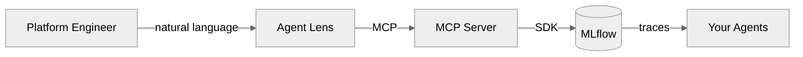
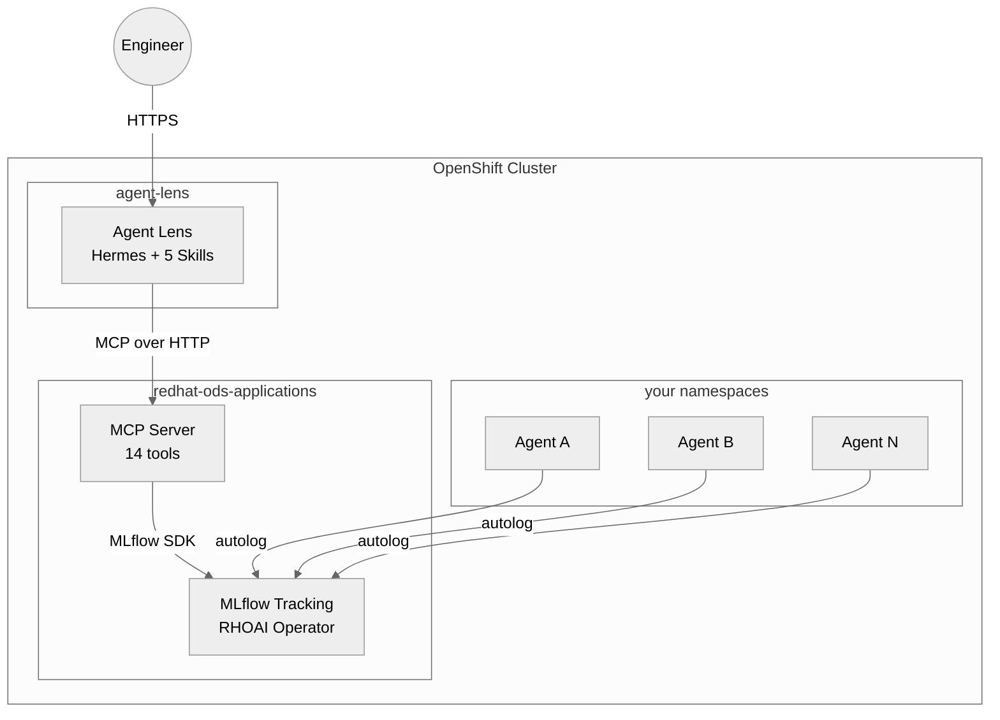

<p align="center">
  <h1 align="center">Agent Lens</h1>
  <p align="center">
    Evaluate, annotate, and gate AI agents you didn't build.
    <br />
    <a href="docs/architecture.md"><strong>Architecture</strong></a> · <a href="docs/demo-script.md"><strong>Demo</strong></a> · <a href="#contributing"><strong>Contributing</strong></a> · <a href="https://github.com/rrbanda/agent-lens/issues"><strong>Issues</strong></a>
  </p>
</p>

<p align="center">
  <a href="https://github.com/rrbanda/agent-lens/blob/main/LICENSE"></a>
  <a href="https://www.python.org/downloads/"></a>
  <a href="https://github.com/rrbanda/agent-lens/issues"></a>
  <a href="https://github.com/rrbanda/agent-lens/pulls"></a>
</p>

---

## What is Agent Lens?

Agent Lens is an **evaluation platform for AI agents** — designed for platform teams who manage agents they didn't build. It wraps [MLflow's GenAI evaluation APIs](https://mlflow.org/docs/latest/genai/eval-monitor/) in a conversational interface powered by the [Model Context Protocol](https://modelcontextprotocol.io/).

Instead of building custom scoring pipelines, you talk to Agent Lens:

```
You:          "Evaluate the outreach agent"
Agent Lens:   Runs mlflow.genai.evaluate() on 50 production traces...

              ┌────────────────┬───────┬────────┐
              │ Dimension      │ Score │ Rating │
              ├────────────────┼───────┼────────┤
              │ Relevance      │ 4.2/5 │ PASS   │
              │ Tool Correct.  │ 3.1/5 │ FAIL   │
              └────────────────┴───────┴────────┘
              Recommendation: Block deploy — tool calls failing on date parsing
```

## Why Agent Lens?

- **Evaluation, not just observability** — scores agent quality with MLflow's battle-tested scorers, not just logs what happened
- **Conversational interface** — no dashboards to click through, ask questions in natural language
- **Closed feedback loop** — observe → evaluate → annotate → gate → improve, all in one tool
- **Zero-code instrumentation** — add tracing to any agent with one file copy
- **Production-grade** — TLS, RBAC, NetworkPolicies, secrets management, health probes
- **Extensible** — add custom scorers, skills, and evaluation datasets

## How It Works



The system runs a continuous **AgentOps loop**:

| Phase | What Happens | MCP Tool |
|-------|-------------|----------|
| **Observe** | Agents generate traces via MLflow autolog | `search_traces` |
| **Evaluate** | Scorers grade production traces | `run_evaluation` |
| **Annotate** | Humans flag bad responses | `annotate_trace` |
| **Gate** | CI/CD gets PASS/FAIL signal | `check_quality_gate` |
| **Improve** | Failures become regression tests | `create_test_case` |

## Getting Started

### Prerequisites

- OpenShift cluster with [RHOAI](https://www.redhat.com/en/technologies/cloud-computing/openshift/openshift-ai) 3.4+ and MLflow operator
- `oc` CLI authenticated to your cluster
- Gemini API key (or any OpenAI-compatible LLM)

### Install

```bash
git clone https://github.com/rrbanda/agent-lens.git
cd agent-lens
cp .env.example .env   # add your API key and cluster details
make deploy-all
```

### Instrument Your First Agent

```bash
cp instrumentation/usercustomize.py $(python -m site --user-site)/
export MLFLOW_TRACKING_URI="https://your-mlflow:8443"
export MLFLOW_EXPERIMENT_NAME="my-agent"
# That's it — all LLM calls are now traced
```

### Run an Evaluation

Open the Agent Lens dashboard and type:

```
Evaluate my-agent using the tool-calling profile
```

See the [demo script](docs/demo-script.md) for a full walkthrough.

## Scorer Profiles

Pre-configured evaluation dimensions per agent type:

| Profile | Scorers | Use When |
|---------|---------|----------|
| **RAG** | RelevanceToQuery, RetrievalGroundedness | Agent retrieves documents |
| **Tool-Calling** | ToolCallCorrectness, ToolCallEfficiency, Relevance | Agent calls APIs/tools |
| **Chat** | RelevanceToQuery, Guidelines | Conversational assistant |
| **Custom** | Any `Guidelines` string you provide | Your own quality bars |

## Architecture



See [docs/architecture.md](docs/architecture.md) for the full design, security model, and deployment topology.

## Project Layout

```
agent-lens/
├── mcp-server/           # MLflow evaluation tools exposed via MCP
│   ├── entrypoint.py     # 14 tools: evaluate, annotate, gate, datasets, health summary
│   ├── Containerfile     # Production image build
│   └── deploy/           # K8s manifests, NetworkPolicy, RBAC
├── analyst-agent/        # Conversational evaluation agent
│   ├── soul.md           # Agent identity and constraints
│   ├── config.yaml       # MCP connections, LLM provider
│   ├── skills/           # 5 evaluation methodologies
│   └── deploy/           # K8s manifests, secrets, probes
├── instrumentation/      # Zero-code agent tracing
├── tests/                # Unit + skill alignment tests
├── vendor/mlflow-skills/ # Upstream evaluation patterns (submodule)
└── docs/                 # Architecture, demo script
```

## Contributing

We welcome contributions of all kinds — new scorers, skills, deployment targets, documentation, and bug fixes.

### Quick Start for Contributors

```bash
# Fork and clone
git clone https://github.com/<you>/agent-lens.git
cd agent-lens

# Install dependencies
python -m venv .venv && source .venv/bin/activate
pip install -r mcp-server/requirements.txt
pip install pytest

# Run tests
pytest

# Run the skill alignment check (ensures skills reference valid tools)
pytest tests/test_skill_alignment.py -v
```

### Ways to Contribute

| Area | Description | Good First Issue? |
|------|-------------|:-:|
| **New scorers** | Add scorers to `entrypoint.py` scorer_map | Yes |
| **New skills** | Write a `SKILL.md` methodology for the agent | Yes |
| **Deployment targets** | Kustomize overlays for EKS, GKE, vanilla K8s | Yes |
| **MCP tools** | Add tools like `compare_runs`, `get_metric_history` | No |
| **CI pipeline** | GitHub Actions for lint, test, image build | Yes |
| **Documentation** | Improve architecture docs, add tutorials | Yes |

### Development Guidelines

1. **Skills must reference real tools** — run `pytest tests/test_skill_alignment.py` before submitting
2. **No credentials in code** — use K8s Secrets; see `deploy/secret-auth.yaml` for the pattern
3. **Test your changes** — add cases to `tests/test_mcp_tools.py` for new MCP tools
4. **Keep diagrams as Mermaid** — inline in markdown, `neutral` theme, no external images

### Submitting Changes

1. Fork the repository
2. Create a feature branch (`git checkout -b feature/my-scorer`)
3. Commit your changes with a descriptive message
4. Push to your fork and open a Pull Request
5. Describe what your change does and why

### Reporting Issues

Found a bug or have a feature request? [Open an issue](https://github.com/rrbanda/agent-lens/issues/new) with:
- What you expected vs. what happened
- Steps to reproduce (if a bug)
- Your environment (OpenShift version, RHOAI version, Python version)

## Roadmap

Work is tracked on the **[Agent Lens Roadmap](https://github.com/users/rrbanda/projects/3)** project board and these milestones:

| Milestone | Goal |
|-----------|------|
| [M0 — Upstream foundation](https://github.com/rrbanda/agent-lens/milestone/1) | CI, templates, contracts, immutable deploy path |
| [M1 — MVP pilot](https://github.com/rrbanda/agent-lens/milestone/2) | First-trace activation, GenAI-only eval, trusted gate, regression loop |
| [M2 — Production hardening](https://github.com/rrbanda/agent-lens/milestone/3) | SSO, CI gate webhook, audit, overlays, Prometheus |
| [M3 — Platform scale](https://github.com/rrbanda/agent-lens/milestone/4) | Multi-tenant, custom scorers, Grafana, session skill |

### How we track work

- Every change should have a GitHub issue
- Priority labels: `P0` (current milestone must), `P1`, `P2`
- Area labels: `area:mcp`, `area:hermes`, `area:instrumentation`, `area:deploy`, `area:ci`, `area:docs`, `area:security`
- Good starter tasks: [`good first issue`](https://github.com/rrbanda/agent-lens/issues?q=is%3Aissue+is%3Aopen+label%3A%22good+first+issue%22)

## Built With

- [MLflow](https://mlflow.org/) — `genai.evaluate()`, `log_feedback()`, datasets, scorers
- [Model Context Protocol](https://modelcontextprotocol.io/) — Tool integration standard
- [FastMCP](https://github.com/jlowin/fastmcp) — Python MCP server framework
- [Hermes Agent](https://github.com/hermes-ai/hermes-agent) — Multi-skill agent runtime
- [Red Hat OpenShift AI](https://www.redhat.com/en/technologies/cloud-computing/openshift/openshift-ai) — Platform

## License

Apache License 2.0 — see [LICENSE](LICENSE) for details.
