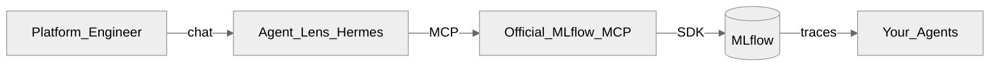
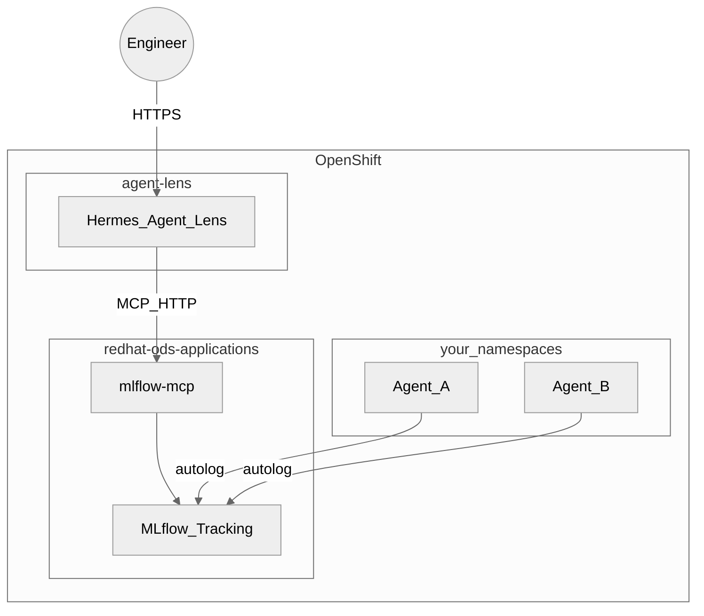

<p align="center">
  <h1 align="center">Agent Lens</h1>
  <p align="center">
    Certify AI agents you didn't build — conversationally, on MLflow.
    <br />
    <a href="docs/architecture.md"><strong>Architecture</strong></a> ·
    <a href="docs/limitations.md"><strong>Limitations</strong></a> ·
    <a href="docs/demo-script.md"><strong>Demo</strong></a> ·
    <a href="docs/operator-mcp.md"><strong>MCP ops</strong></a> ·
    <a href="#contributing"><strong>Contributing</strong></a>
  </p>
</p>

<p align="center">
  <a href="https://github.com/rrbanda/agent-lens/blob/main/LICENSE"></a>
  <a href="https://www.python.org/downloads/"></a>
  <a href="https://github.com/rrbanda/agent-lens/issues"></a>
  <a href="https://github.com/rrbanda/agent-lens/pulls"></a>
</p>

---

## Who this is for

**ICP:** OpenShift AI / RHOAI **platform engineers** who must approve agents they did not author.

**Job to be done:** *When an app team wants to ship an agent, I need evidence of quality (and a clear no-ship when it fails) without building a custom eval pipeline.*

Agent Lens is **not** another MLflow UI. It is a Hermes chat layer that drives **upstream official [MLflow MCP](https://mlflow.org/docs/latest/genai/mcp/)** so you can observe, evaluate, and annotate in natural language.

## Success moment

You are done with first-value when, in one session:

1. An instrumented agent has produced traces in MLflow ([first-trace guide](docs/first-trace.md))
2. Agent Lens returns a **Quality Certification Report** for that experiment
3. A **fleet Observatory** row is not all INACTIVE ([demo script](docs/demo-script.md))

## What this repo installs (and what it does not)

| This repo deploys | You must already have |
|-------------------|------------------------|
| Hermes Agent Lens (`agent-lens/`) | MLflow on RHOAI |
| Skills, soul, OpenShift manifests | **Official MLflow MCP** service `mlflow-mcp` (`mlflow mcp run`) |
| Instrumentation helpers | Gemini (or compatible) API key |

`make deploy-all` deploys **Agent Lens only**. It does **not** install MLflow or MCP. See [docs/operator-mcp.md](docs/operator-mcp.md).

## Why Agent Lens?

- **Evaluation, not just observability** — scorers on production traces, not only logs
- **Official MLflow MCP only** — no custom FastMCP fork in this product
- **Conversational AgentOps** — observe → evaluate → annotate → certify → follow up
- **Zero-code tracing** for OpenAI-compatible Python agents (`instrumentation/usercustomize.py`)

## Known limitations (read this)

After the official-MCP-only decision, some words in older decks are **skill-side**, not platform APIs:

| Phrase | What you actually get today |
|--------|-----------------------------|
| Gate / deploy block | Certification verdict in chat — **not** a CI webhook ([#18](https://github.com/rrbanda/agent-lens/issues/18)) |
| Regression dataset | Expectation + tags on a trace — **not** an MLflow Evaluation Dataset API |
| Review queue | Heuristic error/recent search — **not** a dedicated queue tool |
| Fleet health | Multi-call MCP aggregation — **not** a single server summary tool |

Full detail: [docs/limitations.md](docs/limitations.md).

## How it works



| Phase | What happens | Official MCP tools |
|-------|--------------|-------------------|
| **Observe** | Discover experiments and traces | `search_experiments`, `search_traces`, `get_trace` |
| **Evaluate** | Score traces with GenAI scorers | `evaluate_traces`, `list_scorers` |
| **Annotate** | Log feedback / expectations | `log_trace_feedback`, `log_trace_expectation` |
| **Certify** | PASS/FAIL thresholds in the skill report | (skill logic on MCP results) |
| **Follow up** | Tag failures for regression tracking | `set_trace_tag`, `log_trace_expectation` |

## Getting started

### Prerequisites

- OpenShift + [RHOAI](https://www.redhat.com/en/technologies/cloud-computing/openshift/openshift-ai) with MLflow
- Official MLflow MCP reachable as `mlflow-mcp` (see [operator guide](docs/operator-mcp.md))
- `oc` authenticated; Gemini API key

### Install Agent Lens

```bash
git clone https://github.com/rrbanda/agent-lens.git
cd agent-lens
cp .env.example .env

# Creates LLM + dashboard/API secrets interactively, then deploys Hermes
make deploy-all

make status   # MCP + Agent Lens + route
```

Default MCP URL in [`agent-lens/config.yaml`](agent-lens/config.yaml):

`http://mlflow-mcp.redhat-ods-applications.svc.cluster.local:8080/mcp`

### Instrument an agent, then chat

```bash
# See docs/first-trace.md — OpenAI-compatible Python agents
cp instrumentation/usercustomize.py $(python -m site --user-site)/
export MLFLOW_TRACKING_URI="https://your-mlflow:8443"
export MLFLOW_EXPERIMENT_NAME="my-agent"
```

Open the dashboard route and try:

```
Evaluate my-agent using the tool-calling profile
Give me a quality dashboard across all agents
```

## Scorer profiles

| Profile | Scorers | Use when |
|---------|---------|----------|
| **RAG** | RelevanceToQuery, RetrievalGroundedness | Retrieves documents |
| **Tool-Calling** | ToolCallCorrectness, ToolCallEfficiency, Relevance | Calls APIs/tools |
| **Chat** | RelevanceToQuery, Guidelines | Conversational assistant |
| **Custom** | Guidelines / available scorers via MCP | Your quality bars |

## Architecture



See [docs/architecture.md](docs/architecture.md).

## Project layout

```
agent-lens/
├── agent-lens/        # Hermes: soul, config, skills, OpenShift deploy
├── instrumentation/      # Zero-code autolog + CLI eval helper
├── tests/                # Skill ↔ official MCP allowlist tests
├── scripts/              # Operator helpers (MCP contract check)
├── vendor/mlflow-skills/ # Upstream reference patterns (submodule; not runtime)
└── docs/                 # Architecture, limitations, ops, demo, first-trace
```

## Contributing

```bash
python -m venv .venv && source .venv/bin/activate
pip install pytest pyyaml
pytest
```

Skills must reference only allowlisted `mcp_mlflow_*` tools — see [CONTRIBUTING.md](CONTRIBUTING.md).

### Ways to contribute

| Area | Notes |
|------|-------|
| New skills | Use `mcp_mlflow_*` from `config.yaml` allowlist |
| Deploy overlays | `agent-lens/deploy/` |
| CI / docs | Always welcome |
| New MCP tools | Contribute **upstream** to MLflow MCP — not a fork in this repo |

## Roadmap

Tracked on the **[Agent Lens Roadmap](https://github.com/users/rrbanda/projects/3)** board:

| Milestone | Goal |
|-----------|------|
| [M0 — Upstream foundation](https://github.com/rrbanda/agent-lens/milestone/1) | CI, contracts, immutable deploy path |
| [M1 — MVP pilot](https://github.com/rrbanda/agent-lens/milestone/2) | First-trace activation, GenAI eval, trusted certification |
| [M2 — Production hardening](https://github.com/rrbanda/agent-lens/milestone/3) | SSO, CI gate webhook, audit, overlays |
| [M3 — Platform scale](https://github.com/rrbanda/agent-lens/milestone/4) | Multi-tenant, Grafana, session skill |

## Built with

- [MLflow](https://mlflow.org/) GenAI evaluation APIs
- [Official MLflow MCP](https://mlflow.org/docs/latest/genai/mcp/) (`mlflow mcp run`)
- [Model Context Protocol](https://modelcontextprotocol.io/)
- [Hermes Agent](https://github.com/hermes-ai/hermes-agent)
- [Red Hat OpenShift AI](https://www.redhat.com/en/technologies/cloud-computing/openshift/openshift-ai)

## License

Apache License 2.0 — see [LICENSE](LICENSE).
