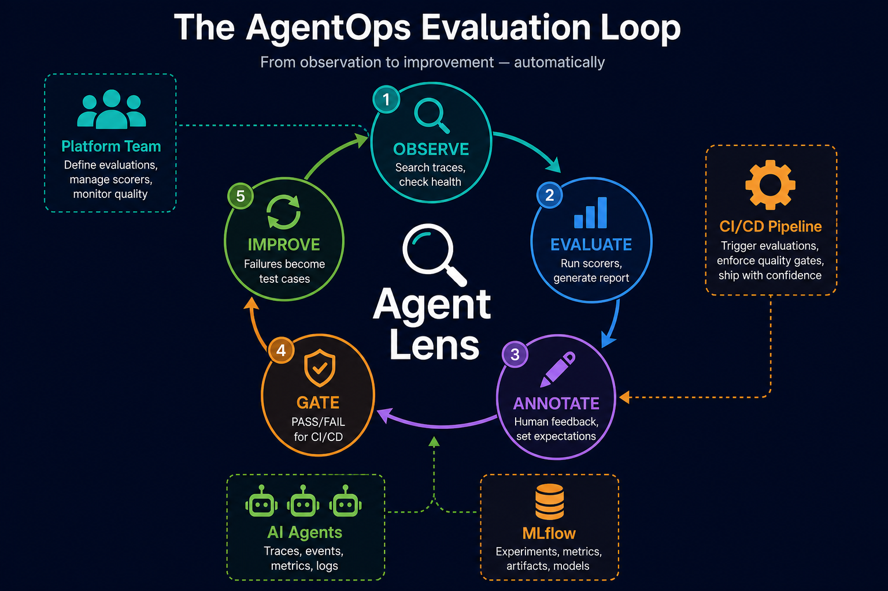
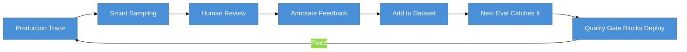

# Agent Lens

**AI agent evaluation platform for platform teams.** Evaluate, annotate, and gate agents you didn't build — powered by MLflow and the Model Context Protocol.

<p align="center">
  
</p>

---

## The Problem

Platform teams manage fleets of AI agents they did not build. They need to:

1. **Score** whether agents perform well (not just see what they did)
2. **Annotate** production traces when quality drops
3. **Gate** deployments — agents should not ship if they regress
4. **Close the loop** — today's failure becomes tomorrow's test case

Agent Lens orchestrates this entire cycle through a conversational interface backed by MLflow's evaluation APIs.

## How It Works

```
Platform Team: "Evaluate the outreach agent"

Agent Lens:   Runs mlflow.genai.evaluate() with ToolCallCorrectness + RelevanceToQuery
              on 50 production traces...

              Quality Certification Report:
              | Dimension      | Score | Rating |
              |----------------|-------|--------|
              | Relevance      | 4.2/5 | PASS   |
              | Tool Correct.  | 3.1/5 | FAIL   |

              CERTIFICATION: NOT CERTIFIED
              Finding: Tool calls failing on date parsing (8/50 traces)
              Recommendation: Add to regression dataset and block deploy
```

## Key Features

| Feature | What It Does | MLflow API Used |
|---------|-------------|-----------------|
| **Evaluate** | Run scorers on agent traces | `mlflow.genai.evaluate()` |
| **Annotate** | Log human feedback on traces | `mlflow.log_feedback()` |
| **Set Expectations** | Define ground truth | `mlflow.log_expectation()` |
| **Create Test Cases** | Failure → regression dataset | `dataset.merge_records()` |
| **Quality Gate** | PASS/FAIL for CI/CD | Compare runs + thresholds |
| **Review Queue** | Surface traces needing attention | Smart trace sampling |
| **Scorer Profiles** | Pre-configured per agent type | Built-in + `make_judge()` |

## Architecture

<p align="center">
  
</p>

### Components

| Component | Purpose |
|-----------|---------|
| **MCP Server** | MLflow SDK-based tools (evaluate, annotate, gate) |
| **Agent Lens** | Conversational evaluation agent (Hermes-based) |
| **Instrumentation** | Zero-code tracing for target agents |
| **mlflow/skills** | Vendored evaluation patterns and methodology |

### Hybrid MCP Pattern

<p align="center">
  
</p>

## Quick Start

### Prerequisites

- OpenShift cluster with RHOAI and MLflow operator
- `oc` CLI logged in
- Gemini API key (or other LLM provider)

### Deploy

```bash
git clone https://github.com/rrbanda/agent-lens.git && cd agent-lens
cp .env.example .env  # Edit with your values
make deploy-all
```

### Instrument an Agent

```bash
cp instrumentation/usercustomize.py $(python -m site --user-site)/
export MLFLOW_TRACKING_URI="https://your-mlflow:8443"
export MLFLOW_EXPERIMENT_NAME="my-agent"
```

### Run Your First Evaluation

In the Agent Lens dashboard:
```
You:    "Evaluate the outreach agent using the tool-calling profile"
Agent:  [Runs evaluation, returns Quality Certification Report]
```

## Scorer Profiles

Pre-configured evaluation dimensions per agent type:

| Profile | Scorers | Best For |
|---------|---------|----------|
| **RAG Agent** | RelevanceToQuery + RetrievalGroundedness | Agents that retrieve documents |
| **Tool-Calling** | ToolCallCorrectness + ToolCallEfficiency + Relevance | Agents that call APIs/tools |
| **Chat Agent** | RelevanceToQuery + Guidelines (helpful, harmless) | Conversational assistants |

## The Feedback Loop



## Project Structure

```
agent-lens/
├── mcp-server/              # MLflow SDK-based evaluation tools
│   └── entrypoint.py        # evaluate, annotate, gate, datasets
├── analyst-agent/           # Agent Lens (Hermes + skills)
│   ├── soul.md              # v2: evaluation platform identity
│   ├── skills/
│   │   ├── evaluate-agent/  # Quality Certification Reports
│   │   ├── review-trace/    # Human annotation workflow
│   │   ├── create-regression/ # Failure-to-dataset pipeline
│   │   ├── trace-explorer/  # Trace search and analysis
│   │   └── quality-dashboard/ # Fleet health overview
│   └── deploy/              # Kubernetes manifests
├── instrumentation/         # Target agent auto-tracing
├── vendor/mlflow-skills/    # Upstream patterns (submodule)
├── docs/                    # Architecture + demo script
├── Makefile                 # make deploy-all, make eval
└── .env.example             # Configuration template
```

## Built On

- [MLflow GenAI Evaluation](https://mlflow.org/docs/latest/genai/eval-monitor/) — `evaluate()`, `log_feedback()`, datasets, scorers
- [mlflow/skills](https://github.com/mlflow/skills) — Agent evaluation patterns and methodology
- [Model Context Protocol](https://modelcontextprotocol.io/) — Tool integration standard
- [Hermes Agent](https://github.com/hermes-ai/hermes-agent) — Multi-skill agent framework

## Inspiration

- [Harness AgentTrace](https://www.harness.io/blog/introducing-agent-trace) — "Observe, evaluate, govern" framework
- [Databricks AgentOps](https://community.databricks.com/t5/technical-blog/agentops-on-databricks-operating-production-ai-agents/ba-p/163602) — Closed feedback loop
- [Braintrust](https://www.braintrust.dev/articles/best-ai-agent-observability-tools-2026) — Evaluation integrated into observability
- [MLflow 2026 Evaluation Guide](https://mlflow.org/articles/integrating-evaluation-into-ai-workflows-2026-guide/)

## Contributing

1. Fork the repository
2. Create a feature branch
3. Commit your changes
4. Open a Pull Request

## License

Apache License 2.0 — see [LICENSE](LICENSE).
