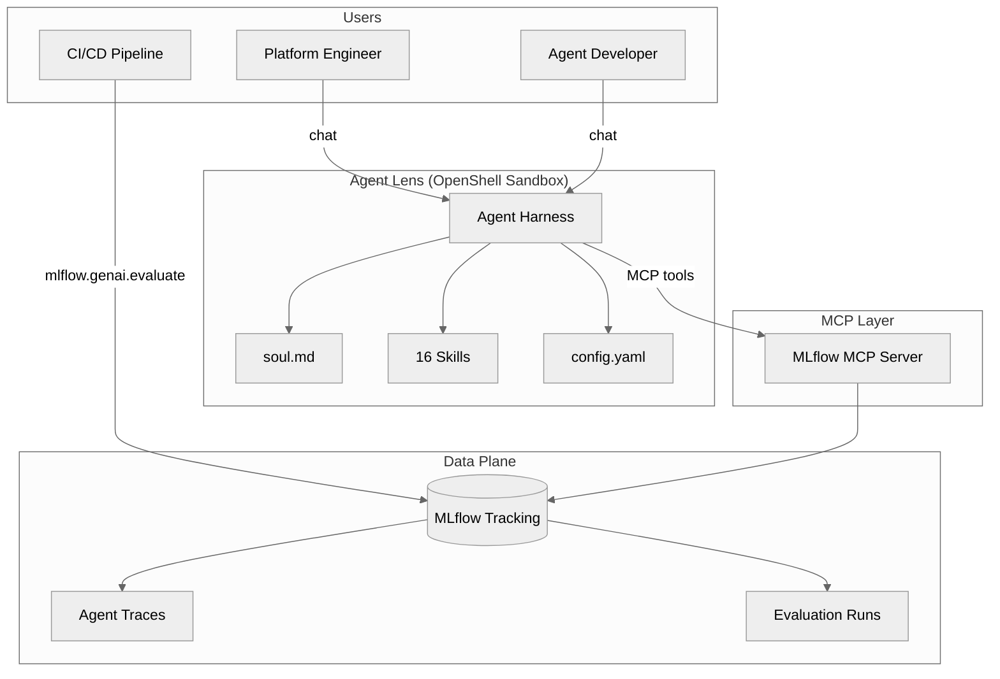
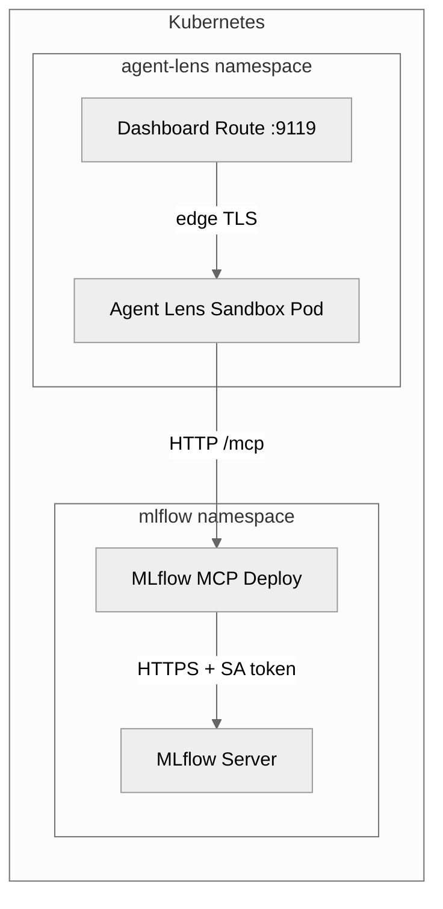

# Architecture

## System Overview



## Design Principles

1. **MCP-native** — All data access through official MLflow MCP tools. No direct SDK calls at runtime.
2. **Skills as prompts** — Each skill is a SKILL.md file, not code. The LLM interprets it and calls MCP tools.
3. **Upstream-first** — Never fork MLflow MCP. Missing features go upstream.
4. **Conversational-first** — The UI is chat. Structured output (tables, reports) rendered in conversation.

## Component Details

### Agent Harness (runtime)

Agent Lens requires an MCP-capable agent harness — any runtime that can:
- Call MCP tools (streamable HTTP or stdio transport)
- Load and interpret SKILL.md prompt documents
- Maintain session context across multi-step workflows
- Provide a chat interface (web dashboard or CLI)

The reference implementation ships with **Hermes v0.19**, which provides all of the above plus a built-in web dashboard with auth. However, the skills, soul, and config are portable — see [Agent harness runtime](https://github.com/rrbanda/agentlens#agent-harness-runtime) for how to use a different harness.

### Agents being evaluated (target agents)

Agent Lens evaluates **any agent that sends traces to MLflow**, regardless of framework:

| Framework | MLflow integration |
|-----------|-------------------|
| LangGraph | `mlflow.langchain.autolog()` |
| Google ADK | `mlflow.tracing.enable()` or ADK's built-in tracing |
| LangChain | `mlflow.langchain.autolog()` |
| CrewAI | `mlflow.crewai.autolog()` |
| OpenAI Agents SDK | `mlflow.openai.autolog()` |
| AutoGen | `mlflow.autogen.autolog()` |
| LlamaIndex | `mlflow.llama_index.autolog()` |
| Custom | `@mlflow.trace` decorator or REST API |

### MLflow MCP Server

Official `mlflow mcp run` providing 19 tools:

```yaml
tools:
  include:
    # Observability
    - search_experiments
    - get_experiment
    - search_traces
    - get_trace
    - list_runs
    - describe_run
    # Evaluation
    - evaluate_traces
    - list_scorers
    # Annotation
    - log_trace_feedback
    - log_trace_expectation
    - set_trace_tag
    - delete_trace_tag
    # Assessment
    - get_trace_assessment
    - update_trace_assessment
    - delete_trace_assessment
    # Scorer management
    - register_llm_judge_scorer
    # Run-trace association
    - link_traces_to_run
    # Lifecycle
    - delete_traces
    - create_run
    - create_experiment
```

### MLflow AI Gateway (built into MLflow)

MLflow AI Gateway runs as part of the MLflow Tracking Server and provides:
- Governed LLM access for all providers (OpenAI, Anthropic, Gemini, etc.)
- Automatic tracing of all LLM requests with token counts
- Automatic evaluation — LLM judges run as traces arrive
- RBAC and credential management

No custom gateway service needed — Agent Lens consumes these features directly.

## Deployment Topology



## ADRs

- [ADR-001: LoggedModel MCP Gap](/docs/adr/loggedmodel-gap) — Why LoggedModel operations are not yet available via MCP
