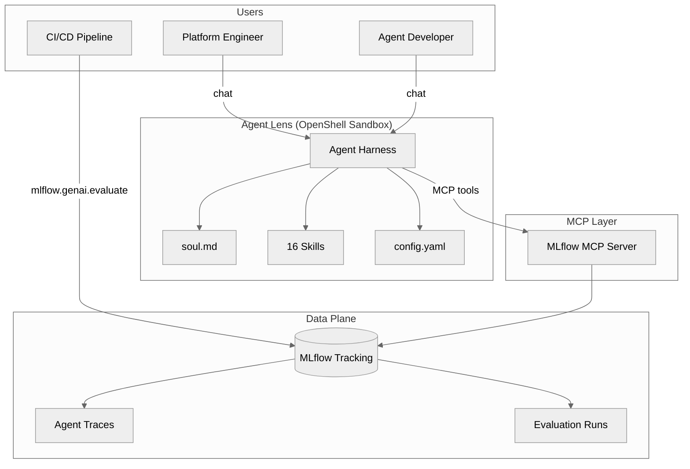
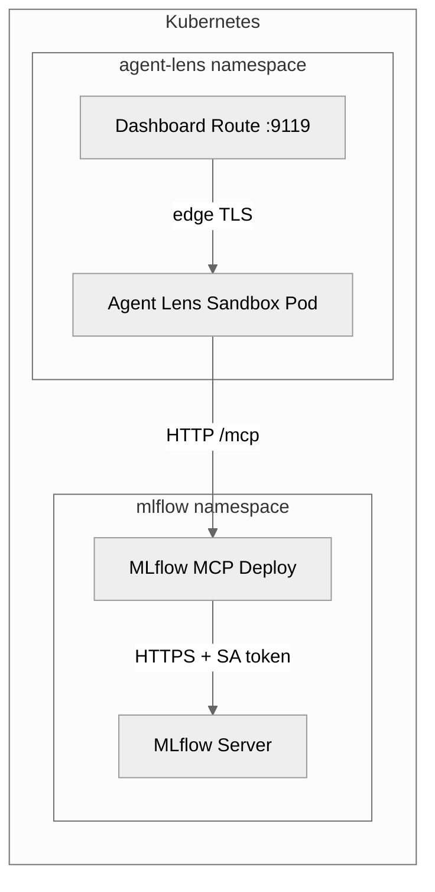

# Architecture

## System Overview



## Design Principles

1. **MCP-native** — All data access through official MLflow MCP tools. No direct SDK calls at runtime.
2. **Skills as prompts** — Each skill is a SKILL.md file, not code. The LLM interprets it and calls MCP tools.
3. **Upstream-first** — Never fork MLflow MCP. Missing features go upstream.
4. **Conversational-first** — The UI is chat. Structured output (tables, reports) rendered in conversation.
5. **Sandbox-first** — The qualification agent itself runs inside an [OpenShell](https://github.com/NVIDIA/OpenShell) sandbox. Security is not a bolt-on.

## Security Model: OpenShell Sandbox

Agent Lens runs inside an [OpenShell](https://github.com/NVIDIA/OpenShell) sandbox — the same defense-in-depth isolation used for production agent workloads. The qualification agent is sandboxed, not just the agents it evaluates.

```
Infrastructure → Sandbox → Harness → Skills → Model
     K8s          OpenShell   Agent     Agent Lens   LLM
                              Runtime
```

### Defense-in-depth layers

| Layer | Mechanism | What it does |
|-------|-----------|-------------|
| **Namespaces** | PID, mount, network, user | Restricts the agent's view of the system |
| **Landlock LSM** | Kernel-enforced filesystem ACLs | Even root inside the namespace can't escape allowed paths |
| **Seccomp-BPF** | System call filtering | Blocks `ptrace`, `mount`, `memfd_create`, raw sockets |
| **Capability dropping** | Empty bounding set | "Root" in the namespace has no real capabilities |
| **L7 network proxy** | Binary identity binding | `git` can reach github.com; `curl` from the same sandbox cannot |
| **Resource controls** | cgroups v2 | CPU, memory, and I/O limits prevent runaway processes |

### Sandbox vs. harness — separate concerns

The sandbox is **subtractive** — it constrains what the agent can do and limits blast radius. The skills are **additive** — they layer on knowledge and MCP tool access to increase competence. These have [different failure modes](https://medium.com/@ralphbean/what-even-is-the-harness-2e7ac2fba905):

- **Sandbox failure** = the agent did something it shouldn't have been able to do
- **Skill failure** = the agent did something poorly that it should have done well

The sandbox also serves as a **recorder** — a neutral observer that can attest to what the agent did, providing provenance information independent of the agent runtime's self-reporting.

### Kubernetes integration

On Kubernetes, Agent Lens deploys via the [agent-sandbox-operator](https://github.com/kubernetes-sigs/agent-sandbox) which manages the sandbox pod lifecycle (warm pools, PVCs, rescheduling). The OpenShell supervisor inside the pod enforces the actual security boundary — filesystem policy, egress enforcement, credential isolation, and OCSF audit events.

## Component Details

### Agent Harness (runtime) — pick yours

Agent Lens requires an MCP-capable agent harness — any runtime that can:
- Call MCP tools (streamable HTTP or stdio transport)
- Load and interpret SKILL.md prompt documents
- Maintain session context across multi-step workflows
- Provide a chat interface (web dashboard or CLI)

The reference implementation ships with **Hermes**, but the skills, soul, and config are **portable artifacts** — plain markdown and YAML, not code.

| | Harness-independent (keep) | Harness-specific (swap) |
|---|---|---|
| **Files** | `skills/*.md`, `soul.md`, `config.yaml` | `Containerfile`, `startup.sh` |
| **Why** | Standard MCP tool patterns any client can execute | Runtime-specific packaging and lifecycle |

Compatible runtimes include [Hermes](https://github.com/hermes-ai/hermes-agent), [Claude Code](https://docs.anthropic.com/en/docs/claude-code), [OpenClaw](https://github.com/openclaw), [Goose](https://github.com/block/goose), or any custom MCP-capable agent. Choose a commodity runtime — the qualification logic lives in the skills, not the harness.

### Agents being evaluated (target agents)

Agent Lens evaluates **any agent that sends traces to MLflow**, regardless of framework:

| Framework | MLflow integration |
|-----------|-------------------|
| LangGraph | `mlflow.langchain.autolog()` |
| Google ADK | `mlflow.tracing.enable()` or ADK's built-in tracing |
| LangChain | `mlflow.langchain.autolog()` |
| CrewAI | `mlflow.crewai.autolog()` |
| OpenAI Agents SDK | `mlflow.openai.autolog()` |
| AutoGen | `mlflow.autogen.autolog()` |
| LlamaIndex | `mlflow.llama_index.autolog()` |
| Custom | `@mlflow.trace` decorator or REST API |

### MLflow MCP Server

Official `mlflow mcp run` providing 19 tools:

```yaml
tools:
  include:
    # Observability
    - search_experiments
    - get_experiment
    - search_traces
    - get_trace
    - list_runs
    - describe_run
    # Evaluation
    - evaluate_traces
    - list_scorers
    # Annotation
    - log_trace_feedback
    - log_trace_expectation
    - set_trace_tag
    - delete_trace_tag
    # Assessment
    - get_trace_assessment
    - update_trace_assessment
    - delete_trace_assessment
    # Scorer management
    - register_llm_judge_scorer
    # Run-trace association
    - link_traces_to_run
    # Lifecycle
    - delete_traces
    - create_run
    - create_experiment
```

### MLflow AI Gateway (built into MLflow)

MLflow AI Gateway runs as part of the MLflow Tracking Server and provides:
- Governed LLM access for all providers (OpenAI, Anthropic, Gemini, etc.)
- Automatic tracing of all LLM requests with token counts
- Automatic evaluation — LLM judges run as traces arrive
- RBAC and credential management

No custom gateway service needed — Agent Lens consumes these features directly.

## Deployment Topology



## ADRs

- [ADR-001: LoggedModel MCP Gap](/docs/adr/loggedmodel-gap) — Why LoggedModel operations are not yet available via MCP
