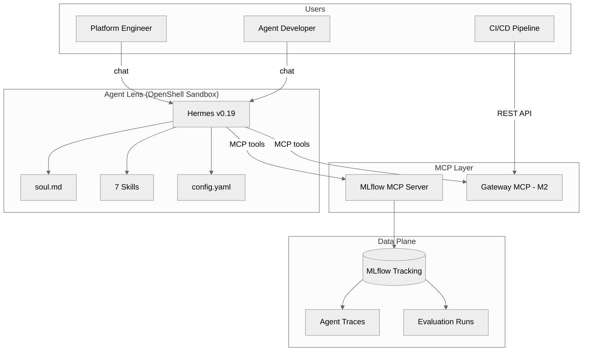
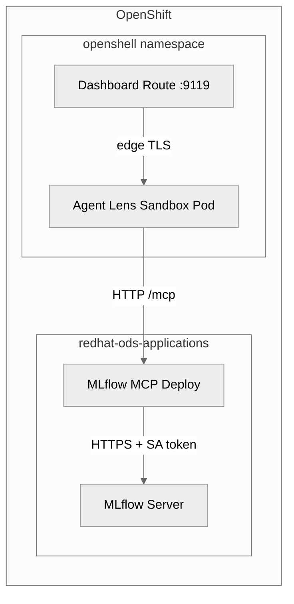

# Architecture

## System Overview



## Design Principles

1. **MCP-native** — All data access through official MLflow MCP tools. No direct SDK calls at runtime.
2. **Skills as prompts** — Each skill is a SKILL.md file, not code. The LLM interprets it and calls MCP tools.
3. **Upstream-first** — Never fork MLflow MCP. Missing features go upstream or into the Gateway.
4. **Conversational-first** — The UI is chat. Structured output (tables, reports) rendered in conversation.

## Component Details

### Hermes Agent

The Hermes conversational AI framework provides:
- Tool calling via MCP (streamable HTTP transport)
- Skill discovery and routing
- Session management and memory
- Dashboard with auth

### MLflow MCP Server

Official `mlflow mcp run` providing 11 tools:

```yaml
tools:
  include:
    - search_experiments
    - get_experiment
    - search_traces
    - get_trace
    - log_trace_feedback
    - log_trace_expectation
    - set_trace_tag
    - evaluate_traces
    - list_runs
    - describe_run
    - list_scorers
```

### Gateway MCP (M2)

A custom FastAPI service adding:
- CI/CD quality gate (`POST /api/v1/gate/evaluate`)
- Governance audit trail (append-only JSONL + SHA-256)
- Agent registry (LoggedModel lifecycle)
- Prometheus metrics export

## Deployment Topology



## ADRs

- [ADR-001: LoggedModel MCP Gap](/docs/adr/loggedmodel-gap) — Why LoggedModel operations need the Gateway
