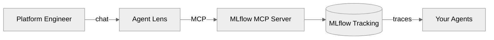

# Agent Lens

**Trust your agents. Verify with evidence — conversationally, on MLflow.**

Agent Lens is a conversational qualification layer that drives the **upstream official [MLflow MCP](https://mlflow.org/docs/latest/genai/mcp/)** so platform engineers can evaluate, qualify, and govern AI agents in natural language.

:::tip
Works with any agent framework that sends traces to MLflow — LangGraph, Google ADK, LangChain, CrewAI, OpenAI Agents SDK, and more.
:::

## The Problem

You have 50 AI agents in production. Some you built, most you didn't. MLflow gives you traces and scorers — but no one is systematically grading them, no one is blocking bad deployments, and compliance has no audit trail.

## The Solution

Ask Agent Lens in plain English:

```
You:   "Evaluate financial-advisor-agent using the RAG profile"
You:   "Show me traces with errors in the last 24 hours"
You:   "Can this agent be deployed to production?"
```

Agent Lens calls MLflow MCP tools, runs evaluations, and returns structured verdicts.

## Architecture



**MLflow** = data plane (traces, scorers, models)
**Agent Lens** = decision plane (verdicts, governance, fleet management)

Your agents can be built with any framework — LangGraph, Google ADK, LangChain, CrewAI, OpenAI Agents SDK, or custom. If they send traces to MLflow, Agent Lens can qualify them.

## Quick Start

```bash
git clone https://github.com/rrbanda/agent-lens.git && cd agent-lens

# Local development with integration tests
make dev-setup        # Create venv, install deps
make mlflow-start     # Start local MLflow server
make seed-data        # Populate with test traces
make test-integration # Run integration tests against real MCP

# Deploy to OpenShift
make deploy-all       # Build image + deploy Sandbox
make status           # Verify MCP + pod health
```

## Who It's For

| Persona | Their Question | What Agent Lens Gives Them |
|---------|---------------|---------------------------|
| **Agent Platform Engineer** | "Can I qualify this agent?" | Qualification verdicts, fleet observatory, trace forensics |
| **Agent Developer** | "Will my agent pass quality gates?" | CI/CD gate API, eval-in-pipeline, regression tracking |
| **Chief AI Officer** | "Is this investment paying off?" | Fleet-wide quality scores, executive summaries |
| **CISO / Security Lead** | "Is the security boundary robust?" | Governance audit trail, policy violation tracking |
| **Domain Expert / SME** | "Did the agent do the right thing?" | Trace annotation, expectation authoring |
