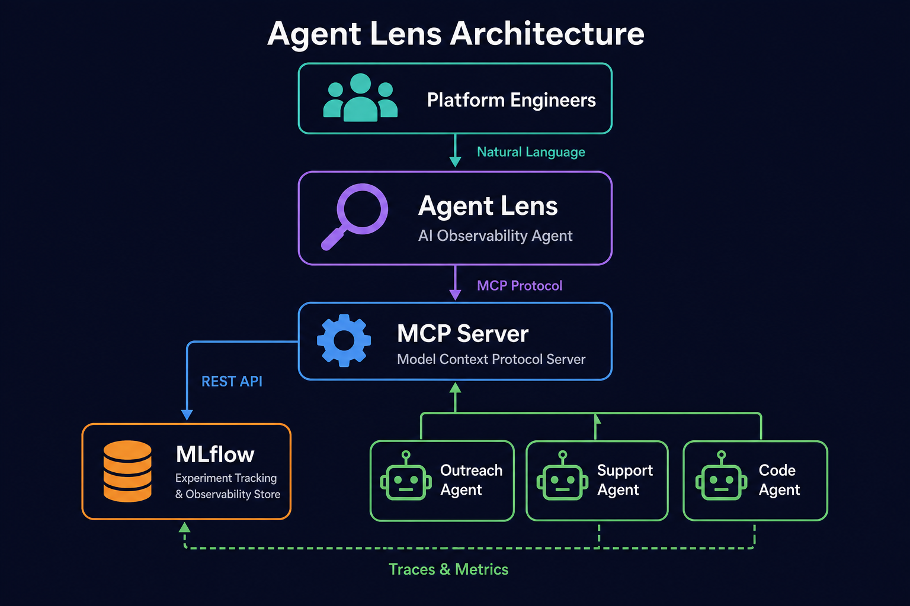
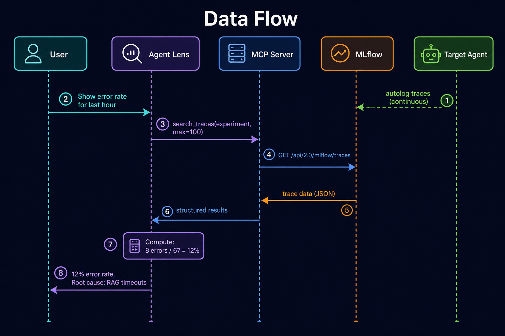
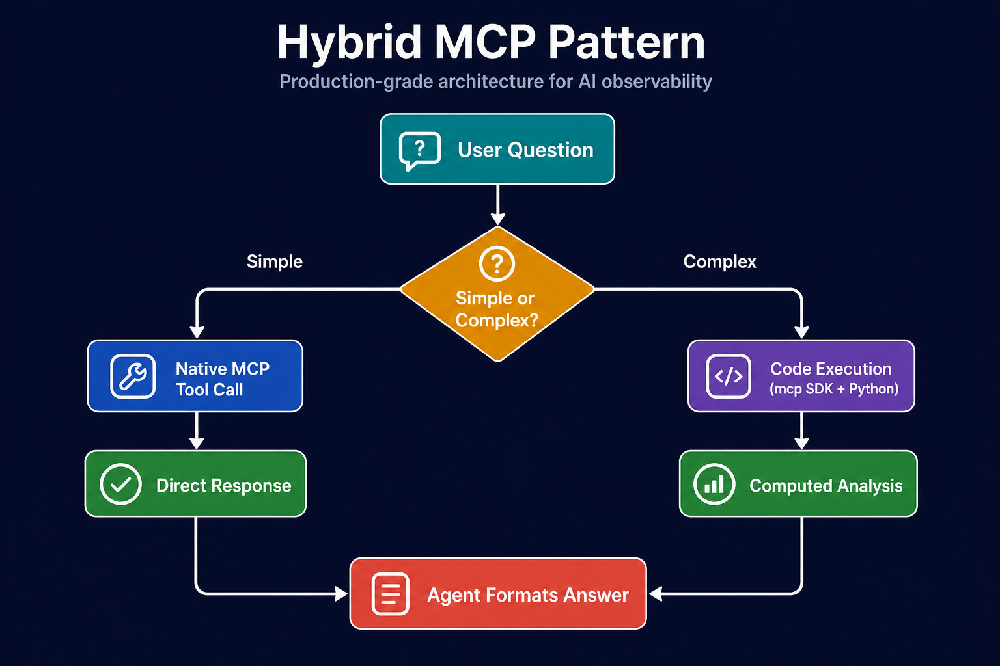

# Architecture

## Overview

Agent Lens is composed of three independent components that work together to provide
conversational observability for AI agents running on OpenShift AI (RHOAI).

<p align="center">
  
</p>

## Components

### 1. MLflow MCP Server (`mcp-server/`)

A lightweight Python service that bridges MLflow's REST API with the
[Model Context Protocol](https://modelcontextprotocol.io/).

**Stack**: FastMCP + httpx + Python 3.11

**Key design decisions**:
- No `mlflow` Python package required — uses raw REST API calls for minimal footprint
- ServiceAccount token-based auth — no credentials stored, uses Kubernetes RBAC
- Workspace header injection — routes requests to the correct Kubernetes namespace
- Streamable HTTP transport — modern MCP transport that works behind proxies

**How it authenticates**:
```
Pod → ServiceAccount → Mounted Token → X-MLflow-Workspace header
                                      → Authorization: Bearer <sa-token>
```

The `mlflow-operator-mlflow-integration` ClusterRole grants cross-namespace access
to experiment data.

### 2. Agent Lens (`analyst-agent/`)

A [Hermes Agent](https://github.com/hermes-ai/hermes-agent) instance configured as
an observability specialist.

**Stack**: Hermes Agent + Gemini 2.5 Flash + 5 built-in skills

**Key design decisions**:
- **Native MCP integration** — MLflow tools are registered at startup via Hermes's
  built-in MCP client (`mcp_servers` in config.yaml), making them available as
  first-class tools alongside built-in ones
- **Hybrid execution model** — simple queries use native tool calls; complex
  aggregation uses Python code execution with the `mcp` SDK
- **Persistent state** — PVC stores memory, sessions, and learned skills across restarts
- **Skill-driven** — analytical patterns are encoded as skills (methodology only, no
  hardcoded protocol code) so the agent can adapt its approach

**Skills architecture**:
```
soul.md          → Identity, tone, constraints, tool catalog
skills/*.md      → Analytical methodologies (trace-explorer, eval-report, etc.)
config.yaml      → MCP connections, toolsets, provider settings
```

### 3. Instrumentation (`instrumentation/`)

Tools to add MLflow observability to any existing AI agent with zero code changes.

**`usercustomize.py`** — Python's automatic site-packages loader. When placed in a
target agent's environment, it:
1. Imports mlflow on interpreter startup
2. Calls `mlflow.openai.autolog()` to patch OpenAI-compatible clients
3. Every LLM call becomes a trace in the configured experiment

**`eval_agent.py`** — Batch evaluation runner that:
1. Sends test prompts to an agent's API
2. Records responses in an MLflow run
3. Computes quality scores (relevance, faithfulness, correctness)
4. Logs aggregate metrics for trend tracking

## Data Flow

<p align="center">
  
</p>

### Trace Lifecycle

1. **Capture**: Target agent makes LLM call → `usercustomize.py` intercepts →
   MLflow trace created with spans, tokens, latency
2. **Store**: MLflow Tracking Server persists trace in experiment (backed by PostgreSQL)
3. **Query**: Agent Lens calls MCP Server → MCP Server calls MLflow REST API →
   structured data returned
4. **Analyze**: Agent Lens processes data (native tool or code execution) →
   presents insight to user

### Hybrid MCP Pattern

<p align="center">
  
</p>

| Scenario | Path | Why |
|----------|------|-----|
| "List experiments" | Native MCP | Single tool call, small response |
| "Get run details" | Native MCP | Direct lookup, no processing needed |
| "Error rate this week" | Code Execution | Needs 200+ traces, aggregation logic |
| "Compare 5 runs" | Code Execution | Loop, delta computation, statistical test |
| "Quality trend over time" | Code Execution | Time bucketing, metric history merging |

## Deployment Topology

```
┌─────────────────────────────────────────────────────────────────┐
│ OpenShift Cluster                                               │
│                                                                 │
│  ┌──────────────────────┐   ┌─────────────────────────────────┐│
│  │ Namespace: agent-lens│   │ Namespace: <target-agent>       ││
│  │                      │   │                                 ││
│  │  ┌────────────────┐  │   │  ┌──────────────────────────┐  ││
│  │  │ Agent Lens Pod │  │   │  │ Target Agent Pod         │  ││
│  │  │  (Hermes)      │  │   │  │  + usercustomize.py      │  ││
│  │  └───────┬────────┘  │   │  └──────────┬───────────────┘  ││
│  │          │            │   │             │                  ││
│  │  ┌───────▼────────┐  │   │             │                  ││
│  │  │ MCP Server Pod │  │   │             │                  ││
│  │  └───────┬────────┘  │   │             │                  ││
│  │          │            │   │             │                  ││
│  └──────────┼────────────┘   └─────────────┼──────────────────┘│
│             │                              │                   │
│  ┌──────────▼──────────────────────────────▼──────────────────┐│
│  │ Namespace: mlflow-system                                   ││
│  │  ┌─────────────────────────────────────┐                   ││
│  │  │ MLflow Tracking Server (Operator)   │                   ││
│  │  │  + PostgreSQL backend               │                   ││
│  │  └─────────────────────────────────────┘                   ││
│  └────────────────────────────────────────────────────────────┘│
└─────────────────────────────────────────────────────────────────┘
```

## Security Model

| Layer | Mechanism |
|-------|-----------|
| Agent Lens → MCP Server | In-cluster HTTP (Service DNS) |
| MCP Server → MLflow | ServiceAccount token + ClusterRoleBinding |
| User → Agent Lens | HTTPS Route + basic auth (scrypt hashed) |
| LLM API Key | Kubernetes Secret mounted as env var |
| Cross-namespace | NetworkPolicy allows explicit ingress only |

## Scaling Considerations

- **MCP Server**: Stateless, horizontally scalable (add replicas)
- **Agent Lens**: Single replica (stateful sessions), scale via delegation
- **MLflow**: Managed by RHOAI operator, scales independently
- **Traces volume**: MLflow handles retention; MCP Server streams results
