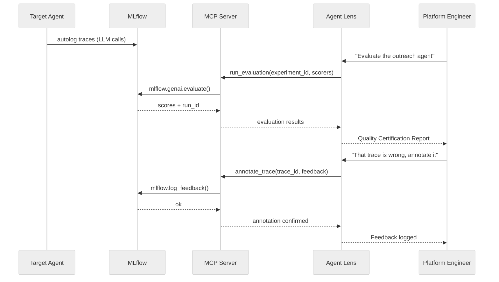
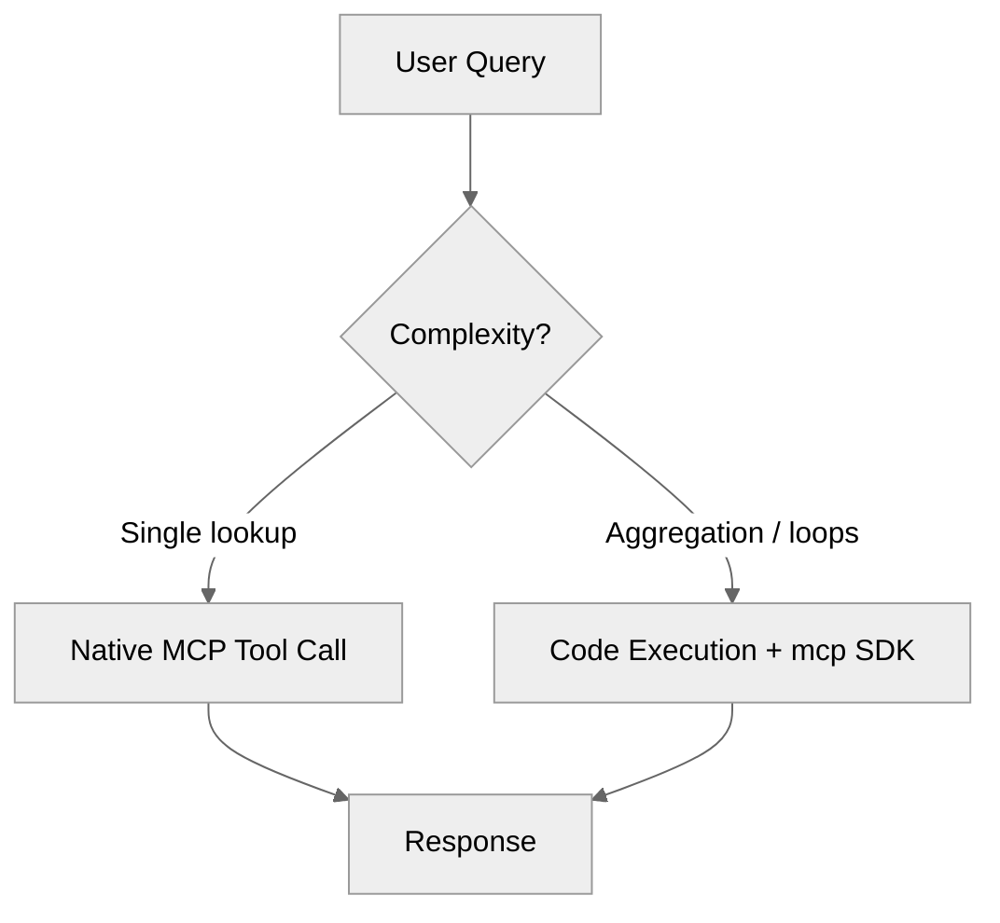
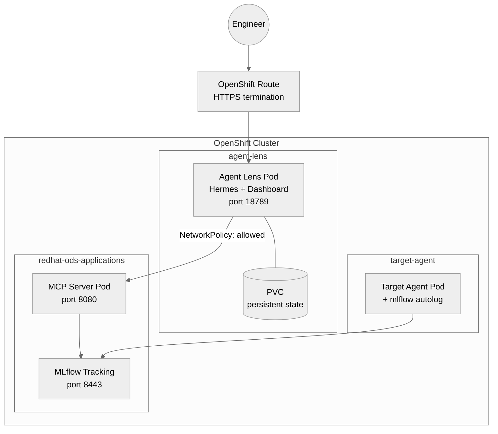

# Architecture

## Overview

Agent Lens is composed of two primary components that work together to provide
conversational evaluation and governance for AI agents running on OpenShift AI (RHOAI).


## Components

### 1. MLflow MCP Server (`mcp-server/`)

A Python service that exposes MLflow's evaluation, annotation, and governance
capabilities via the [Model Context Protocol](https://modelcontextprotocol.io/).

**Stack**: FastMCP + MLflow SDK + Starlette + Python 3.11

**Key design decisions**:
- Uses MLflow Python SDK directly — enables `mlflow.genai.evaluate()`, `log_feedback()`,
  and dataset management natively
- ServiceAccount token-based auth — no credentials stored, uses Kubernetes RBAC
- Singleton `MlflowClient` with timeout/retry — production-grade resilience
- Streamable HTTP transport at `/mcp` — works behind proxies
- Dedicated `/health` endpoint — proper K8s readiness/liveness probes
- Pre-built container image — no runtime dependency install

```mermaid
%%{init: {'theme': 'neutral'}}%%
graph LR
    subgraph MCP Server
        H[/health]
        M[/mcp]
        SDK[MLflow SDK<br/>singleton client]
    end

    Agent -->|JSON-RPC| M
    K8s -->|probe| H
    M --> SDK
    SDK -->|search_traces<br/>evaluate<br/>log_feedback| MLflow[(MLflow)]
```

**MCP Tools** (13 registered):

| Category | Tools |
|----------|-------|
| Observe | `list_experiments`, `search_traces`, `get_trace`, `search_runs` |
| Evaluate | `run_evaluation`, `list_scorers` |
| Annotate | `annotate_trace`, `set_expectation` |
| Datasets | `list_datasets`, `create_test_case` |
| Govern | `check_quality_gate`, `get_review_queue` |
| System | `health_check` |

### 2. Agent Lens (`analyst-agent/`)

A [Hermes Agent](https://github.com/hermes-ai/hermes-agent) instance configured as
an evaluation and governance specialist.

**Stack**: Hermes Agent + Gemini 2.5 Flash + 5 built-in skills

**Key design decisions**:
- **Native MCP integration** — tools registered at startup via `mcp_servers` in config.yaml
- **Hybrid execution model** — simple queries use native MCP calls; complex
  aggregation uses Python code execution with the `mcp` SDK
- **Persistent state** — PVC stores memory, sessions, and learned skills across restarts
- **Skill-driven** — methodologies encoded as skills, not hardcoded logic

**Skills**:

| Skill | Trigger | MCP Tools Used |
|-------|---------|---------------|
| `evaluate-agent` | "Evaluate", "Score" | `run_evaluation`, `list_scorers` |
| `review-trace` | "Review", "Annotate" | `get_review_queue`, `annotate_trace` |
| `create-regression` | "Add to dataset" | `create_test_case` |
| `trace-explorer` | "Show traces", "Errors" | `search_traces`, `get_trace` |
| `quality-dashboard` | "Overview", "Health" | `list_experiments`, `search_traces`, `search_runs` |

## Data Flow



### Hybrid MCP Pattern



| Scenario | Path | Reason |
|----------|------|--------|
| "List experiments" | Native MCP | Single tool call, small response |
| "Evaluate the agent" | Native MCP | Single tool call (long-running internally) |
| "Error rate this week" | Code Execution | 200+ traces, aggregation logic |
| "Compare 5 runs" | Code Execution | Loop, delta computation |
| "Quality trend over time" | Code Execution | Time bucketing, metric merging |

## Deployment Topology



## Security Model

| Layer | Mechanism |
|-------|-----------|
| User → Agent Lens | HTTPS Route + basic auth (scrypt hashed, secret-sourced) |
| Agent Lens → MCP Server | In-cluster HTTP, NetworkPolicy restricted |
| MCP Server → MLflow | ServiceAccount token + TLS (cluster CA bundle) |
| API authentication | K8s Secret `agent-lens-auth` |
| LLM API key | K8s Secret `agent-lens-llm-key` |
| Pod security | `runAsNonRoot`, `readOnlyRootFilesystem`, drop `ALL` capabilities |
| Network isolation | NetworkPolicy on both deployments |

## Scaling Considerations

- **MCP Server**: Stateless, horizontally scalable (add replicas)
- **Agent Lens**: Single replica (stateful sessions), scale via delegation
- **MLflow**: Managed by RHOAI operator, scales independently
- **Traces volume**: MLflow handles retention; MCP Server streams results
