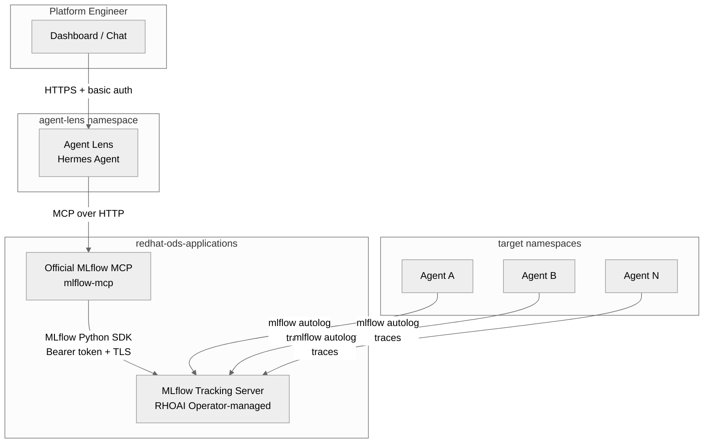
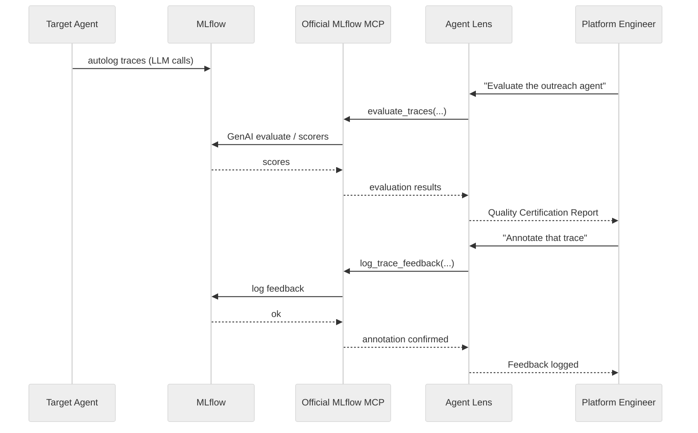
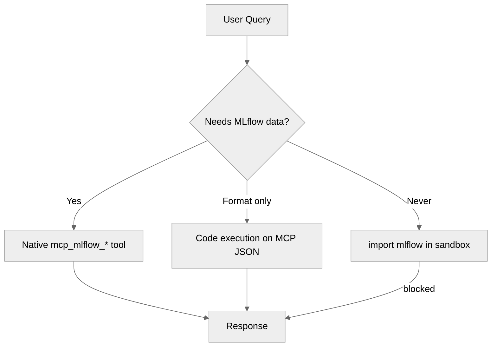
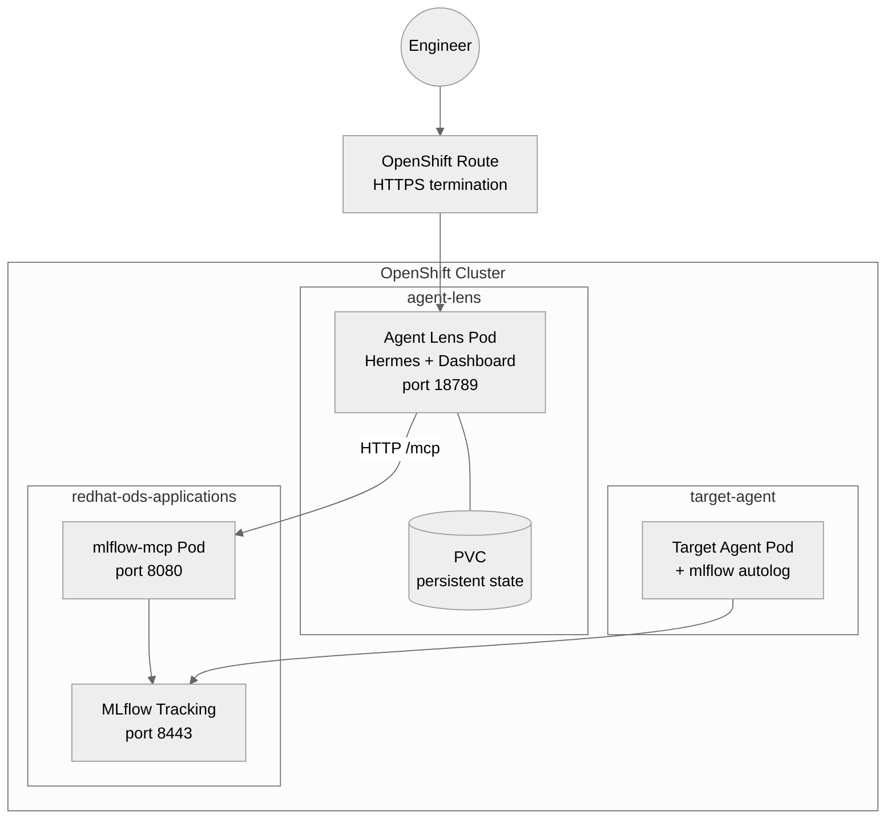

# Architecture

## Overview

Agent Lens is a Hermes-based conversational evaluation layer on top of **upstream
official MLflow MCP** (`mlflow mcp run`). It does not ship a custom FastMCP server.

## Components

### 1. Official MLflow MCP (`mlflow-mcp`)

Deployed with the platform (RHOAI / MLflow operator stack), not by this repo.

**Stack**: `mlflow mcp run` (often behind `mcp-proxy`) + MLflow SDK

**Contract used by Agent Lens** (allowlisted in `analyst-agent/config.yaml`):

| Category | Tools |
|----------|-------|
| Observe | `search_experiments`, `get_experiment`, `search_traces`, `get_trace`, `list_runs`, `describe_run` |
| Evaluate | `evaluate_traces`, `list_scorers` |
| Annotate | `log_trace_feedback`, `log_trace_expectation`, `set_trace_tag` |

Hermes exposes these as `mcp_mlflow_<tool_name>`.

See [MLflow MCP docs](https://mlflow.org/docs/latest/genai/mcp/).

### 2. Agent Lens (`analyst-agent/`)

A [Hermes Agent](https://github.com/hermes-ai/hermes-agent) instance configured as
an evaluation and governance specialist.

**Stack**: Hermes Agent + Gemini + skills

**Key design decisions**:
- **Official MCP only** — `mcp_servers.mlflow.url` points at `mlflow-mcp`
- **MCP-first** — all MLflow access via native tools; code execution only formats MCP JSON
- **No sandbox `import mlflow`** — Hermes has no RHOAI ServiceAccount for tracking
- **Persistent state** — PVC stores memory/sessions across restarts
- **Skill-driven** — methodologies encoded as skills, not hardcoded logic

**Skills**:

| Skill | Trigger | Official MCP Tools |
|-------|---------|-------------------|
| `evaluate-agent` | "Evaluate", "Score" | `evaluate_traces`, `list_scorers` |
| `review-trace` | "Review", "Annotate" | `get_trace`, `search_traces`, `log_trace_feedback`, `log_trace_expectation` |
| `create-regression` | "Add to dataset" | `log_trace_expectation`, `set_trace_tag` |
| `trace-explorer` | "Show traces", "Errors" | `search_traces`, `get_trace` |
| `quality-dashboard` | "Overview", "Health" | `search_experiments`, `search_traces`, `list_runs` |

### 3. Instrumentation (`instrumentation/`)

Zero-code autolog (`usercustomize.py`) and optional CLI eval (`eval_agent.py`) for
target agents. Independent of Hermes MCP wiring.

## Data Flow

### MCP-first execution

| Scenario | Path | Reason |
|----------|------|--------|
| "List experiments" | Native MCP | `search_experiments` |
| "Evaluate the agent" | Native MCP | `evaluate_traces` |
| "Error rate / dashboard" | Native MCP + local format | `search_experiments` + `search_traces` |
| "Compare runs" | Code exec on MCP JSON | After `list_runs` / `describe_run` |
| Sandbox `import mlflow` | Forbidden | No SA token to RHOAI MLflow |

## Deployment Topology

This repo deploys **only** the Agent Lens Hermes stack (`make deploy-agent`).
Official MLflow MCP must already exist in the cluster.

## Security Model

| Layer | Mechanism |
|-------|-----------|
| User → Agent Lens | HTTPS Route + basic auth (scrypt hashed, secret-sourced) |
| Agent Lens → Official MCP | In-cluster HTTP to `mlflow-mcp` |
| Official MCP → MLflow | ServiceAccount token + TLS (cluster CA bundle) |
| API authentication | K8s Secret `agent-lens-auth` |
| LLM API key | K8s Secret `agent-lens-llm-key` |
| Pod security | `runAsNonRoot`, drop `ALL` capabilities |
| Network isolation | NetworkPolicy on Agent Lens |

## Scaling Considerations

- **Official MLflow MCP**: Managed with the platform; scale with that deploy
- **Agent Lens**: Single replica (stateful sessions), scale via Hermes delegation if enabled
- **MLflow**: Managed by RHOAI operator, scales independently
