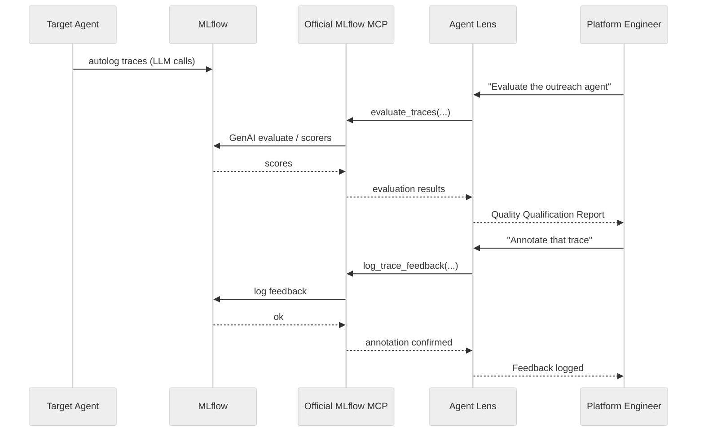
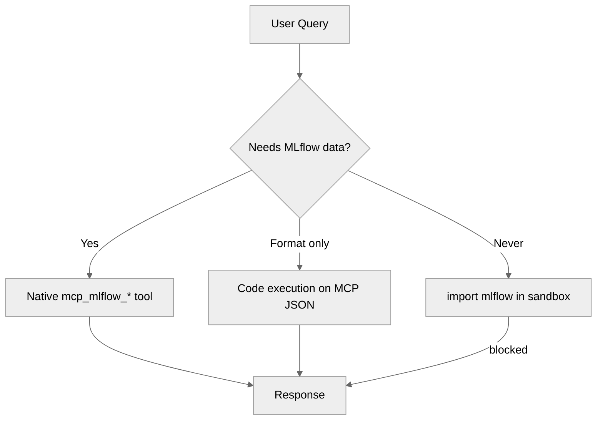
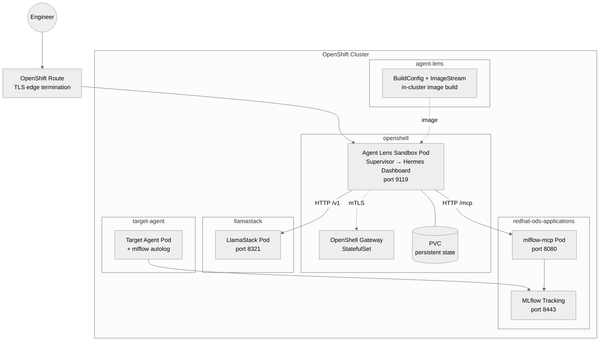

# Architecture

## Overview

Agent Lens is a conversational evaluation layer on top of **upstream official MLflow
MCP** (`mlflow mcp run`). It runs inside an **NVIDIA OpenShell Sandbox** on OpenShift,
with the agent harness (currently Hermes Agent) wrapped by the OpenShell supervisor
for Landlock + seccomp enforcement.

The harness is pluggable -- see [agent-lens/README.md](../agent-lens/README.md#agent-harness)
for how to swap to a different framework.

```mermaid
%%{init: {'theme': 'neutral'}}%%
graph TB
    subgraph Platform Engineer
        UI[Dashboard / Chat]
    end

    subgraph openshell namespace
        subgraph Sandbox Pod
            Supervisor[OpenShell Supervisor<br/>Landlock + seccomp]
            Hermes[Agent Lens<br/>Hermes Agent v0.19.0+<br/>port 9119]
            Supervisor --> Hermes
        end
        Gateway[OpenShell Gateway<br/>mTLS + policy engine]
        Supervisor -.->|mTLS| Gateway
    end

    subgraph agent-sandbox-system
        Controller[Agent Sandbox Controller<br/>reconciles Sandbox CRs]
    end

    subgraph redhat-ods-applications
        MCP[Official MLflow MCP<br/>mlflow-mcp:8080]
        MLflow[MLflow Tracking Server<br/>cluster-managed]
    end

    subgraph llamastack namespace
        LLM[LlamaStack<br/>inference:8321]
    end

    subgraph target namespaces
        A1[Agent A]
        A2[Agent B]
        A3[Agent N]
    end

    UI -->|HTTPS + cookie auth| Hermes
    Hermes -->|MCP over HTTP| MCP
    Hermes -->|OpenAI-compatible API| LLM
    MCP -->|MLflow Python SDK<br/>Bearer token + TLS| MLflow
    A1 & A2 & A3 -->|mlflow autolog<br/>traces| MLflow
    Controller -->|reconciles| Sandbox Pod
```

## Components

### 1. OpenShell Sandbox (runtime layer)

NVIDIA OpenShell provides the secure execution environment. The supervisor binary
(`openshell-sandbox`) wraps the agent process with:

- **Landlock filesystem sandbox** -- read-only and read-write path allowlists
- **seccomp syscall filter** -- blocks dangerous syscalls
- **Process isolation** (`--mode=process`) -- UID/GID mapping
- **mTLS** -- supervisor authenticates to the gateway using client certificates

Deployed via Helm chart (`oci://ghcr.io/nvidia/openshell/helm-chart`) into the
`openshell` namespace.

### 2. Agent Sandbox Controller (orchestration layer)

The [Kubernetes Agent Sandbox](https://github.com/kubernetes-sigs/agent-sandbox)
controller reconciles `Sandbox` CRs into pods. Available as:

- Red Hat build of Agent Sandbox v0.9.0 (recommended for OpenShift)
- Upstream k8s-sigs/agent-sandbox

### 3. Official MLflow MCP (`mlflow-mcp`)

Deployed with the platform (MLflow operator or standalone install), not by this repo.

**Stack**: `mlflow mcp run` (often behind `mcp-proxy`) + MLflow SDK

**Contract used by Agent Lens** (allowlisted in `agent-lens/config.yaml`):

| Category | Tools |
|----------|-------|
| Observe | `search_experiments`, `get_experiment`, `search_traces`, `get_trace`, `list_runs`, `describe_run` |
| Evaluate | `evaluate_traces`, `list_scorers` |
| Annotate | `log_trace_feedback`, `log_trace_expectation`, `set_trace_tag` |

Hermes exposes these as `mcp_mlflow_<tool_name>`.

See [MLflow MCP docs](https://mlflow.org/docs/latest/genai/mcp/).

### 4. Agent Lens (harness layer)

A [Hermes Agent](https://github.com/NousResearch/hermes-agent) instance configured as
an evaluation and governance specialist.

**Key design decisions**:
- **Official MCP only** -- `mcp_servers.mlflow.url` points at `mlflow-mcp`
- **MCP-first** -- all MLflow access via native tools; code execution only formats MCP JSON
- **No sandbox `import mlflow`** -- Hermes has no ServiceAccount for MLflow tracking
- **Persistent state** -- PVC stores memory/sessions across restarts
- **Skill-driven** -- methodologies encoded as skills, not hardcoded logic
- **Harness-pluggable** -- only the Containerfile and startup.sh are harness-specific

**Skills**:

| Skill | Trigger | Official MCP Tools |
|-------|---------|-------------------|
| `evaluate-agent` | "Evaluate", "Score" | `evaluate_traces`, `list_scorers` |
| `review-trace` | "Review", "Annotate" | `get_trace`, `search_traces`, `log_trace_feedback`, `log_trace_expectation` |
| `analyze-session` | "Chat session" | `search_traces`, `get_trace` |
| `create-regression` | "Add to dataset" | `log_trace_expectation`, `set_trace_tag` |
| `trace-explorer` | "Show traces", "Errors" | `search_traces`, `get_trace` |
| `quality-dashboard` | "Overview", "Health" | `search_experiments`, `search_traces`, `list_runs` |

### 5. Instrumentation (`instrumentation/`)

Zero-code autolog (`usercustomize.py`) and optional CLI eval (`eval_agent.py`) for
target agents. Independent of Hermes MCP wiring.

## Data Flow



### MCP-first execution



| Scenario | Path | Reason |
|----------|------|--------|
| "List experiments" | Native MCP | `search_experiments` |
| "Evaluate the agent" | Native MCP | `evaluate_traces` |
| "Error rate / dashboard" | Native MCP + local format | `search_experiments` + `search_traces` |
| "Compare runs" | Code exec on MCP JSON | After `list_runs` / `describe_run` |
| Sandbox `import mlflow` | Forbidden | No SA token to MLflow tracking |

## Deployment Topology



This repo deploys **only** the Agent Lens stack (`make build-agent && make deploy-openshell`).
Official MLflow MCP and LlamaStack must already exist in the cluster.

## Security Model

| Layer | Mechanism |
|-------|-----------|
| User → Agent Lens | HTTPS Route (TLS edge) + cookie-based basic auth |
| Agent Lens → OpenShell Gateway | mTLS (client cert from `openshell-client-tls` secret) |
| Agent Lens → Official MCP | In-cluster HTTP to `mlflow-mcp:8080` |
| Agent Lens → LlamaStack | In-cluster HTTP to `llamastack-service:8321` |
| Official MCP → MLflow | ServiceAccount token + TLS (cluster CA bundle) |
| Dashboard authentication | Basic auth (scrypt hashed), secret-sourced password |
| API authentication | K8s Secret `agent-lens-auth` |
| Pod security | `runAsUser: 0` (required by supervisor), capabilities `SYS_ADMIN, NET_ADMIN, SYS_PTRACE, SYSLOG` |
| Process isolation | OpenShell supervisor `--mode=process` (UID/GID mapping, Landlock, seccomp) |
| Filesystem isolation | Landlock: read-only system paths, read-write `/sandbox`, `/tmp`, `/dev/pts` |
| Network isolation | Kubernetes NetworkPolicy restricts egress to MCP, LlamaStack, gateway, DNS |
| SCC | `privileged` SCC bound to `openshell-sandbox` SA |

## Scaling Considerations

- **Official MLflow MCP**: Managed with the platform; scale with that deploy
- **Agent Lens**: Single replica (stateful sessions), scale via Hermes delegation if enabled
- **MLflow**: Managed independently (operator, Helm, or standalone), scales separately
- **OpenShell Gateway**: StatefulSet, single replica sufficient for sandbox coordination
