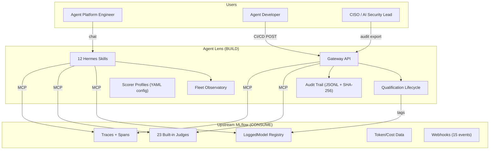

# Agent Lens: Enterprise Identity on Top of Upstream MLflow

*Owner: Product Management*
*Last updated: July 2026*
*Derived from: [MLflow Capability Audit](mlflow-capability-audit.md), [Vision](vision.md), [Implementation Plan](implementation-plan-m2.md)*

---

## The One-Sentence Answer

Agent Lens is the **qualification, governance, and fleet management layer** that MLflow does not provide and has no plans to provide.

---

## What MLflow Is (Upstream -- Consume, Never Rebuild)

MLflow is the **data plane**. It owns:

- **Trace storage**: Every agent interaction, captured via autolog or SDK
- **Evaluation engine**: 23 built-in LLM judges that score traces (yes/no categorical)
- **Agent metadata**: LoggedModel with tags, params, metrics -- the registry of record
- **Token/cost accounting**: `mlflow.chat.tokenUsage` and `mlflow.llm.cost` on every span
- **Prompt management**: Version-controlled prompt templates (not relevant for skills, but available)
- **Webhooks**: Event notifications for model and prompt lifecycle (15 event types)

Agent Lens should **never** duplicate any of this. No custom scoring engine. No custom trace store. No custom model registry. No custom cost database.

---

## What Agent Lens Is (Net-New -- Build on Top)

Agent Lens is the **decision plane**. It adds four capabilities that MLflow explicitly does not have and has no roadmap to provide.

### 1. Qualification Lifecycle

*MLflow has evidence, not verdicts.*

MLflow stores scorer results on traces. It does not:

- Aggregate results into a PASS/FAIL verdict against configurable thresholds
- Track qualification state (QUALIFIED / PENDING / EXPIRED) over time
- Enforce TTL-based re-qualification requirements
- Produce a Quality Qualification Report consumable by an Agent Platform Engineer

**Agent Lens adds:** The `evaluate-agent` skill, scorer profiles (YAML config mapping profile names to scorer lists), verdict logic, and qualification tags on MLflow LoggedModel.

### 2. CI/CD Quality Gate

*MLflow webhooks are async, not synchronous.*

MLflow has no synchronous pass/fail API. Webhooks fire-and-forget. Pipelines need:

- `POST /api/v1/gate/evaluate` that blocks and returns a verdict
- Exit code 0=PASS, 1=FAIL, 2=ERROR for Tekton / GitHub Actions / GitLab CI
- Scorer profile and threshold parameters on the request

**Agent Lens adds:** The Gateway REST API -- the only net-new service component.

### 3. Governance Audit Trail

*MLflow stores evidence, not decisions.*

MLflow assessments are per-trace, mutable, and lack actor identity. It has:

- No structured decision log
- No SHA-256 hash chain for tamper evidence
- No append-only guarantee
- No compliance export (JSON Lines / CSV for GRC)
- No cross-entity query ("show all qualifications by user X in Q3")

**Agent Lens adds:** Append-only JSONL audit store in the Gateway, with hash chain, actor identity, and export endpoints.

### 4. Fleet Observatory

*MLflow is per-experiment, not fleet-wide.*

MLflow operates experiment-by-experiment. It has:

- No fleet-wide health aggregation
- No cross-agent comparison dashboards
- No qualification status overview
- No cost-per-agent trending

**Agent Lens adds:** Skills that scan across experiments and LoggedModels to present fleet health, cost summaries, and executive views -- all via chat.

---

## What Agent Lens Is NOT

- **Not an MLflow alternative** -- it calls MLflow, never replaces it
- **Not a scoring engine** -- MLflow's 23 judges do the evaluation; Agent Lens picks which ones to use (profiles)
- **Not a trace store** -- all trace data lives in MLflow; Agent Lens reads it via MCP
- **Not a model registry** -- LoggedModel in MLflow is the source of truth; Agent Lens adds lifecycle tags
- **Not an observability platform** -- observability is traces in MLflow; Agent Lens adds judgment on top
- **Not a dashboard** -- it is conversational-first; the UI is the Hermes chat

---

## Architecture

---

## Build vs. Consume Summary

| Category | What | Approach |
|---|---|---|
| **Consume only** | Trace storage, evaluation execution, scorer logic, token tracking, model metadata storage, prompt registry | Never build -- MLflow provides these |
| **Consume + thin config** | Scorer profiles, Safety fallback for OSS | YAML mapping profile name to scorer list |
| **Consume + chat interface** | Version comparison, trace exploration, session analysis | Skills that wrap existing MCP tools |
| **Consume + extend** | Agent registry | LoggedModel as storage + qualification lifecycle on top |
| **Build (Gateway)** | CI/CD gate API, audit trail, Gateway MCP server for Hermes | Net-new FastAPI service |
| **Build (Skills)** | audit-trail, agent-registry, aggregate-traces, compare-evaluations, executive-summary, compliance-export | 6 new SKILL.md files |
| **Build (Infrastructure)** | SSO/OAuth Proxy, CronJob-based monitoring (M3), alerting (M3) | K8s manifests and config |

---

## MCP Tool Surface

### Current (M1): 11 MLflow MCP tools

`search_experiments`, `get_experiment`, `search_traces`, `get_trace`, `log_feedback`, `log_expectation`, `set_trace_tag`, `evaluate`, `list_runs`, `describe_run`, `list_scorers`

### Expanded (M2): 16 MLflow MCP tools + 4 Gateway MCP tools

Adds from MLflow: `search_logged_models`, `get_logged_model`, `set_logged_model_tags`, `create_logged_model`, `create_external_model`

Adds from Gateway: `log_audit_event`, `query_audit_trail`, `get_registry`, `register_agent`

### Future (M3+): + Prometheus MCP + Kubernetes MCP

No additional MLflow MCP tools expected. New data planes for infrastructure metrics and deployment discovery.

---

## Implementation Constraint

The Gateway is the **only new service** Agent Lens builds. Everything else is either:

- A SKILL.md file (prompt document, not code)
- A YAML config file (scorer profiles, thresholds)
- A K8s manifest (OAuth Proxy, CronJob, NetworkPolicy)

MLflow's capability set is broader than originally assumed: tag filtering works on LoggedModel, 23 judges are available (not 7), cost tracking is built in, and LoggedModel serves as the agent registry. This means Agent Lens builds less custom code than initially estimated.

---

## Defining Documents

| Document | Purpose |
|---|---|
| [Vision and Strategy](vision.md) | Why Agent Lens exists |
| [Personas](personas.md) | Who it serves |
| [MLflow Capability Audit](mlflow-capability-audit.md) | What to build vs. consume |
| [M2 PRD](prd-m2-enterprise.md) | What to build for production hardening |
| [M2 Implementation Plan](implementation-plan-m2.md) | How to build it |
| [Roadmap](roadmap.md) | When to build it (M0-M5) |
