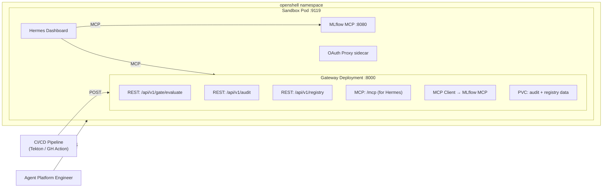
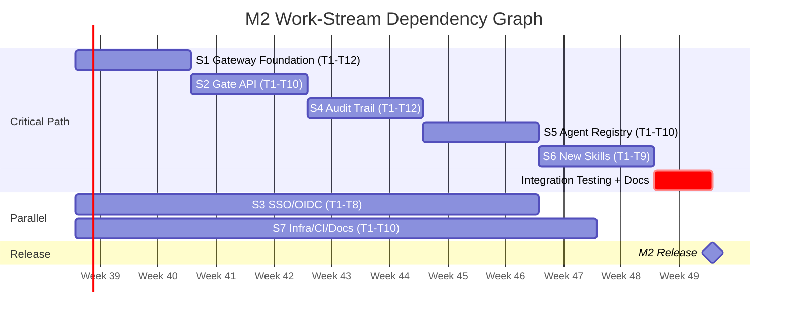
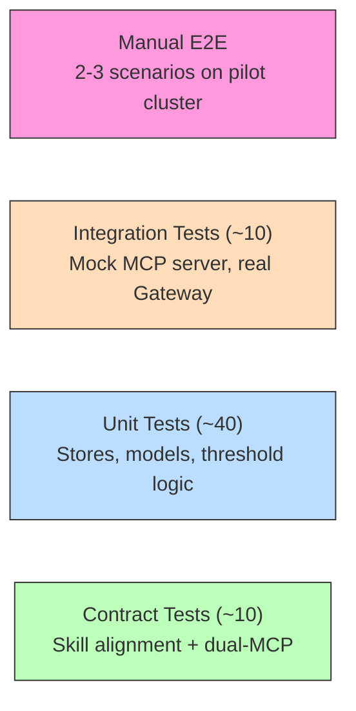

# M2 Implementation Plan -- Technical Task Breakdown

*Owner: Engineering*
*Last updated: July 2026*
*Status: Draft — Updated per [MLflow Capability Audit](mlflow-capability-audit.md)*
*Prerequisite: [PRD](prd-m2-enterprise.md), [Roadmap](roadmap.md), and [MLflow Capability Audit](mlflow-capability-audit.md)*

---

## 1. Current State Assessment

Before defining tasks, here is what exists and what does not.

### What Exists (M1 Baseline)

| Component | Location | Nature |
|---|---|---|
| 6 Hermes skills | `agent-lens/skills/*/SKILL.md` | Markdown instruction documents, not code |
| Agent identity | `agent-lens/soul.md` | LLM system prompt with routing table |
| Hermes config | `agent-lens/config.yaml` | Model, MCP server, tool allowlist, skill curator |
| Container image | `agent-lens/Containerfile` | Python 3.13, hermes-agent>=0.19.0, Node 22 |
| OpenShell deploy | `agent-lens/deploy/openshell/` | Sandbox CR, Service, Route, NetworkPolicy |
| Legacy deploy | `agent-lens/deploy/` | Deprecated Deployment stack |
| Instrumentation | `instrumentation/` | usercustomize.py (autolog) + eval_agent.py (CLI) |
| CI | `.github/workflows/ci.yml` | skill-alignment, score-scale-guard, kustomize-build |
| Tests | `tests/test_skill_alignment.py` | 7 static contract tests (no integration tests) |
| MCP contract check | `scripts/check_mcp_contract.sh` | Live MCP tool validation |
| Makefile | `Makefile` | build, deploy, status, eval, check-mcp |

### What Does Not Exist (Required for M2)

| Component | Nature | Complexity |
|---|---|---|
| **Agent Lens Gateway** | Net-new Python service (FastAPI) | High -- new component, new image, new deploy |
| **Audit trail** | Net-new storage + query layer | Medium -- append-only log, query API |
| **Agent registry** | Net-new fleet inventory | Medium -- aggregation logic, status computation |
| **SSO/OIDC** | New sidecar on existing Sandbox | Medium -- config-heavy, no code |
| **Gateway MCP server** | Net-new MCP interface for Hermes | Medium -- enables skills to write audit events |
| **5 new skills** | New SKILL.md files | Low per skill -- follows established pattern |
| **Package manifest** | requirements.txt or pyproject.toml | Low -- currently missing from repo |
| **Integration tests** | Tests against running Gateway | Medium -- no test infrastructure exists |

---

## 2. Architecture Decisions (Resolve Before Coding)

These decisions shape every task below. Each needs agreement before implementation begins.

### AD-1: How Does Hermes Write to the Audit Trail?

Skills are markdown documents executed by the LLM. They cannot directly write to a database. When the `evaluate-agent` skill issues a QUALIFIED verdict, how does that decision reach the audit log?

| Option | Mechanism | Pros | Cons |
|---|---|---|---|
| **A: Gateway MCP** (recommended) | Gateway exposes an MCP server; Hermes connects to it as a second MCP server (`agentlens`). Skills call `mcp_agentlens_log_audit_event`. | Clean tool invocation pattern; Hermes already supports multiple MCP servers; consistent with planned Prometheus/K8s MCPs in M3 | Adds a second MCP connection; Gateway must implement MCP protocol |
| B: Code execution HTTP | Skills instruct LLM to use `code_execution` to POST to Gateway REST API | No new MCP server; simple HTTP call | Fragile (LLM may not always execute); NetworkPolicy needs update; code execution is meant for formatting, not I/O |
| C: MLflow tags only | Skills use existing `set_trace_tag` to store qualification metadata; Gateway reconstructs audit from tags | No new components | Tags are per-trace, not per-experiment; no checksumming; data scattered; not queryable as a log |

**Recommendation:** Option A. The Gateway already needs to exist for CI/CD. Adding MCP server capability is incremental. Hermes `config.yaml` already supports multiple `mcp_servers`. This is not a "custom MCP fork" -- it is Agent Lens's own MCP, analogous to the planned Prometheus MCP and K8s MCP in M3.

**Impact if chosen:** Gateway becomes a dual-protocol service (REST + MCP). Hermes config adds `agentlens` MCP server. NetworkPolicy adds egress to Gateway. Skills use `mcp_agentlens_*` tool names.

### AD-2: Gateway Storage Backend (M2)

The Gateway needs persistent storage for audit records and registry data. M2 targets 100 agents and 10,000 audit records.

| Option | Mechanism | Pros | Cons |
|---|---|---|---|
| **A: JSON Lines on PVC** (recommended) | Append-only `.jsonl` files for audit; JSON file for registry; PVC mount | Zero external dependencies; simple to implement; easy to export | No concurrent write safety; query = file scan; migrating to PostgreSQL in M3 anyway |
| B: SQLite on PVC | SQLite database file on PVC | SQL queries; ACID; concurrent reads | SQLite write locking under concurrent gate evaluations; migration to PostgreSQL in M3 |
| C: PostgreSQL from M2 | PostgreSQL as external dependency | Production-ready from day one | Adds operational complexity; not all pilot environments have PostgreSQL |

**Recommendation:** Option A for M2, with schema designed for easy PostgreSQL migration in M3. JSON Lines is the simplest path for the M2 scale target (10K records, 5 concurrent evaluations). The audit record schema in the PRD is already JSON -- writing it to `.jsonl` is trivial.

### AD-3: SSO Implementation Path

| Option | Mechanism | Pros | Cons |
|---|---|---|---|
| **A: OAuth Proxy sidecar** (recommended) | Add `oauth-proxy` container to Sandbox pod (or separate pod fronting the Route) | Zero Hermes code changes; proven OpenShift pattern; group-based RBAC | Another container; proxy must forward user identity headers |
| B: Reverse proxy Deployment | Separate Deployment running oauth-proxy, fronting the existing Route | Decoupled from Sandbox lifecycle; easier to manage independently | Extra Deployment; Route configuration complexity |

**Recommendation:** Option A for Hermes dashboard (sidecar or separate pod fronting the Route). For the Gateway, API key auth is sufficient for M2 (CI/CD pipelines use tokens, not SSO). OIDC for Gateway deferred to M3.

### AD-4: Gateway Container Image Strategy

| Option | Mechanism | Pros | Cons |
|---|---|---|---|
| **A: Separate image** (recommended) | Own `gateway/Containerfile` + BuildConfig | Independent lifecycle; smaller image; clear separation | Two images to build |
| B: Same image as Hermes | Add Gateway code to existing Containerfile; entrypoint flag selects mode | Single build | Bloats Hermes image with Gateway deps; couples lifecycles |

**Recommendation:** Option A. Gateway is a different component with different dependencies (FastAPI + MCP client, no Hermes/Node.js). Separate image keeps each lean.

### AD-5: Gateway MCP Tools (if AD-1 = Option A)

What MCP tools does the Gateway MCP server expose to Hermes?

| Tool | Purpose | Used by Skills |
|---|---|---|
| `log_audit_event` | Write qualification/annotation/gate decisions to audit trail | evaluate-agent, review-trace, create-regression |
| `query_audit_trail` | Query audit records by experiment, date range, actor | audit-trail (new skill) |
| `get_registry` | Return fleet inventory with qualification status | agent-registry (new skill), quality-dashboard |
| `register_agent` | Manually register an agent with metadata | agent-registry (new skill) |

Hermes config addition:
```yaml
mcp_servers:
  mlflow:
    url: "http://mlflow-mcp.redhat-ods-applications.svc.cluster.local:8080/mcp"
    # ... existing config
  agentlens:
    url: "http://agent-lens-gateway.openshell.svc.cluster.local:8000/mcp"
    timeout: 30
    tools:
      include:
        - log_audit_event
        - query_audit_trail
        - get_registry
        - register_agent
```

---

## 3. New Component: Agent Lens Gateway

The Gateway is the largest new piece of work in M2. This section defines its structure.

### 3.1 Directory Structure

```
gateway/
├── pyproject.toml              # Package definition + dependencies
├── Containerfile               # Python 3.13-slim + FastAPI + MCP
├── gateway/
│   ├── __init__.py
│   ├── main.py                 # FastAPI app factory + lifespan
│   ├── config.py               # Gateway configuration (env + YAML)
│   ├── api/
│   │   ├── __init__.py
│   │   ├── gate.py             # POST /api/v1/gate/evaluate
│   │   ├── audit.py            # GET /api/v1/audit, export endpoints
│   │   └── registry.py         # GET/POST /api/v1/registry
│   ├── mcp_client/
│   │   ├── __init__.py
│   │   └── mlflow.py           # MCP client connecting to MLflow MCP
│   ├── mcp_server/
│   │   ├── __init__.py
│   │   └── server.py           # MCP server for Hermes integration
│   ├── stores/
│   │   ├── __init__.py
│   │   ├── audit.py            # Append-only JSONL audit store
│   │   └── registry.py         # Agent registry store
│   └── models/
│       ├── __init__.py
│       ├── gate.py             # Request/response models for gate API
│       ├── audit.py            # Audit record schema
│       └── registry.py         # Registry entry schema
├── tests/
│   ├── __init__.py
│   ├── test_gate.py            # Gate API unit tests
│   ├── test_audit_store.py     # Audit store unit tests
│   ├── test_registry_store.py  # Registry store unit tests
│   └── conftest.py             # Fixtures (mock MCP client)
├── deploy/
│   ├── kustomization.yaml
│   ├── deployment.yaml         # Gateway Deployment
│   ├── service.yaml            # ClusterIP :8000
│   ├── route.yaml              # Optional external Route (for CI/CD)
│   └── networkpolicy.yaml      # Ingress from CI/CD + Hermes; egress to MCP
└── examples/
    ├── tekton-task.yaml         # Tekton Task for CI/CD gate
    └── github-action.yml        # GitHub Action for CI/CD gate
```

### 3.2 Key Dependencies

```toml
[project]
name = "agent-lens-gateway"
requires-python = ">=3.11"
dependencies = [
    "fastapi>=0.115",
    "uvicorn[standard]>=0.30",
    "httpx>=0.27",
    "mcp>=1.0",
    "pyyaml>=6.0",
    "pydantic>=2.0",
]

[project.optional-dependencies]
dev = ["pytest>=8.0", "pytest-asyncio>=0.24", "httpx"]

[project.scripts]
agent-lens-gate = "gateway.cli:main"
```

### 3.3 Network Topology (M2)



---

## 4. Task Breakdown by Work Stream

Tasks are numbered `S<stream>.T<task>`. Dependencies are explicit.

### Stream 1: Gateway Foundation (Week 1-2)

Everything else depends on this. The Gateway is the new component that hosts the gate API, audit trail, registry, and MCP server.

| Task | Description | Depends On | Deliverable | Estimate |
|---|---|---|---|---|
| S1.T1 | Create `gateway/` directory structure and `pyproject.toml` | -- | Package skeleton, installable with `pip install -e .` | 0.5d |
| S1.T2 | Implement `gateway/config.py` | S1.T1 | Configuration from env vars + optional YAML; MCP URL, audit path, API key | 0.5d |
| S1.T3 | Implement `gateway/mcp_client/mlflow.py` | S1.T1 | Async MCP client that connects to MLflow MCP via SSE/streamable HTTP. Methods: `evaluate()`, `search_traces()`, `list_scorers()`, `search_experiments()`, `list_runs()` | 2d |
| S1.T4 | Implement `gateway/stores/audit.py` | S1.T1 | Append-only JSONL audit store with SHA-256 checksums. Methods: `append()`, `query()`, `export_jsonl()`, `export_csv()`. File locking for concurrent writes. | 1.5d |
| S1.T5 | Implement `gateway/stores/registry.py` | S1.T1 | JSON-file-backed registry store. Methods: `list_agents()`, `get_agent()`, `register()`, `refresh_from_mlflow()`, `compute_status()`. Qualification TTL logic. | 1.5d |
| S1.T6 | Implement `gateway/models/*.py` | S1.T1 | Pydantic models for gate request/response, audit record, registry entry. Match PRD schemas exactly. | 1d |
| S1.T7 | Implement `gateway/main.py` | S1.T2-T6 | FastAPI app with lifespan (init stores, MCP client). Health check endpoint. CORS for CI/CD. | 1d |
| S1.T8 | Create `gateway/Containerfile` | S1.T1 | Python 3.13-slim, install gateway package, EXPOSE 8000, CMD uvicorn | 0.5d |
| S1.T9 | Create `gateway/deploy/` manifests | S1.T8 | Deployment (1 replica), Service (:8000), Route (optional), NetworkPolicy, PVC (2Gi) | 1d |
| S1.T10 | Unit tests for stores and config | S1.T4-T6 | `test_audit_store.py`, `test_registry_store.py`, `test_config.py` | 1.5d |
| S1.T11 | Update Makefile | S1.T8-T9 | Targets: `build-gateway`, `deploy-gateway`, `logs-gateway` | 0.5d |
| S1.T12 | Update CI workflow | S1.T10 | Add `gateway-tests` job to `ci.yml` | 0.5d |

**Stream 1 total: ~12 days**

### Stream 2: Gate API (Week 2-4)

The CI/CD quality gate -- the primary M2 deliverable.

| Task | Description | Depends On | Deliverable | Estimate |
|---|---|---|---|---|
| S2.T1 | Implement `POST /api/v1/gate/evaluate` | S1.T3, S1.T6, S1.T7 | Accepts experiment name, profile, thresholds. Calls MLflow MCP `evaluate`. Returns structured verdict JSON. | 2d |
| S2.T2 | Implement scorer profile resolution | S2.T1 | Resolve profile name (rag/tool-calling/chat/safety/comprehensive/custom) to scorer list. Call `list_scorers` to validate availability. | 1d |
| S2.T3 | Implement threshold evaluation logic | S2.T1 | Aggregate yes/no scorer results into pass rates. Compare against thresholds. Compute overall PASS/FAIL verdict. | 1d |
| S2.T4 | Wire gate decisions to audit store | S2.T1, S1.T4 | Every gate evaluation writes a `gate_evaluation` audit record with checksummed evidence. | 0.5d |
| S2.T5 | Implement API key authentication | S2.T1 | `Authorization: Bearer <key>` validation. Key from K8s Secret via env. Reject unauthenticated requests with 401. | 0.5d |
| S2.T6 | Implement CLI wrapper `agent-lens-gate` | S2.T1 | CLI that calls Gateway API. Args: `--experiment`, `--profile`, `--min-pass-rate`, `--max-error-rate`, `--gateway-url`, `--api-key`. Exit code 0=PASS, 1=FAIL, 2=ERROR. | 1d |
| S2.T7 | Create Tekton Task example | S2.T6 | `examples/tekton-task.yaml` with params, steps, and usage docs | 0.5d |
| S2.T8 | Create GitHub Action example | S2.T6 | `examples/github-action.yml` with inputs, steps, and usage docs | 0.5d |
| S2.T9 | Gate API unit tests | S2.T1-T5 | Mock MCP client; test PASS/FAIL/ERROR scenarios; test threshold boundary conditions; test malformed requests | 2d |
| S2.T10 | Gate API integration test | S2.T1 | End-to-end test with mock MCP server returning realistic MLflow data | 1d |

**Stream 2 total: ~10 days**

### Stream 3: SSO / OIDC (Week 1-3, parallel with Stream 1)

Primarily configuration work, not application code.

| Task | Description | Depends On | Deliverable | Estimate |
|---|---|---|---|---|
| S3.T1 | Research Hermes OIDC / OAuth Proxy integration | -- | Design doc: how to inject user identity from OAuth Proxy headers into Hermes session. Validate Hermes supports `X-Forwarded-User` or similar. | 1d |
| S3.T2 | Create OAuth Proxy overlay manifests | S3.T1 | Kustomize overlay: oauth-proxy sidecar (or separate pod), ServiceAccount, ConfigMap for OIDC config | 2d |
| S3.T3 | Update NetworkPolicy for OAuth Proxy | S3.T2 | Allow OAuth Proxy → Hermes dashboard (localhost or pod network). Allow OAuth Proxy → OIDC provider (egress). | 0.5d |
| S3.T4 | Update Route to terminate at OAuth Proxy | S3.T2 | Route → OAuth Proxy :4180 → Hermes :9119 (instead of Route → Hermes :9119 directly) | 0.5d |
| S3.T5 | Document OIDC provider setup | S3.T2 | Docs for Keycloak, Azure AD, Okta configuration: client ID, redirect URI, group claims | 1d |
| S3.T6 | Implement basic-auth fallback | S3.T2 | When OAuth Proxy is not configured, existing basic auth continues to work. Document both paths. | 0.5d |
| S3.T7 | Propagate user identity to skills | S3.T1 | If Hermes supports extracting `X-Forwarded-User` header, configure it. If not, document the gap and propose upstream contribution. Affects audit trail actor field. | 1d |
| S3.T8 | Integration test with Keycloak | S3.T2-T7 | Manual test procedure: deploy Keycloak, configure OIDC, login, verify user identity in audit trail | 1d |

**Stream 3 total: ~7.5 days**

### Stream 4: Audit Trail (Week 3-5)

Builds on Gateway foundation (Stream 1) and Gate API (Stream 2).

| Task | Description | Depends On | Deliverable | Estimate |
|---|---|---|---|---|
| S4.T1 | Implement `GET /api/v1/audit` REST endpoint | S1.T4, S1.T7 | Query audit records by experiment, date range, actor, event type. Paginated response. | 1d |
| S4.T2 | Implement audit export endpoints | S4.T1 | `GET /api/v1/audit/export?format=jsonl` and `format=csv`. Streaming response for large exports. | 1d |
| S4.T3 | Implement Gateway MCP server | S1.T7 | `gateway/mcp_server/server.py`: MCP server (SSE/streamable HTTP) exposing `log_audit_event`, `query_audit_trail`, `get_registry`, `register_agent` tools. Mount at `/mcp` alongside REST. | 2.5d |
| S4.T4 | Update Hermes `config.yaml` | S4.T3 | Add `agentlens` MCP server entry with URL and tool allowlist | 0.5d |
| S4.T5 | Update NetworkPolicy: Sandbox → Gateway egress | S4.T3 | Allow Hermes pod to reach Gateway on port 8000 | 0.5d |
| S4.T6 | Update `evaluate-agent` skill | S4.T4 | Add step after qualification verdict: call `mcp_agentlens_log_audit_event` with verdict, evidence, actor. Preserve existing MCP-first flow. | 1d |
| S4.T7 | Update `review-trace` skill | S4.T4 | After logging feedback/expectations: call `mcp_agentlens_log_audit_event` with annotation event | 0.5d |
| S4.T8 | Update `create-regression` skill | S4.T4 | After tagging regression: call `mcp_agentlens_log_audit_event` with regression_tagged event | 0.5d |
| S4.T9 | Create `audit-trail` skill (SKILL.md) | S4.T4 | New skill: "Show me the audit trail for outreach-agent." Calls `mcp_agentlens_query_audit_trail`. Formats as table. | 1d |
| S4.T10 | Update `soul.md` | S4.T6-T9 | Add `mcp_agentlens_*` tools to MCP section. Add `agentlens` tool descriptions. Update intent routing table with `audit-trail` skill. | 0.5d |
| S4.T11 | Update skill alignment tests | S4.T4, S4.T10 | Add `agentlens` MCP server to config validation. Update `_official_tools_from_config()` to check both MCP servers. Allow `mcp_agentlens_*` pattern in skills. | 1d |
| S4.T12 | Audit trail tests | S4.T1-T3 | Gateway MCP server tests (mock stores). Audit query/export tests. | 1.5d |

**Stream 4 total: ~11.5 days**

### Stream 5: Agent Registry (Week 5-7)

| Task | Description | Depends On | Deliverable | Estimate |
|---|---|---|---|---|
| S5.T1 | Implement `GET /api/v1/registry` | S1.T5, S1.T7 | REST endpoint returning fleet inventory with computed status | 1d |
| S5.T2 | Implement `POST /api/v1/registry` | S1.T5, S1.T7 | Manual agent registration with metadata (owner_team, namespace, framework) | 0.5d |
| S5.T3 | Implement MLflow experiment sync | S1.T3, S1.T5 | Background task: periodically call MLflow MCP `search_experiments` to discover agents. Merge with manual registrations. | 1.5d |
| S5.T4 | Implement status computation | S1.T4, S1.T5 | Compute QUALIFIED / PENDING / EXPIRED / NOT_QUALIFIED / INACTIVE from audit trail + MLflow trace data + qualification TTL | 1.5d |
| S5.T5 | Wire registry tools to Gateway MCP | S4.T3, S1.T5 | `get_registry` and `register_agent` MCP tools return registry data for skills | 0.5d |
| S5.T6 | Create `agent-registry` skill (SKILL.md) | S5.T5 | New skill: "Show me the agent registry." Calls `mcp_agentlens_get_registry`. Formats as fleet inventory table with status, qualification expiry, owner. | 1d |
| S5.T7 | Update `quality-dashboard` skill | S5.T5 | Integrate registry data: show qualification status alongside health status. Replace or supplement the current experiment-scanning logic. | 1d |
| S5.T8 | Update `soul.md` routing | S5.T6 | Add agent-registry to intent routing table | 0.5d |
| S5.T9 | Register new skills in kustomize + startup | S5.T6 | Add `skill-agent-registry` ConfigMap, volume mount, SKILLS list entry | 0.5d |
| S5.T10 | Registry tests | S5.T1-T4 | Unit tests for status computation, sync logic, REST endpoints | 1.5d |

**Stream 5 total: ~9.5 days**

### Stream 6: New and Enhanced Skills (Week 7-9)

Each skill is a SKILL.md file following established patterns. All skills also need kustomize registration, startup.sh addition, and volume mounts.

| Task | Description | Depends On | Deliverable | Estimate |
|---|---|---|---|---|
| S6.T1 | Create `aggregate-traces` skill (F5) | -- | SKILL.md: aggregation over search_traces results. Error rate, latency p50/p95, tool call success rate, token usage. Configurable window (24h/7d/30d). | 1d |
| S6.T2 | Update `evaluate-agent` skill for Safety + Comprehensive profiles (F6) | -- | Add Safety profile (Safety + Guidelines scorers). Add Comprehensive profile (all available scorers). Document scorer requirements per profile. | 0.5d |
| S6.T3 | Implement custom profile configuration (F6) | S6.T2 | YAML format for custom profiles stored on PVC (`/sandbox/data/profiles/`). Skill reads profile via file_operations tool. | 1d |
| S6.T4 | Create `compare-evaluations` skill (F7) | -- | SKILL.md: accepts two run IDs or "latest vs. previous". Calls `mcp_mlflow_describe_run` and `mcp_mlflow_list_runs`. Shows per-scorer delta with threshold crossing flags. | 1d |
| S6.T5 | Create `executive-summary` skill (F8) | S5.T5 | SKILL.md: calls `mcp_agentlens_get_registry` + `mcp_mlflow_search_experiments`. Produces non-technical paragraph: fleet size, qualified count, top concern, health sentence. | 0.5d |
| S6.T6 | Create `compliance-export` skill (F9) | S4.T3 | SKILL.md: calls `mcp_agentlens_query_audit_trail` with date range. Formats as exportable structured table (JSON Lines / CSV via code_execution). | 0.5d |
| S6.T7 | Update `soul.md` with all new skills and tools | S6.T1-T6 | Add intent routing for aggregate-traces, compare-evaluations, executive-summary, compliance-export. Update scorer profiles section. | 0.5d |
| S6.T8 | Register all new skills in kustomize + startup | S6.T1-T6 | Add ConfigMap entries, volume mounts, and SKILLS list entries for: audit-trail (S4.T9), agent-registry (S5.T6), aggregate-traces, compare-evaluations, executive-summary, compliance-export | 1d |
| S6.T9 | Update skill alignment tests | S6.T7-T8 | Verify all new skills reference only allowlisted tools (both `mcp_mlflow_*` and `mcp_agentlens_*`). Update required tool lists. | 0.5d |

**Stream 6 total: ~6.5 days**

### Stream 7: Infrastructure, CI, and Documentation (Throughout)

| Task | Description | Depends On | Deliverable | Estimate |
|---|---|---|---|---|
| S7.T1 | Create repo-level `pyproject.toml` or `requirements.txt` | -- | Pin dev/test dependencies: pytest, pyyaml, httpx. Document Gateway and instrumentation deps separately. | 0.5d |
| S7.T2 | Update CI workflow | S1.T12, S4.T11 | Add jobs: gateway-tests, gateway-lint. Update skill-alignment job for dual-MCP config. Add kustomize build for gateway/deploy/. | 1d |
| S7.T3 | Update Makefile | S1.T11 | Targets: `build-gateway`, `deploy-gateway`, `deploy-m2` (deploys both Sandbox + Gateway), `logs-gateway`, `status` (adds Gateway check) | 0.5d |
| S7.T4 | Update `deploy-all` and `status` | S7.T3 | `make deploy-all` includes Gateway. `make status` checks Gateway pod + readiness. | 0.5d |
| S7.T5 | Update `README.md` | All | Architecture diagram, M2 features, Gateway quickstart, SSO setup | 1d |
| S7.T6 | Update `docs/enterprise-readiness.md` | All | Mark completed items: CI/CD gate, SSO, audit trail. Update gaps. | 0.5d |
| S7.T7 | Update `docs/limitations.md` | All | Remove items that M2 resolves. Add new limitations (single-replica Gateway, PVC audit, no multi-tenant). | 0.5d |
| S7.T8 | Update `docs/architecture.md` | All | Add Gateway to architecture diagram. Document dual-MCP topology. | 0.5d |
| S7.T9 | Update `docs/first-trace.md` and `docs/demo-script.md` | All | Add M2 demo acts: gate evaluation, audit query, registry view | 1d |
| S7.T10 | Create `docs/gateway-ops.md` | S1.T9 | Operator guide for Gateway: deploy, configure, monitor, troubleshoot | 1d |

**Stream 7 total: ~7 days**

---

## 5. Dependency Graph



**Critical path:** S1 → S2 → S4 → S5 → S6 → Integration Testing

**Parallel work:**
- S3 (SSO) is independent of S1/S2 and can proceed in parallel from week 1
- S7 (Infra/CI/Docs) runs throughout
- Within S6, skills that use only `mcp_mlflow_*` tools (F5, F6, F7) can start before Gateway MCP is ready

---

## 6. Concrete File Changes per Stream

### Files Created (Net New)

| File | Stream | Purpose |
|---|---|---|
| `gateway/pyproject.toml` | S1 | Package manifest |
| `gateway/Containerfile` | S1 | Container image |
| `gateway/gateway/__init__.py` | S1 | Package |
| `gateway/gateway/main.py` | S1 | FastAPI app |
| `gateway/gateway/config.py` | S1 | Configuration |
| `gateway/gateway/cli.py` | S2 | CLI wrapper |
| `gateway/gateway/api/gate.py` | S2 | Gate API endpoint |
| `gateway/gateway/api/audit.py` | S4 | Audit query/export endpoints |
| `gateway/gateway/api/registry.py` | S5 | Registry endpoints |
| `gateway/gateway/mcp_client/mlflow.py` | S1 | MLflow MCP client |
| `gateway/gateway/mcp_server/server.py` | S4 | Gateway MCP server |
| `gateway/gateway/stores/audit.py` | S1 | Audit store |
| `gateway/gateway/stores/registry.py` | S1 | Registry store |
| `gateway/gateway/models/*.py` | S1 | Pydantic models |
| `gateway/tests/*.py` | S1-S5 | Gateway tests |
| `gateway/deploy/*.yaml` | S1 | K8s manifests |
| `examples/tekton-task.yaml` | S2 | CI/CD example |
| `examples/github-action.yml` | S2 | CI/CD example |
| `agent-lens/skills/audit-trail/SKILL.md` | S4 | Audit trail skill |
| `agent-lens/skills/agent-registry/SKILL.md` | S5 | Registry skill |
| `agent-lens/skills/aggregate-traces/SKILL.md` | S6 | Trace aggregation skill |
| `agent-lens/skills/compare-evaluations/SKILL.md` | S6 | Eval comparison skill |
| `agent-lens/skills/executive-summary/SKILL.md` | S6 | Executive summary skill |
| `agent-lens/skills/compliance-export/SKILL.md` | S6 | Compliance export skill |
| `docs/product/gateway-ops.md` | S7 | Gateway operator guide |

### Files Modified (Existing)

| File | Stream | Change |
|---|---|---|
| `agent-lens/config.yaml` | S4 | Add `agentlens` MCP server entry |
| `agent-lens/soul.md` | S4, S5, S6 | Add agentlens MCP tools, new skill routing, updated scorer profiles |
| `agent-lens/skills/evaluate-agent/SKILL.md` | S4, S6 | Add audit logging step; add Safety + Comprehensive profiles |
| `agent-lens/skills/review-trace/SKILL.md` | S4 | Add audit logging step after annotation |
| `agent-lens/skills/create-regression/SKILL.md` | S4 | Add audit logging step after regression tagging |
| `agent-lens/skills/quality-dashboard/SKILL.md` | S5 | Integrate registry data for qualification status |
| `agent-lens/deploy/openshell/kustomization.yaml` | S4, S5, S6 | Add ConfigMaps for new skills |
| `agent-lens/deploy/openshell/startup.sh` | S4, S5, S6 | Add new skills to SKILLS list and copy loop |
| `agent-lens/deploy/openshell/sandbox.yaml` | S4, S5, S6 | Add volume mounts for new skill ConfigMaps |
| `agent-lens/deploy/openshell/network-policies.yaml` | S4 | Add egress to Gateway :8000 |
| `tests/test_skill_alignment.py` | S4, S6 | Support dual-MCP config; allow mcp_agentlens_* |
| `.github/workflows/ci.yml` | S7 | Add gateway-tests job; update kustomize job |
| `Makefile` | S7 | Add gateway targets |
| `README.md` | S7 | Update architecture, features, quickstart |
| `docs/product/enterprise-readiness.md` | S7 | Update completed/roadmap items |
| `docs/product/limitations.md` | S7 | Update limitations |
| `docs/product/architecture.md` | S7 | Add Gateway to architecture |

---

## 7. Test Strategy

### 7.1 Test Pyramid



### 7.2 New Test Files

| File | Type | What it tests |
|---|---|---|
| `gateway/tests/test_audit_store.py` | Unit | Append, query, export, checksum, file locking |
| `gateway/tests/test_registry_store.py` | Unit | Register, list, sync, status computation, TTL expiry |
| `gateway/tests/test_gate.py` | Unit | PASS/FAIL/ERROR scenarios, threshold boundaries, profile resolution |
| `gateway/tests/test_mcp_server.py` | Unit | MCP tool handlers, input validation |
| `gateway/tests/test_gate_integration.py` | Integration | Mock MCP server + real Gateway; end-to-end gate evaluation |
| `gateway/tests/test_cli.py` | Unit | CLI arg parsing, exit codes |
| `tests/test_skill_alignment.py` | Contract | Extended: dual-MCP validation, agentlens tool allowlist |

### 7.3 What Is NOT Tested (and why)

- **Hermes skill execution**: skills are markdown, not code; testing them requires a running LLM. This is manual QA.
- **SSO/OIDC end-to-end**: requires OIDC provider; manual test procedure documented.
- **MCP client against live MLflow MCP**: requires MLflow tracking; CI uses mock MCP.

---

## 8. Deployment Strategy

### 8.1 Deployment Order

```
1. Build Gateway image          make build-gateway
2. Deploy Gateway               make deploy-gateway
3. Verify Gateway health        curl https://gateway-route/health
4. Rebuild Hermes image         make build-agent          (new skills + config baked in)
5. Redeploy Hermes Sandbox      make deploy-openshell     (picks up new config + skills)
6. Verify MCP connectivity      Hermes → Gateway MCP + MLflow MCP
7. Verify gate API              curl -X POST .../api/v1/gate/evaluate
8. Configure OAuth Proxy        make deploy-sso           (if SSO enabled)
```

### 8.2 Rollback

- Gateway is independent of Hermes -- rollback by scaling Gateway to 0 replicas
- Hermes skills degrade gracefully: if Gateway MCP is unreachable, `mcp_agentlens_*` calls fail but `mcp_mlflow_*` calls still work
- Soul.md routing falls back to existing skills
- BasicAuth continues working if OAuth Proxy is removed

### 8.3 Updated `make deploy-all` Flow

```makefile
deploy-all: deploy-gateway deploy-openshell
	@echo "Gateway + Hermes Sandbox deployed"
	@$(MAKE) status
```

---

## 9. Risk Register

| Risk | Likelihood | Impact | Mitigation |
|---|---|---|---|
| Hermes does not support `X-Forwarded-User` for user identity propagation | Medium | High (SSO actor in audit trail) | Validate in S3.T1; if blocked, contribute upstream or use Gateway API actor instead |
| MCP Python SDK (`mcp` package) SSE client is unstable for Gateway → MLflow connection | Low | High (Gate API fails) | S1.T3 includes connection resilience testing; fallback to raw HTTP JSON-RPC |
| Gateway MCP server (serving Hermes) adds latency to skill execution | Low | Medium | MCP server runs in-process with FastAPI; timeout tuning in S4.T4 |
| Custom profile YAML on PVC is hard to manage without a UI | Medium | Low | M3 adds profile management via chat; M2 documents manual procedure |
| File-based audit store fails under concurrent gate evaluations | Medium | Medium | File locking in S1.T4; M2 targets 5 concurrent evaluations only |
| OpenShift OAuth Proxy version incompatibility with Sandbox CR | Low | Medium | Test against target OpenShift versions in S3.T2 |

---

## 10. Estimation Summary

| Stream | Duration | Parallelism |
|---|---|---|
| S1: Gateway Foundation | 12 days | Blocks S2, S4, S5 |
| S2: Gate API | 10 days | After S1 |
| S3: SSO/OIDC | 7.5 days | Parallel with S1 |
| S4: Audit Trail | 11.5 days | After S1; overlaps with S2 |
| S5: Agent Registry | 9.5 days | After S4 |
| S6: New Skills | 6.5 days | After S4 (partially after S1) |
| S7: Infra/CI/Docs | 7 days | Throughout |

**Total effort:** ~64 engineering days (~13 weeks for 1 engineer; ~7 weeks for 2 engineers working on parallel streams)

**Calendar estimate with 2 engineers:**
- Weeks 1-2: S1 (Gateway Foundation) + S3 (SSO) in parallel
- Weeks 3-4: S2 (Gate API) + S4 (Audit Trail) in parallel
- Weeks 5-6: S5 (Registry) + S6 (Skills, MLflow-only subset) in parallel
- Weeks 7-8: S6 (Skills, Gateway MCP subset) + S7 (Docs/CI) + integration testing
- Weeks 9-10: Integration testing, pilot deployment, docs polish

---

## 11. Definition of Done

M2 is implementable when:

- [ ] Architecture decisions AD-1 through AD-5 are agreed upon
- [ ] Gateway directory structure exists with passing skeleton tests
- [ ] `POST /api/v1/gate/evaluate` returns correct PASS/FAIL verdicts against mock MCP
- [ ] Audit trail records every qualification decision with SHA-256 checksums
- [ ] Agent registry computes correct status for all status values (QUALIFIED/PENDING/EXPIRED/INACTIVE)
- [ ] At least 2 new skills (audit-trail, agent-registry) work via Gateway MCP
- [ ] SSO login demonstrated with at least 1 OIDC provider
- [ ] All existing tests pass; new tests cover Gateway components
- [ ] `make deploy-all` deploys Gateway + Hermes Sandbox
- [ ] Tekton Task and GitHub Action examples are functional
- [ ] README and operator docs updated for M2 components

---

## 12. MLflow Capability Audit — Impact on M2 Tasks

*Added July 2026 per [MLflow Capability Audit](mlflow-capability-audit.md). This section documents how audit findings change specific tasks.*

### 12.1 Agent Registry: Use LoggedModel as Storage Layer

**Audit finding:** MLflow LoggedModel provides `create_external_model`, `set_logged_model_tags`, `search_logged_models`, and `get_logged_model` — sufficient to store agent metadata, qualification status, and ownership. Building a separate registry store duplicates this.

**Task changes:**

| Task | Original Design | Updated Design |
|---|---|---|
| S1.T5 (`stores/registry.py`) | JSON-file-backed primary store | **Cache/view over MLflow LoggedModel data.** `list_agents()` calls `search_logged_models`. `register()` calls `create_external_model` + `set_logged_model_tags`. Local cache for computed status fields (TTL, lifecycle state). |
| S5.T3 (MLflow experiment sync) | Periodically scan experiments to discover agents | **Periodically call `search_logged_models`** with tag filtering (confirmed working — [doc bug #17920](https://github.com/mlflow/mlflow/issues/17920) fixed in [PR #18364](https://github.com/mlflow/mlflow/pull/18364)). Query `tags.agentlens.qualification_status` directly. Merge with `search_experiments` for unregistered agents. |
| S5.T5 (`get_registry` MCP tool) | Returns data from local JSON store | Returns data aggregated from MLflow LoggedModel + computed qualification status |
| S5.T6 (`agent-registry` skill) | Calls `mcp_agentlens_get_registry` only | Also calls `mcp_mlflow_search_logged_models` and `mcp_mlflow_get_logged_model` directly |

**Config change required:** Set `MLFLOW_MCP_TOOLS=all` (or `genai,models`) in MLflow MCP server configuration. Add `search_logged_models`, `get_logged_model`, `set_logged_model_tags`, `create_logged_model`, `create_external_model` to Hermes `config.yaml` tool allowlist.

### 12.2 Scorer Profiles: Config, Not Code

**Audit finding:** MLflow provides 23 built-in judges. Agent Lens profiles should be named groupings of scorer names — YAML configuration, not custom scorer code.

**Task changes:**

| Task | Original Design | Updated Design |
|---|---|---|
| S6.T2 (Safety + Comprehensive profiles) | Implied new scorer development | **YAML config only.** Safety profile = `[Guidelines]` on OSS (with safety criteria text) or `[Safety, Guidelines]` on Databricks. Comprehensive = all scorers from `list_scorers` minus RAG-only scorers. |
| S6.T3 (Custom profile config) | YAML format for custom profiles on PVC | **Simplified.** Profile YAML = `{name: "custom", scorers: ["RelevanceToQuery", "Correctness"], thresholds: {pass_rate: 0.85}}`. No scorer implementation code. |

**OSS limitation to document:** `Safety` and `RetrievalRelevance` judges are Databricks-only. Safety profile falls back to `Guidelines` with explicit safety criteria on OSS deployments.

### 12.3 Comparison Skill: No Gateway Dependency

**Audit finding:** `describe_run` MCP tool returns evaluation metrics (scorer pass rates). `list_runs` can filter evaluation runs. The comparison skill needs only existing MLflow MCP tools.

**Task change:**

| Task | Original Design | Updated Design |
|---|---|---|
| S6.T4 (`compare-evaluations` skill) | Implied possible Gateway dependency | **No Gateway dependency.** Skill calls `mcp_mlflow_describe_run` on two run IDs, computes per-scorer delta in code_execution, flags threshold crossings. Can start before Gateway MCP is ready. |

### 12.4 Cost Tracking: No Prometheus Needed for M2

**Audit finding:** MLflow traces contain `mlflow.chat.tokenUsage` and `mlflow.llm.cost` span attributes with automatic trace-level aggregation. `search_traces` with `extract_fields` can retrieve token data.

**Task impact:**

| Task | Impact |
|---|---|
| S6.T1 (`aggregate-traces` skill) | Add token usage aggregation: fetch traces with `extract_fields="info.token_usage"`, sum `input_tokens`/`output_tokens`/`total_tokens`, compute cost from `info.cost` if populated. |

**Known limitation:** [mlflow/mlflow#24059](https://github.com/mlflow/mlflow/issues/24059) — OpenAI autolog with streaming may report 0 tokens. Document in skill and operator guide.

### 12.5 Audit Trail: Confirmed Net-New Build

**Audit finding:** MLflow stores evidence (assessments, tags, runs) but not structured decisions. The audit trail is confirmed as a net-new build. No changes to S1.T4 or S4 tasks.

The audit record REFERENCES MLflow data (run IDs, trace IDs, assessment IDs) as evidence but the trail itself is stored and managed by Agent Lens Gateway.

### 12.6 Gateway: Confirmed Essential, Scope Narrowed

**Audit finding:** The CI/CD quality gate requires synchronous pass/fail — MLflow webhooks are async-only. The Gateway is essential. However, its registry component becomes a view/cache over MLflow LoggedModel data rather than a primary store.

**Net effect:** Gateway complexity is slightly reduced (registry store is simpler) but all core functionality remains necessary.

### 12.7 New soul.md MCP Tool Additions

```yaml
# Additional MLflow MCP tools to add to soul.md
### Agent Registry (via official MLflow MCP, models category)
- `mcp_mlflow_search_logged_models`, `mcp_mlflow_get_logged_model`
- `mcp_mlflow_set_logged_model_tags`, `mcp_mlflow_create_logged_model`
```

### 12.8 Monitoring and Alerting (M3): No MLflow Shortcut

**Audit finding:** MLflow's `ScorerScheduleConfig` (automatic online evaluation) is Databricks-only. For M3, Agent Lens must implement its own scheduling mechanism:
- K8s CronJob calling Gateway gate API
- Or Tekton scheduled pipeline
- Or Hermes `cronjob` toolset (if enabled)

No impact on M2 tasks, but important context for M3 planning.
