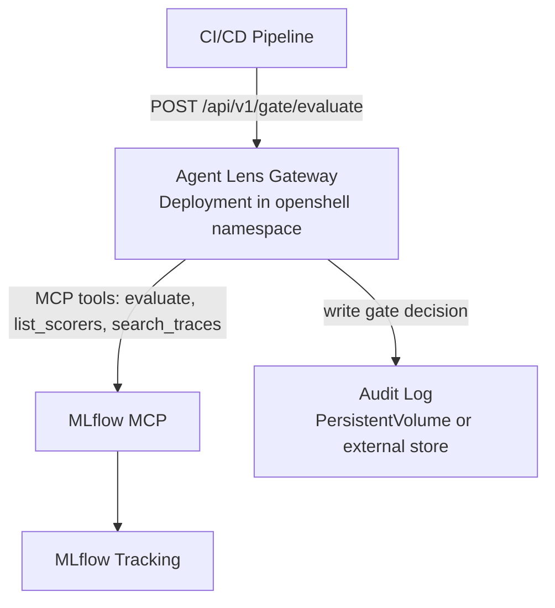

# PRD: M2 -- Production Hardening

*Owner: Product Management*
*Last updated: July 2026*
*Status: Draft*
*Milestone: [M2 -- Production hardening](https://github.com/rrbanda/agent-lens/milestone/3)*
*Target: Q4 2026*

---

## 1. Context and Motivation

Agent Lens M1 delivered a functional MVP pilot: platform engineers can evaluate, review, annotate, and qualify AI agents conversationally via upstream MLflow MCP. Six skills, OpenShell Sandbox deployment, and zero-code instrumentation are in place.

M1 proved the concept. M2 makes it enforceable.

The gap between M1 and enterprise readiness is defined by four missing capabilities:

1. **Qualification is advisory only** -- chat verdicts do not block CI/CD pipelines
2. **No authentication beyond basic auth** -- cannot integrate with enterprise identity
3. **No audit trail** -- qualification decisions are ephemeral chat history, not durable records
4. **No agent inventory** -- platform teams cannot see what agents exist, only what has traces

Industry data validates urgency: 64% of enterprise leaders cite evaluation gaps as the top blocker preventing agent pilots from reaching production (Forrester 2026). The 12% of pilots that do convert share a consistent profile -- named ownership, scoped success criteria, and automated evaluation. Agent Lens M2 provides the tooling for that profile.

### Success Criteria for M2

M2 is done when an enterprise can:
1. Block a CI/CD pipeline if an agent fails quality thresholds (not just advise in chat)
2. Authenticate users via SSO/OIDC (not basic auth)
3. Produce an audit report of every qualification decision with full evidence
4. See every agent on the cluster with its qualification status

---

## 2. Personas Served

| Persona | Role in M2 |
|---|---|
| **Agent Platform Engineer** (primary) | Sets quality bars, reviews audit trails, manages agent registry |
| **Agent Developer** (new in M2) | Integrates quality gate into CI/CD, iterates on failing evaluations |
| **Domain Expert / SME** (secondary) | Provides domain-specific feedback during trace review and annotation |

See [personas.md](personas.md) for full persona definitions.

---

## 3. Features

### 3.1 P0 Features (Must-Have for M2 Ship)

#### F1: CI/CD Quality Gate API

**GitHub Issue:** [#18](https://github.com/rrbanda/agent-lens/issues/18)

**Problem:** Qualification verdicts exist only in chat. CI/CD pipelines cannot consume them. Platform engineers must manually relay results.

**Solution:** A lightweight REST API service (Agent Lens Gateway) that accepts evaluation requests from CI/CD pipelines and returns structured pass/fail verdicts.

**User Stories:**

| ID | As a... | I want to... | So that... |
|---|---|---|---|
| F1-US1 | Agent Developer | trigger an evaluation from my CI/CD pipeline via HTTP POST | my PR is blocked if agent quality drops below the threshold |
| F1-US2 | Agent Platform Engineer | define quality thresholds per experiment (scorer, pass rate, max error rate) | different agents can have different quality bars |
| F1-US3 | Agent Developer | receive a structured JSON response with pass/fail, scorer results, and trace IDs | I can diagnose failures without switching to the Agent Lens chat |
| F1-US4 | Agent Platform Engineer | see all gate decisions in the audit trail | I know which pipelines ran evaluations and what the results were |

**API Contract (draft):**

```
POST /api/v1/gate/evaluate
Content-Type: application/json

{
  "experiment_name": "outreach-agent",
  "profile": "tool-calling",
  "thresholds": {
    "min_pass_rate": 0.80,
    "max_error_rate": 0.05
  },
  "trace_filter": {
    "max_results": 50,
    "timestamp_from": "2026-07-01T00:00:00Z"
  }
}

Response 200:
{
  "verdict": "FAIL",
  "pass_rate": 0.72,
  "error_rate": 0.02,
  "scorers": [
    {
      "name": "ToolCallCorrectness",
      "pass_rate": 0.68,
      "threshold": 0.80,
      "result": "FAIL"
    },
    {
      "name": "RelevanceToQuery",
      "pass_rate": 0.88,
      "threshold": 0.80,
      "result": "PASS"
    }
  ],
  "traces_evaluated": 50,
  "evaluation_run_id": "run-abc123",
  "timestamp": "2026-07-25T22:00:00Z"
}
```

**Exit codes for CI integration:** HTTP 200 + `verdict: PASS` = success; HTTP 200 + `verdict: FAIL` = quality failure (pipeline should fail); HTTP 4xx/5xx = infrastructure error.

**Acceptance Criteria:**

- [ ] `POST /api/v1/gate/evaluate` accepts experiment name, profile, and thresholds
- [ ] Returns structured JSON with per-scorer results and overall verdict
- [ ] Calls MLflow MCP `evaluate` internally (no direct MLflow SDK)
- [ ] Response time <30 seconds for 50 traces with 3 scorers
- [ ] Every gate decision is written to the audit log (see F3)
- [ ] CLI wrapper available: `agent-lens-gate --experiment outreach-agent --profile tool-calling`
- [ ] Tekton Task and GitHub Action examples provided in `examples/`
- [ ] Gateway runs as a separate Deployment (not inside the Hermes sandbox)

**Architecture:**



**Dependencies:**
- MLflow MCP with `evaluate` tool (already available)
- Judge LLM configured on MLflow side (existing requirement)
- New container image for Gateway (Python, FastAPI)
- Network access from Gateway to MLflow MCP service

---

#### F2: SSO / OIDC Authentication

**GitHub Issue:** [#17](https://github.com/rrbanda/agent-lens/issues/17)

**Problem:** Agent Lens uses basic auth (scrypt-hashed password in a K8s Secret). This is acceptable for pilot demos but blocks enterprise adoption -- no user identity, no group-based access control, no integration with enterprise directories.

**Solution:** OIDC-based authentication via OpenShift OAuth proxy or direct Hermes OIDC support.

**User Stories:**

| ID | As a... | I want to... | So that... |
|---|---|---|---|
| F2-US1 | Agent Platform Engineer | log in with my enterprise SSO credentials | I do not need a separate password for Agent Lens |
| F2-US2 | CISO / AI Security Lead | know which user performed each qualification decision | the audit trail has verifiable identity, not "admin" |
| F2-US3 | Agent Platform Engineer | restrict access to Agent Lens by LDAP group | only authorized platform team members can qualify agents |

**Implementation Options:**

| Option | Mechanism | Pros | Cons |
|---|---|---|---|
| A (recommended) | OpenShift OAuth Proxy sidecar | Zero Hermes changes; native OpenShift pattern; RBAC via groups | Adds a container to the pod; slightly more complex deploy |
| B | Hermes native OIDC | Single container; cleaner UX | Requires Hermes OIDC support (verify with upstream) |

**Acceptance Criteria:**

- [ ] Users authenticate via enterprise OIDC provider (Keycloak, Azure AD, Okta)
- [ ] User identity (email/username) is captured in session metadata
- [ ] Audit trail records authenticated user identity on every qualification decision
- [ ] Basic auth remains available as fallback for air-gapped / pilot environments
- [ ] Group-based access control: `agent-lens-users` group can view; `agent-lens-admins` can qualify
- [ ] OpenShift OAuth Proxy configuration documented in deploy manifests

**Dependencies:**
- OpenShift OAuth Proxy image (standard Red Hat catalog)
- OIDC provider configuration (customer-provided)
- Hermes session API must propagate authenticated identity to skills

---

#### F3: Audit Trail

**GitHub Issue:** [#19](https://github.com/rrbanda/agent-lens/issues/19)

**Problem:** Qualification decisions exist only in Hermes chat session history stored on a PVC. There is no structured, queryable, tamper-evident record of what was qualified, by whom, when, and on what evidence.

**Solution:** A structured audit log that records every qualification decision, annotation, and gate evaluation with full provenance.

**User Stories:**

| ID | As a... | I want to... | So that... |
|---|---|---|---|
| F3-US1 | CISO / AI Security Lead | query all qualification decisions for the last quarter | I can prepare for an internal audit |
| F3-US2 | Agent Platform Engineer | see the history of qualifications for a specific agent | I know when it was last evaluated and what the results were |
| F3-US3 | AI Compliance / GRC Lead | export the audit trail as structured JSON or CSV | I can import it into our GRC platform |
| F3-US4 | CISO / AI Security Lead | verify that no qualification decision has been tampered with | the audit trail is a trustworthy regulatory artifact |
| F3-US5 | Domain Expert / SME | annotate traces with domain-specific feedback during review | my expertise is captured as structured evidence in the audit trail |

**Audit Record Schema (draft):**

```json
{
  "id": "cert-2026-07-25-001",
  "timestamp": "2026-07-25T22:15:00Z",
  "type": "qualification",
  "actor": {
    "user": "jane.doe@example.com",
    "method": "chat"
  },
  "subject": {
    "experiment_name": "outreach-agent",
    "experiment_id": "exp-123"
  },
  "verdict": "QUALIFIED",
  "evidence": {
    "profile": "tool-calling",
    "traces_evaluated": 50,
    "scorers": [
      {"name": "ToolCallCorrectness", "pass_rate": 0.92},
      {"name": "RelevanceToQuery", "pass_rate": 0.96}
    ],
    "error_rate": 0.01,
    "evaluation_run_id": "run-abc123"
  },
  "thresholds": {
    "min_pass_rate": 0.80,
    "max_error_rate": 0.05
  },
  "checksum": "sha256:..."
}
```

**Audit Event Types:**

| Event | Trigger | Data Captured |
|---|---|---|
| `qualification` | `evaluate-agent` skill issues verdict | Verdict, evidence, thresholds, actor |
| `gate_evaluation` | Gateway API processes a CI/CD request | Verdict, pipeline identity, evidence |
| `annotation` | `review-trace` or `log_feedback` | Trace ID, feedback, actor |
| `regression_tagged` | `create-regression` skill tags a trace | Trace ID, expectation, actor |
| `threshold_change` | Quality threshold modified | Old/new thresholds, actor |

**Acceptance Criteria:**

- [ ] Every qualification decision (chat and API) produces an audit record
- [ ] Records are stored in append-only format (not editable via chat)
- [ ] Each record includes a SHA-256 checksum of its contents
- [ ] Records include authenticated user identity (from SSO, or "api-key:name" for Gateway)
- [ ] Query API: `GET /api/v1/audit?experiment=outreach-agent&from=2026-07-01`
- [ ] Export as JSON lines and CSV
- [ ] Hermes skill: "Show me the audit trail for outreach-agent" returns formatted table
- [ ] Storage: initially append-only JSON lines on PVC; M3 migrates to external store

**Dependencies:**
- SSO integration (F2) for user identity
- Gateway API (F1) for CI/CD actor identity
- PVC storage (existing) or external store (PostgreSQL, S3 -- M3)

---

#### F4: Agent Registry

**Problem:** Platform engineers cannot see what agents exist on the cluster. The `quality-dashboard` skill discovers agents via MLflow experiments, but agents without traces are invisible. There is no single inventory of the agent fleet.

**Solution:** An agent registry that combines MLflow experiment discovery with optional Kubernetes namespace scanning to produce a complete fleet inventory.

**User Stories:**

| ID | As a... | I want to... | So that... |
|---|---|---|---|
| F4-US1 | Agent Platform Engineer | see every agent on the cluster with its qualification status | I know which agents are qualified and which are pending |
| F4-US2 | CISO / AI Security Lead | know how many agents are deployed vs. how many are qualified | I can quantify governance coverage |
| F4-US3 | Agent Platform Engineer | register an agent manually if auto-discovery misses it | the registry is complete even for non-standard deployments |
| F4-US4 | Agent Platform Engineer | see agent metadata (owner team, deploy namespace, framework) | I can route evaluation requests to the right people |

**Registry Data Model (extends MLflow experiment metadata):**

| Field | Source | Required |
|---|---|---|
| `agent_name` | MLflow experiment name | Yes |
| `experiment_id` | MLflow | Yes |
| `status` | Computed: QUALIFIED / PENDING / EXPIRED / NOT_QUALIFIED / INACTIVE | Yes |
| `last_qualified` | Audit trail timestamp | Auto |
| `last_evaluated` | MLflow evaluation run timestamp | Auto |
| `owner_team` | Manual registration or K8s label | No |
| `namespace` | K8s discovery or manual | No |
| `framework` | Trace metadata (if available) | No |
| `trace_count` | MLflow trace count | Auto |
| `qualification_expiry` | last_qualified + configurable TTL (default 30 days) | Auto |

**Acceptance Criteria:**

- [ ] Registry aggregates MLflow experiments + manual registrations
- [ ] Status computed from audit trail + evaluation history + TTL
- [ ] EXPIRED status when qualification age exceeds configurable TTL
- [ ] Hermes skill: "Show me the agent registry" returns formatted table
- [ ] API: `GET /api/v1/registry` returns JSON fleet inventory
- [ ] Manual registration: `POST /api/v1/registry` with agent name and metadata
- [ ] Registry is the source of truth for fleet coverage metrics (qualified / total)

**Dependencies:**
- Audit trail (F3) for qualification history
- MLflow MCP for experiment and trace discovery
- Optional: Kubernetes MCP for namespace discovery (M3)

---

### 3.2 P1 Features (Should-Have for M2)

#### F5: Enhanced Trace Aggregation

**Problem:** The `trace-explorer` skill shows individual traces but does not aggregate patterns. Platform engineers need to see error rate trends, latency distributions, and tool call failure patterns across many traces -- not one at a time.

**User Stories:**

| ID | As a... | I want to... | So that... |
|---|---|---|---|
| F5-US1 | Agent Platform Engineer | see the error rate trend for an agent over the last 7 days | I can spot quality regressions early |
| F5-US2 | Agent Developer | see which tool calls fail most frequently | I can fix the most impactful issues first |
| F5-US3 | Agent Platform Engineer | see latency p50/p95 by agent | I can identify slow agents before users complain |

**Acceptance Criteria:**

- [ ] New `aggregate-traces` skill (separate from `trace-explorer`)
- [ ] Computes: error rate, latency p50/p95, tool call success rate, token usage trend
- [ ] Aggregation window: last 24h, 7d, 30d (user-selectable)
- [ ] Implemented via multiple `search_traces` MCP calls with client-side aggregation
- [ ] Output as formatted table, not raw JSON

---

#### F6: Expanded Scorer Profiles

**Problem:** M1 has three scorer profiles (RAG, Tool-Calling, Chat). Enterprise agents have more diverse quality requirements -- safety, guideline adherence, custom domain-specific rules.

**User Stories:**

| ID | As a... | I want to... | So that... |
|---|---|---|---|
| F6-US1 | Agent Platform Engineer | evaluate an agent with a Safety profile | I can check for harmful or policy-violating outputs |
| F6-US2 | Agent Developer | define a custom profile with specific scorers and thresholds | I can set quality bars tailored to my agent's domain |
| F6-US3 | Agent Platform Engineer | save and reuse custom profiles | I do not have to redefine thresholds every evaluation |

**New Profiles:**

| Profile | Scorers | Use Case |
|---|---|---|
| Safety | Safety, Guidelines (safe + appropriate) | Agents with user-facing output |
| Comprehensive | All available scorers | Pre-production full audit |
| Custom | User-defined via config or chat | Domain-specific requirements |

**Acceptance Criteria:**

- [ ] Safety and Comprehensive profiles added to `evaluate-agent` skill
- [ ] Custom profile definition via YAML config (in PVC) or chat definition
- [ ] Profiles include per-scorer threshold overrides
- [ ] `list_scorers` MCP call validates scorer availability before evaluation

---

#### F7: Evaluation Comparison (Version Diff)

**Problem:** AI/ML engineers iterate on agents and need to compare evaluation results between versions. Currently, they must run two evaluations and mentally diff the results.

**User Stories:**

| ID | As a... | I want to... | So that... |
|---|---|---|---|
| F7-US1 | Agent Developer | compare evaluation results between two MLflow runs | I can see if my changes improved or regressed quality |
| F7-US2 | Agent Platform Engineer | see a before/after when re-evaluating an agent | I can confirm the fix actually worked |

**Acceptance Criteria:**

- [ ] New `compare-evaluations` skill or enhanced `evaluate-agent`
- [ ] Accepts two run IDs or "latest vs. previous"
- [ ] Shows per-scorer delta (improved / regressed / unchanged)
- [ ] Flags any scorer that crossed a threshold boundary
- [ ] Uses `describe_run` and `list_runs` MCP tools

---

### 3.3 P2 Features (Nice-to-Have for M2)

#### F8: Executive Summary Skill

**Problem:** The `quality-dashboard` skill serves platform engineers with technical detail. Executives need a one-paragraph fleet health summary.

**Acceptance Criteria:**

- [ ] New `executive-summary` skill
- [ ] Produces: fleet size, qualified count, critical/warning count, top concern, overall health sentence
- [ ] Runs on the same data as `quality-dashboard` but formats for non-technical consumption
- [ ] No new MCP tools required

---

#### F9: Compliance Export Skill

**Problem:** Compliance officers need structured exports of qualification history for GRC platforms.

**Acceptance Criteria:**

- [ ] Hermes skill: "Export compliance report for Q2" produces structured output
- [ ] Formats: JSON Lines and CSV
- [ ] Includes: agent name, qualification date, verdict, evidence summary, actor
- [ ] Built on top of audit trail data (F3)

---

## 4. Non-Functional Requirements

### 4.1 Performance

| Requirement | Target | Rationale |
|---|---|---|
| Gate API response time | <30 seconds for 50 traces, 3 scorers | CI/CD pipelines have timeout budgets |
| Gate API availability | 99.5% uptime | Pipeline blocking requires high availability |
| Audit log write latency | <500ms per record | Must not block qualification flow |
| Registry query latency | <5 seconds for 100 agents | Fleet overview must feel responsive |

### 4.2 Scale

| Dimension | M2 Target | M3 Target |
|---|---|---|
| Agents in registry | 100 | 500 |
| Concurrent gate evaluations | 5 | 20 |
| Audit records | 10,000 | 100,000 |
| Hermes replicas | 1 (single-tenant) | 3+ (multi-tenant, M3) |

### 4.3 Security

| Requirement | Implementation |
|---|---|
| Authentication | OIDC via OpenShift OAuth Proxy (F2) |
| Authorization | Group-based: viewers vs. qualifiers |
| API authentication | API key in `Authorization: Bearer` header |
| Audit integrity | SHA-256 checksum per record; append-only storage |
| Network isolation | Gateway accessible via OpenShift Route; internal MCP access only |
| Secret management | K8s Secrets for API keys, OIDC client secret |

### 4.4 Compatibility

| Component | Minimum Version | Notes |
|---|---|---|
| MLflow | 3.8+ | Required for GenAI evaluation |
| MLflow MCP | Latest upstream (`mlflow mcp run`) | Contract checked by CI |
| OpenShift | 4.14+ | OAuth Proxy requires 4.14+ features |
| MLflow | 3.8+ | Standalone, RHOAI-managed, or Databricks-managed |
| Hermes Agent | 0.19.0+ | Skill system and MCP client |
| Python (Gateway) | 3.11+ | FastAPI-based Gateway service |

---

## 5. Dependencies and Risks

### 5.1 External Dependencies

| Dependency | Owner | Risk | Mitigation |
|---|---|---|---|
| MLflow MCP `evaluate` tool | MLflow upstream | Tool behavior or contract changes | CI contract check; pin to tested MCP versions |
| Judge LLM behind MLflow GenAI evaluation | Platform team (customer) | No judge = no scoring = gate always fails | Pre-flight check in Gateway; clear error messages |
| OpenShift OAuth Proxy | Red Hat catalog | Version compatibility with OpenShift | Test against target OpenShift versions |
| Hermes session identity propagation | Hermes upstream | May not support passing OIDC user to skills | Contribute upstream or use proxy header injection |

### 5.2 Technical Risks

| Risk | Likelihood | Impact | Mitigation |
|---|---|---|---|
| Gateway adds a new component to operate | Certain | Medium | Minimal footprint (single pod, no DB); include in `make deploy-all` |
| Audit on PVC does not scale beyond M2 | High | Medium | Design schema for external store migration in M3 |
| Custom scorer profiles require scorers not available in MLflow | Medium | Low | `list_scorers` validation; clear error when scorer unavailable |
| SSO integration breaks air-gapped deployments | Medium | Medium | Basic auth remains as fallback; document both paths |

---

## 6. Out of Scope for M2

The following are explicitly deferred to M3 or later:

| Feature | Deferred To | Reason |
|---|---|---|
| Multi-tenant isolation | M3 | Requires Hermes multi-replica + namespace-scoped access |
| Grafana integration | M3 | Requires Prometheus MCP + dashboard provisioning |
| Kubernetes agent auto-discovery | M3 | Requires Kubernetes/OpenShift MCP |
| Cost-per-agent tracking | M3 | Requires Prometheus MCP for token/compute metrics |
| HA / multi-replica Gateway | M3 | Single replica sufficient for M2 scale targets |
| Alerting / notification | M3 | Requires integration with alerting system (PagerDuty, Slack) |
| Red team evaluation profile | M4 | Requires adversarial testing framework integration |
| Compliance regulatory mapping | M4 | Requires regulatory control database |

---

## 7. Success Metrics for M2

| Metric | Target | Measurement |
|---|---|---|
| Gate API adoption | 3+ enterprises with at least 1 pipeline using the gate | Customer tracking |
| Qualification enforcement | >50% of qualified agents also have CI/CD gate enabled | Registry + gate decision audit trail |
| SSO adoption | 100% of M2 deployments use SSO (basic auth only for dev) | Deployment configuration |
| Audit trail coverage | 100% of qualification decisions have audit records | Audit log vs. qualification count |
| Time-to-gate-decision | <30 seconds p95 | Gateway latency monitoring |
| Zero qualification-without-evidence | 0 verdicts issued without evaluation data | Audit trail validation |

---

## 8. Delivery Plan

### 8.1 Work Streams

| Stream | Features | Owner | Dependencies |
|---|---|---|---|
| Gateway API | F1 (CI/CD Gate) | Backend eng | MLflow MCP |
| Auth | F2 (SSO/OIDC) | Platform eng | OpenShift OAuth Proxy |
| Audit | F3 (Audit Trail) | Backend eng | F1, F2 for identity |
| Registry | F4 (Agent Registry) | Skill eng | F3 for qualification history |
| Skills | F5, F6, F7, F8, F9 | Skill eng | MLflow MCP |

### 8.2 Suggested Sequencing

```
Week 1-3:  F1 (Gateway API) + F2 (SSO) in parallel
           Both are independent and can proceed simultaneously.

Week 3-5:  F3 (Audit Trail)
           Depends on F1 (gate decisions) and F2 (user identity).

Week 5-7:  F4 (Agent Registry) + F5 (Trace Aggregation)
           Registry builds on audit trail. Trace aggregation is independent.

Week 7-9:  F6 (Scorer Profiles) + F7 (Eval Comparison)
           Skill enhancements, independent of infrastructure.

Week 9-10: F8 (Executive Summary) + F9 (Compliance Export)
           Built on top of registry and audit trail.

Week 10-12: Integration testing, docs, pilot deployment.
```

### 8.3 Definition of Done (M2 Release)

- [ ] All P0 features pass acceptance criteria
- [ ] CI/CD gate demonstrated with Tekton and GitHub Actions
- [ ] SSO working with at least one OIDC provider (Keycloak or Azure AD)
- [ ] Audit trail exported and imported into a GRC platform (demo)
- [ ] Agent registry shows all agents on a pilot cluster with correct status
- [ ] `make deploy-all` includes Gateway and OAuth Proxy
- [ ] Enterprise readiness doc ([enterprise-readiness.md](../enterprise-readiness.md)) updated
- [ ] Limitations doc ([limitations.md](../limitations.md)) updated to reflect new capabilities
- [ ] At least 2 enterprise pilot deployments running M2
