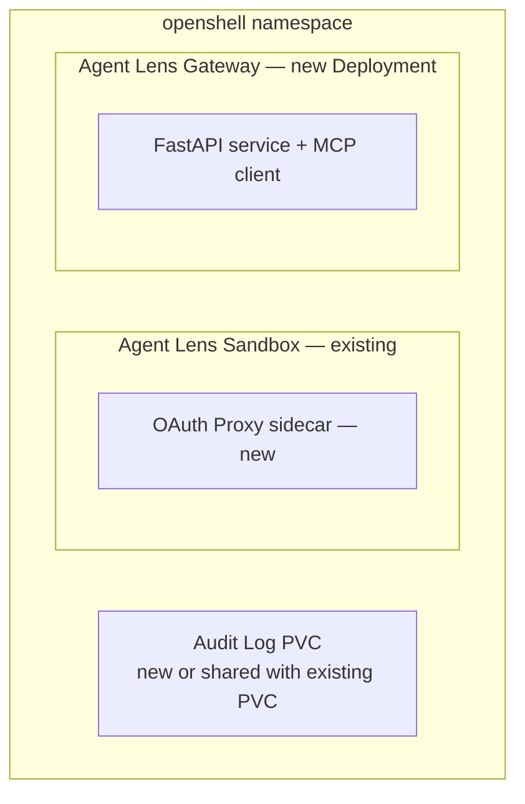
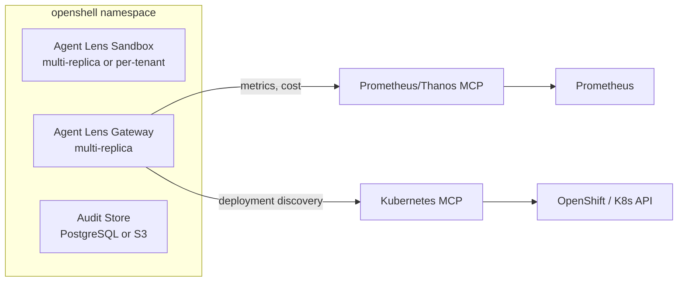
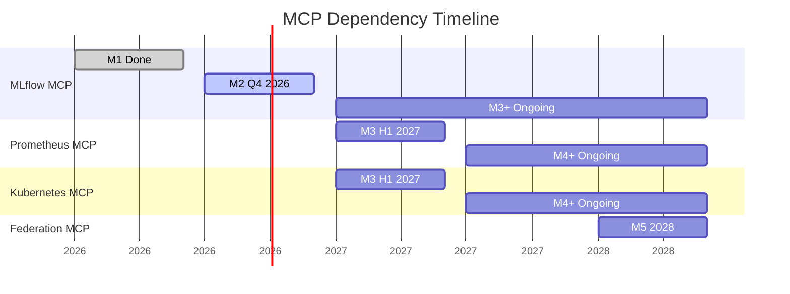

# Agent Lens -- Feature Roadmap

*Owner: Product Management*
*Last updated: July 2026*

---

## Milestone Overview

| Milestone | Theme | Target | Primary Personas | Ship Criteria |
|---|---|---|---|---|
| **M0** | Upstream Foundation | Done | -- | CI, contracts, immutable deploy path |
| **M1** | MVP Pilot | Done | Agent Platform Engineer | First-trace, GenAI eval, qualification verdict, fleet observatory |
| **M2** | Production Hardening | Q4 2026 | APE + Agent Developer | CI/CD gate, SSO, audit trail, agent registry |
| **M3** | Platform Scale | H1 2027 | + CAIO + CISO | Multi-tenant, Grafana, cost tracking, alerting, K8s discovery |
| **M4** | Enterprise Governance | H2 2027 | + Business Sponsor + Compliance | Compliance export, regulatory mapping, drift detection, adoption metrics |
| **M5** | Ecosystem | 2028 | All | Multi-cluster federation, marketplace integrations, advanced analytics |

---

## M0 -- Upstream Foundation (Done)

*Established the architectural and CI foundation.*

| Feature | Status | Notes |
|---|---|---|
| Official MLflow MCP integration | Done | No custom FastMCP; `mlflow-mcp` prerequisite |
| MCP contract CI check | Done | `check_mcp_contract.sh` + `test_skill_alignment.py` |
| Immutable Hermes image | Done | Python 3.13, Landlock blocks runtime pip |
| OpenShell Sandbox deployment | Done | Sandbox CR, NetworkPolicy, mTLS |
| Basic auth | Done | Scrypt-hashed password in K8s Secret |

---

## M1 -- MVP Pilot (Done)

*Proved the conversational evaluation concept with a single persona.*

| Feature | Skill | Status | Notes |
|---|---|---|---|
| Trace exploration | `trace-explorer` | Done | Latency, errors, token patterns |
| Quality evaluation | `evaluate-agent` | Done | GenAI scorers, pass rates, 3 profiles |
| Qualification verdict | `evaluate-agent` | Done | QUALIFIED / NOT QUALIFIED / NEEDS REVIEW (chat-only) |
| Trace review and annotation | `review-trace` | Done | Feedback, expectations via MCP (Domain Expert / SME) |
| Multi-turn session analysis | `analyze-session` | Done | Timeline via `mlflow.trace.session` + conversational eval |
| Regression follow-up | `create-regression` | Done | Expectations + tags (not full Evaluation Dataset) |
| Fleet observatory | `quality-dashboard` | Done | HEALTHY / WARNING / CRITICAL / INACTIVE (cap 20) + cost/latency |
| Zero-code instrumentation | `usercustomize.py` | Done | OpenAI-compatible Python agents |
| CLI evaluation | `eval_agent.py` | Done | Offline MLflow GenAI evaluation |
| Custom judge creation | `create-judge` | Done | Declarative scorer via `register_llm_judge_scorer` |
| Red-team evaluation | `red-team` | Done | Adversarial safety with attack profiles |
| EDD loop orchestration | `eval-loop` | Done | Baseline → diagnose → fix → compare cycle |
| Cost-quality tradeoff | `cost-quality` | Done | Cross-run quality/cost/latency comparison |

**Limitations carried forward:** qualification is advisory only, basic auth only, no audit trail, cap 20 experiments in fleet scan, regression = tags not Evaluation Dataset API.

---

## M2 -- Production Hardening (Q4 2026)

*From advisory to enforceable. Adding the Agent Developer persona.*

Full PRD: [prd-m2-enterprise.md](prd-m2-enterprise.md)

### P0 Features (Must-Have)

| ID | Feature | New Components | Personas |
|---|---|---|---|
| F1 | **CI/CD Quality Gate API** | Agent Lens Gateway (FastAPI Deployment) | AD, APE |
| F2 | **SSO / OIDC Authentication** | OpenShift OAuth Proxy sidecar | All |
| F3 | **Audit Trail** | Append-only log with checksums | APE, CISO |
| F4 | **Agent Registry** | Fleet inventory (MLflow + manual) | APE, CISO |

### P1 Features (Should-Have)

| ID | Feature | New Components | Personas |
|---|---|---|---|
| F5 | Trace Aggregation | New `aggregate-traces` skill (client-side aggregation) | APE, AD |
| F6 | Expanded Scorer Profiles | Safety + Comprehensive + Custom profiles | APE, AD |
| F7 | Evaluation Comparison | New `compare-evaluations` skill | AD |

### P2 Features (Nice-to-Have)

| ID | Feature | New Components | Personas |
|---|---|---|---|
| F8 | Executive Summary Skill | New skill (same data, different format) | CAIO |
| F9 | Compliance Export Skill (Phase 1) | Basic JSONL/CSV export of qualification history | Compliance |

### New Infrastructure Components

### MCP Dependencies (M2)

| MCP | Tools Used | Status |
|---|---|---|
| MLflow MCP | 11 existing + 5 new LoggedModel tools (16 total) | Set `MLFLOW_MCP_TOOLS=all` to expose LoggedModel tools |
| Agent Lens Gateway MCP | 4 new tools: `log_audit_event`, `query_audit_trail`, `get_registry`, `register_agent` | Net-new Gateway MCP server for Hermes |

Per [MLflow Capability Audit](mlflow-capability-audit.md): Agent registry uses LoggedModel as storage (not a custom store). Tag filtering on `search_logged_models` is confirmed working. See [Identity](identity.md) for the definitive build vs. consume boundary.

---

## M3 -- Platform Scale (H1 2027)

*Multi-tenant, cost-aware, integrated with infrastructure monitoring. Adding CAIO and CISO personas.*

### Features

| ID | Feature | Description | New MCP | Personas |
|---|---|---|---|---|
| F10 | **Multi-Tenant Isolation** | Namespace-scoped access; shared Hermes or per-team instances | -- | All |
| F11 | **Prometheus/Grafana Integration** | Infrastructure metrics, token cost, latency SLOs in Agent Lens | Prometheus MCP | APE, CAIO |
| F12 | **Cost-Per-Agent Tracking** | Token usage + compute cost attribution per experiment | Prometheus MCP | APE, CAIO |
| F13 | **Kubernetes Agent Discovery** | Auto-discover agents from K8s deployments + labels | K8s/OpenShift MCP | APE, CISO |
| F14 | **Alerting and Notification** | Configurable alerts on quality regression, SLO breach | Prometheus MCP | APE, CISO |
| F15 | **Trend Analysis Skill** | Quality, cost, and latency trends over time | -- | APE, CAIO |
| F16 | **Fleet Pagination** | Remove 20-experiment cap; paginated fleet scan | -- | APE |
| F17 | **Executive Dashboard** | Periodic summary reports for leadership | -- | CAIO |
| F18 | **External Audit Store** | Migrate audit trail from PVC to PostgreSQL or S3 | -- | CISO, Compliance |
| F19 | **HA Gateway** | Multi-replica Gateway with shared state | -- | APE |

### New Infrastructure Components

### MCP Dependencies (M3)

| MCP | Tools Needed | Source |
|---|---|---|
| MLflow MCP | 16 tools (expanded in M2) | Upstream MLflow |
| Prometheus/Thanos MCP | `query`, `query_range`, `series` | Community or custom |
| Kubernetes/OpenShift MCP | `list_deployments`, `list_pods`, `get_labels` | Community or custom |

### Key Architecture Decisions (M3)

**Multi-tenant model options:**

| Option | Mechanism | Trade-off |
|---|---|---|
| A: Namespace-scoped Hermes | One Hermes instance per tenant namespace | Full isolation; higher resource cost |
| B: Shared Hermes with RBAC | Single instance; experiment access filtered by user group | Lower cost; requires Hermes RBAC support |
| C: Gateway-only multi-tenant | Hermes for chat; Gateway handles tenant routing | Simplest; chat is single-tenant, API is multi-tenant |

Decision deferred to M3 design phase. Option C is the likely path for M3 with Option A/B for M4.

---

## M4 -- Enterprise Governance (H2 2027)

*Full compliance, governance, and business persona support.*

### Features

| ID | Feature | Description | Personas |
|---|---|---|---|
| F20 | **Compliance Export (Phase 2)** | Structured qualification reports (PDF, JSON) mapped to regulatory controls; extends M2 basic export | Compliance, CISO |
| F21 | **Regulatory Control Mapping** | Map qualification evidence to ISO 42001, SOX, HIPAA controls | Compliance |
| F22 | **Configuration Drift Detection** | Compare approved agent config (registry) vs. running config (K8s) | CISO, APE |
| F23 | **Adoption Metrics** | User interaction rates, acceptance rates, usage depth per agent | Business Sponsor |
| F24 | **Red Team Evaluation Profile** | Advanced adversarial testing with multi-vector campaigns (extends M1 `red-team`) | CISO |
| F25 | **PII/PHI Scanner** | Detect sensitive data patterns in trace outputs | CISO, Compliance |
| F26 | **Qualification Expiry and Re-eval** | Auto-flag agents past qualification TTL; trigger re-evaluation | APE, CISO |
| F27 | **Team-Scoped Views** | Business sponsors see only their team's agents | Business Sponsor |
| F28 | **GPA-Aligned Evaluation** | Goal-Plan-Action scoring (per Snowflake research) when MLflow supports it | AD |

### MCP Dependencies (M4)

No new MCP servers beyond M3. Features build on MLflow MCP + Prometheus MCP + K8s MCP.

---

## M5 -- Ecosystem (2028)

*Federation, marketplace, and advanced analytics.*

### Features

| ID | Feature | Description | Personas |
|---|---|---|---|
| F29 | **Multi-Cluster Federation** | Aggregate fleet health across multiple OpenShift clusters | CAIO, APE |
| F30 | **Evaluation Marketplace** | Share and discover custom scorer profiles across teams | AD |
| F31 | **Advanced Analytics** | ML-powered anomaly detection on quality trends | APE |
| F32 | **Data Residency Verification** | Verify agent trace data stays within declared jurisdictions | Compliance |
| F33 | **Retention Policy Enforcement** | Auto-archive or delete traces per retention schedule | Compliance |
| F34 | **External Notification Integrations** | PagerDuty, Slack, email for quality alerts | APE |
| F35 | **CSAT Integration** | Correlate agent quality scores with external satisfaction data | Business Sponsor |

---

## Persona Coverage Timeline

| Persona | M1 | M2 | M3 | M4 | M5 |
|---|---|---|---|---|---|
| Agent Platform Engineer | Primary | Primary | Primary | Primary | Primary |
| Agent Developer | Incidental | Added | Deepened | Deepened | Full |
| Chief AI Officer / VP of AI | Minimal | Minimal | Added | Deepened | Full |
| CISO / AI Security Lead | None | Foundation | Added | Deepened | Full |
| Business Sponsor | None | None | Minimal | Added | Deepened |
| AI Compliance / GRC Lead | None | Foundation | Minimal | Added | Deepened |
| Domain Expert / SME | Incidental | Incidental | Minimal | Added | Deepened |

---

## MCP Dependency Timeline

---

## Feature-to-Skill Mapping

Agent Lens skills are the primary interface. This table maps planned features to new or enhanced skills.

### Existing Skills (M1)

| Skill | M2 Changes | M3 Changes | M4 Changes |
|---|---|---|---|
| `evaluate-agent` | Add Safety + Comprehensive profiles; custom thresholds | Trend comparison | GPA-aligned scoring |
| `review-trace` | Write to audit trail; Domain Expert / SME annotation | Pattern grouping; SME review queue | PII detection |
| `analyze-session` | No changes (conversational eval added in M1) | Enhanced multi-agent tracing | No changes |
| `create-regression` | Write to audit trail; Domain Expert / SME expectations | Regression trend analysis | No changes |
| `trace-explorer` | Enhanced aggregation (F5) | Cost + latency overlay | Adoption metrics |
| `quality-dashboard` | Registry integration (F4) | Pagination (F16); cost column | Team-scoped views |
| `create-judge` | Judge alignment with expert feedback | Judge versioning | Auto-calibration |
| `red-team` | Automated attack generation | Multi-vector campaigns | Continuous red-teaming |
| `eval-loop` | Integration with CI/CD gate | Automated regression triggers | No changes |
| `cost-quality` | Budget alerts integration | Provider comparison automation | No changes |

### New Skills

| Skill | Milestone | Trigger | Purpose |
|---|---|---|---|
| `create-judge` | M1 (done) | "Create a scorer / custom judge" | Declarative LLM judge from natural language |
| `red-team` | M1 (done) | "Red team / safety test" | Adversarial safety evaluation |
| `eval-loop` | M1 (done) | "Improvement loop / EDD cycle" | Baseline → diagnose → fix → compare |
| `cost-quality` | M1 (done) | "Cost vs quality / which model" | Cross-run tradeoff analysis |
| `compare-evaluations` | M2 | "Compare v1.2 vs v1.3" | Version diff on eval results |
| `executive-summary` | M2 | "Executive report" | Non-technical fleet health |
| `compliance-export` | M2 | "Export compliance report" | Structured audit export |
| `agent-registry` | M2 | "Show agent registry" | Fleet inventory with status |
| `cost-tracking` | M3 | "How much does agent X cost?" | Token + compute cost |
| `alert-config` | M3 | "Alert me if quality drops" | Configurable notifications |
| `trend-analysis` | M3 | "Show quality trend" | Temporal quality analysis |
| `drift-detection` | M4 | "Check for config drift" | Approved vs. running comparison |
| `optimize-prompt` | M2 | "Optimize the system prompt" | GEPA prompt optimization via Gateway |

---

## Release Criteria by Milestone

### M2 Release Criteria

- [ ] All P0 features (F1-F4) pass acceptance criteria
- [ ] CI/CD gate demonstrated with Tekton and GitHub Actions
- [ ] SSO working with at least one OIDC provider
- [ ] Audit trail covers 100% of qualification decisions
- [ ] Agent registry shows all agents with correct status
- [ ] At least 2 enterprise pilot deployments running M2
- [ ] Enterprise readiness and limitations docs updated

### M3 Release Criteria

- [ ] Multi-tenant isolation deployed at 1+ enterprise
- [ ] Cost-per-agent visible for all agents with Prometheus integration
- [ ] Fleet scan handles 100+ agents without timeout
- [ ] Executive dashboard reviewed by 2+ Chief AI Officers / VPs of AI
- [ ] Alerting triggers on quality regression within 15 minutes
- [ ] Audit trail migrated to external store at 1+ enterprise

### M4 Release Criteria

- [ ] Compliance export accepted by 1+ GRC platform
- [ ] Regulatory mapping covers ISO 42001 and SOX controls
- [ ] Drift detection catches a real configuration change in pilot
- [ ] Red team profile identifies at least 1 real vulnerability in pilot
- [ ] Business Sponsors using team-scoped views in 2+ enterprises

---

## Dependencies on Upstream Contributions

Some features require upstream contributions to MLflow MCP or other open-source projects. These are tracked here to ensure they are prioritized.

| Feature | Upstream Need | Project | Timeline |
|---|---|---|---|
| Fleet pagination (F16) | Aggregate experiment statistics tool | MLflow MCP | Before M3 |
| GPA-aligned evaluation (F28) | Goal/Plan/Action scorers in MLflow GenAI | MLflow | Before M4 |
| Review queue | Dedicated trace queue/triage tool (Domain Expert / SME workflow) | MLflow MCP | Before M3 |
| Evaluation Dataset creation | `create_evaluation_dataset` MCP tool | MLflow MCP | Before M3 |
| Multi-agent session tracing | Cross-experiment session linking | MLflow | Before M4 |

If upstream contributions are not accepted in time, Agent Lens will implement client-side workarounds in skills (as done today with fleet scanning and regression tagging). The principle of no custom MCP fork is maintained.
